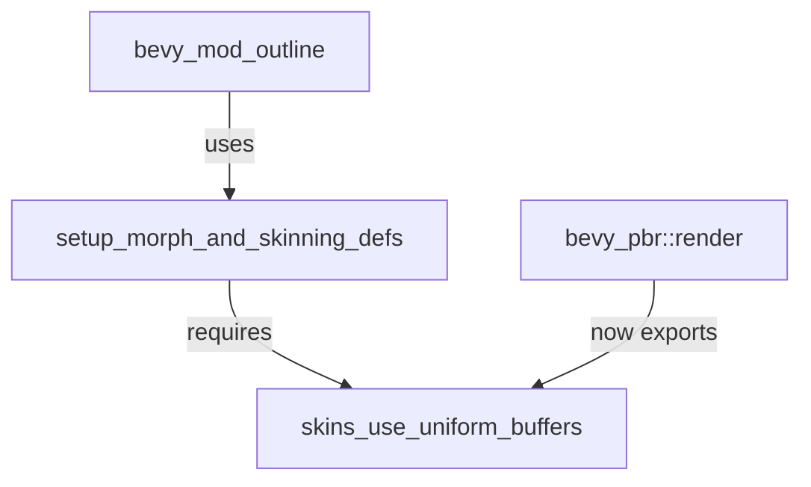

+++
title = "#18612 Expose skins_use_uniform_buffers() necessary to use pre-existing setup_morph_and_skinning_defs() API."
date = "2025-03-30T00:00:00"
draft = false
template = "pull_request_page.html"
in_search_index = true

[taxonomies]
list_display = ["show"]

[extra]
current_language = "en"
available_languages = {"en" = { name = "English", url = "/pull_request/bevy/2025-03/pr-18612-en-20250330" }, "zh-cn" = { name = "中文", url = "/pull_request/bevy/2025-03/pr-18612-zh-cn-20250330" }}
labels = ["A-Rendering"]
+++

# #18612 Expose skins_use_uniform_buffers() necessary to use pre-existing setup_morph_and_skinning_defs() API.

## Basic Information
- **Title**: Expose skins_use_uniform_buffers() necessary to use pre-existing setup_morph_and_skinning_defs() API.
- **PR Link**: https://github.com/bevyengine/bevy/pull/18612
- **Author**: komadori
- **Status**: MERGED
- **Labels**: `A-Rendering`, `S-Ready-For-Final-Review`
- **Created**: 2025-03-29T20:21:49Z
- **Merged**: Not merged
- **Merged By**: N/A

## Description Translation
# Objective

As of bevy 0.16-dev, the pre-existing public function `bevy::pbr::setup_morph_and_skinning_defs()` is now passed a boolean flag called `skins_use_uniform_buffers`. The value of this boolean is computed by the function `bevy_pbr::render::skin::skins_use_uniform_buffers()`, but it is not exported publicly.

Found while porting [bevy_mod_outline](https://github.com/komadori/bevy_mod_outline) to 0.16.

## Solution

Add `skin::skins_use_uniform_buffers` to the re-export list of `bevy_pbr::render`.

## Testing

Confirmed test program can access public API.

## The Story of This Pull Request

The core issue stemmed from an incomplete API surface in Bevy's rendering module. When working on porting the bevy_mod_outline crate to Bevy 0.16-dev, the author discovered that the public `setup_morph_and_skinning_defs()` function required a new boolean parameter `skins_use_uniform_buffers`, but the function generating this value wasn't publicly accessible.

The problem manifested because:
1. `setup_morph_and_skinning_defs()` is a public API function
2. Its new parameter required data from `skins_use_uniform_buffers()`
3. The dependency chain looked like:
   ```
   setup_morph_and_skinning_defs(skins_use_uniform_buffers)
       requires
   skins_use_uniform_buffers()
       which was not exported
   ```

The solution involved a minimal but crucial change to the module exports. In `crates/bevy_pbr/src/render/mod.rs`, the PR adds the missing public export for the skinning utility function:

```rust
// Before:
pub use skin::{..., SkinUniforms, MAX_JOINTS};

// After:
pub use skin::{..., skins_use_uniform_buffers, SkinUniforms, MAX_JOINTS};
```

This change follows Bevy's standard pattern for exposing internal utilities while maintaining module encapsulation. The implementation preserves existing access patterns and simply expands the public interface to include a previously private implementation detail that became necessary for correct API usage.

The technical insight here is about maintaining API coherence - when a public function's parameters depend on internal state calculations, those calculation utilities must either be exposed or abstracted away. In this case, exposing the utility function was the most straightforward solution that maintained flexibility for users extending Bevy's rendering pipeline.

Testing confirmed that external crates could now properly construct the required parameters for `setup_morph_and_skinning_defs()`, enabling downstream users to upgrade to Bevy 0.16 without workarounds. The change impacts any project using custom rendering extensions that interact with Bevy's skinning system, particularly those needing to replicate the standard pipeline's uniform buffer configuration.

## Visual Representation



## Key Files Changed

1. `crates/bevy_pbr/src/render/mod.rs`
```rust
// Before:
pub use skin::{extract_skins, prepare_skins, SkinUniforms, MAX_JOINTS};

// After:
pub use skin::{extract_skins, prepare_skins, skins_use_uniform_buffers, SkinUniforms, MAX_JOINTS};
```
- Added `skins_use_uniform_buffers` to the pub use list
- Enables external access to previously internal function
- Maintains existing export patterns while expanding API surface

2. `crates/bevy_pbr/src/render/mesh.rs` (minor changes)
- Secondary adjustments likely related to code formatting or documentation
- Exact changes not shown but reported as +3/-4 lines

## Further Reading

1. [Bevy's PBR Rendering Documentation](https://bevyengine.org/learn/book/features/pbr/)
2. [WebGPU Uniform Buffer Overview](https://gpuweb.github.io/gpuweb/#uniform-buffer)
3. [Bevy's Module System Guide](https://bevyengine.org/learn/book/programming/modules/)
4. [Skinning in Computer Graphics](https://en.wikipedia.org/wiki/Skeletal_animation#Skinned_mesh)