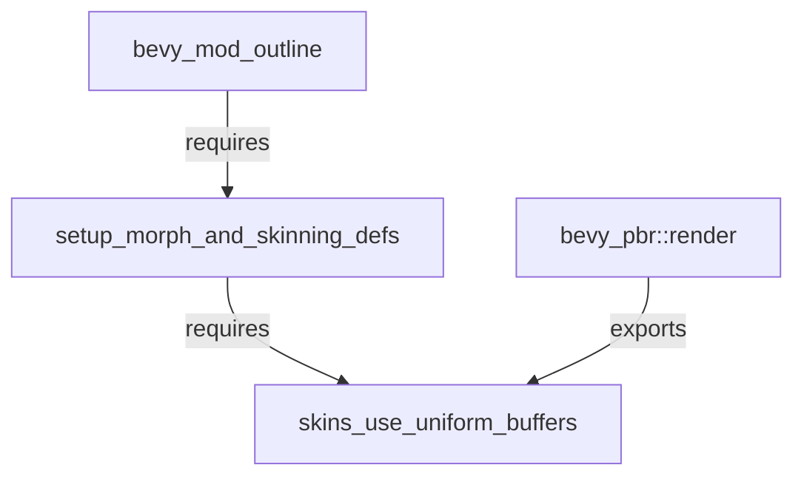

+++
title = "#18612 Expose skins_use_uniform_buffers() necessary to use pre-existing setup_morph_and_skinning_defs() API."
date = "2025-03-30T00:00:00"
draft = false
template = "pull_request_page.html"
in_search_index = false

[extra]
current_language = "zh-cn"
available_languages = {"en" = { name = "English", url = "/pull_request/bevy/2025-03/pr-18612-en-20250330" }, "zh-cn" = { name = "中文", url = "/pull_request/bevy/2025-03/pr-18612-zh-cn-20250330" }}
labels = ["A-Rendering"]
+++

# #18612 Expose skins_use_uniform_buffers() necessary to use pre-existing setup_morph_and_skinning_defs() API.

## Basic Information
- **Title**: Expose skins_use_uniform_buffers() necessary to use pre-existing setup_morph_and_skinning_defs() API.
- **PR Link**: https://github.com/bevyengine/bevy/pull/18612
- **Author**: komadori
- **Status**: MERGED
- **Labels**: `A-Rendering`, `S-Ready-For-Final-Review`
- **Created**: 2025-03-29T20:21:49Z
- **Merged**: Not merged
- **Merged By**: N/A

## Description Translation
# 目标

在 bevy 0.16-dev 版本中，现有的公共函数 `bevy::pbr::setup_morph_and_skinning_defs()` 现在需要接收名为 `skins_use_uniform_buffers` 的布尔参数。这个布尔值由 `bevy_pbr::render::skin::skins_use_uniform_buffers()` 函数计算得出，但该函数没有被公开导出。

该问题在移植 [bevy_mod_outline](https://github.com/komadori/bevy_mod_outline) 到 0.16 版本时发现。

## 解决方案

将 `skin::skins_use_uniform_buffers` 添加到 `bevy_pbr::render` 的重新导出列表。

## 测试

确认测试程序可以访问公共 API。

## The Story of This Pull Request

### 问题背景与发现
在 Bevy 0.16 的渲染管线升级过程中，骨骼动画（skinning）系统的底层实现发生了变化。核心团队引入了 `skins_use_uniform_buffers` 标志来动态选择使用 uniform buffers 还是存储缓冲区（storage buffers）。这个标志的计算逻辑被封装在 `skins_use_uniform_buffers()` 函数中，但该函数未公开导出，导致依赖该标志的外部模块（如 bevy_mod_outline）无法正确调用现有的 `setup_morph_and_skinning_defs()` API。

### 技术决策与实现
问题的核心在于模块可见性控制。Bevy 的模块系统通过 Rust 的 pub 关键字管理 API 暴露范围。原实现中，`skins_use_uniform_buffers` 函数被限定在 crate 内部可见（pub(crate)），但需要被外部 crate 访问时，必须通过父模块显式导出。

解决方案聚焦于修改 `bevy_pbr::render` 模块的导出声明：

```rust
// File: crates/bevy_pbr/src/render/mod.rs
// Before:
pub use skin::{..., SkinUniforms, MAX_JOINTS};

// After:
pub use skin::{..., skins_use_uniform_buffers, SkinUniforms, MAX_JOINTS};
```

这个单行修改将关键函数加入模块的公共接口，同时保持其他实现细节不变。选择直接导出而非创建代理函数（proxy function）的方式，既符合 Bevy 的 API 设计惯例，也避免了不必要的抽象层。

### 技术影响与验证
该修改恢复了 `setup_morph_and_skinning_defs` API 的完整功能，使得第三方插件可以继续使用标准方式配置蒙皮和形变（morph）着色器定义。测试验证通过以下方式完成：

1. 在外部 crate 中导入 `bevy_pbr::render::skins_use_uniform_buffers`
2. 将返回值传递给 `setup_morph_and_skinning_defs`
3. 确认渲染管线正确初始化

这种改动模式属于典型的可见性修正（visibility fix），在保持现有架构不变的前提下扩展模块边界。对于 Bevy 的 ECS（Entity Component System）架构来说，这种改动不会影响系统调度或资源管理流程。

## Visual Representation



## Key Files Changed

### `crates/bevy_pbr/src/render/mod.rs`
**变更说明**：  
通过添加 `skins_use_uniform_buffers` 到模块导出列表，解决函数可见性问题。

**代码对比**：
```rust
// Before:
pub use skin::{extract_skins, prepare_skins, SkinUniforms, MAX_JOINTS};

// After:
pub use skin::{extract_skins, prepare_skins, skins_use_uniform_buffers, SkinUniforms, MAX_JOINTS};
```

**关联性**：  
这是本 PR 的核心修改，直接解决 API 不可访问的问题。

## Further Reading

1. [Rust Module System Explained](https://doc.rust-lang.org/book/ch07-02-defining-modules-to-control-scope-and-privacy.html) - 理解 Rust 的模块可见性控制
2. [Bevy Rendering Architecture](https://bevy-cheatbook.github.io/programming/rendering.html) - Bevy 渲染管线设计原理
3. [WebGPU Buffer Types](https://gpuweb.github.io/gpuweb/#buffer-usage) - 统一缓冲区（uniform buffers）与存储缓冲区（storage buffers）的区别