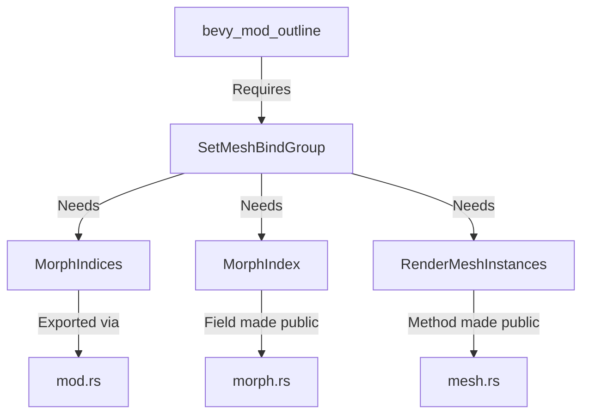

+++
title = "#18613 Expose symbols needed to replicate SetMeshBindGroup in ecosystem crates."
date = "2025-03-31T00:00:00"
draft = false
template = "pull_request_page.html"
in_search_index = true

[taxonomies]
list_display = ["show"]

[extra]
current_language = "en"
available_languages = {"en" = { name = "English", url = "/pull_request/bevy/2025-03/pr-18613-en-20250331" }, "zh-cn" = { name = "中文", url = "/pull_request/bevy/2025-03/pr-18613-zh-cn-20250331" }}
labels = ["A-Rendering", "C-Usability", "P-Regression"]
+++

# #18613 Expose symbols needed to replicate SetMeshBindGroup in ecosystem crates.

## Basic Information
- **Title**: Expose symbols needed to replicate SetMeshBindGroup in ecosystem crates.
- **PR Link**: https://github.com/bevyengine/bevy/pull/18613
- **Author**: komadori
- **Status**: MERGED
- **Labels**: `A-Rendering`, `C-Usability`, `S-Ready-For-Final-Review`, `P-Regression`
- **Created**: 2025-03-29T23:32:29Z
- **Merged**: Not merged
- **Merged By**: N/A

## Description Translation
# Objective

My ecosystem crate, bevy_mod_outline, currently uses `SetMeshBindGroup` as part of its custom rendering pipeline. I would like to allow for possibility that, due to changes in 0.16, I need to customise the behaviour of `SetMeshBindGroup` in order to make it work. However, not all of the symbol needed to implement this render command are public outside of Bevy.

## Solution

- Include `MorphIndices` in re-export list. I feel this is morally equivalent to `SkinUniforms` already being exported.
- Change `MorphIndex::index` field to be public. I feel this is morally equivalent to the `SkinByteOffset::byte_offset` field already being public.
- Change `RenderMeshIntances::mesh_asset_id()` to be public (although since all the fields of `RenderMeshInstances` are public it's possible to work around this one by reimplementing).

These changes exclude:
- Making any change to the `RenderLightmaps` type as I don't need to bind the light-maps for my use-case and I wanted to keep these changes minimal. It has a private field which would need to be public or have access methods.
- The changes already included in #18612.

## Testing

Confirmed that a copy of `SetMeshBindGroup` can be compiled outside of Bevy with these changes, provided that the light-map code is removed.

## The Story of This Pull Request

The PR addresses a regression in accessibility of Bevy's rendering internals that impacted ecosystem crates. The author's `bevy_mod_outline` crate needed to replicate parts of Bevy's `SetMeshBindGroup` implementation but found critical components either not exported or inaccessible due to visibility restrictions.

**Problem Context**: After Bevy 0.16 changes, custom rendering pipelines requiring mesh bind group customization faced three specific visibility issues:
1. `MorphIndices` wasn't re-exported through Bevy's public API
2. `MorphIndex::index` field had private visibility
3. `RenderMeshInstances::mesh_asset_id()` method was private

These limitations made it impossible for external crates to properly handle morph targets and mesh asset identification when implementing custom render commands similar to `SetMeshBindGroup`.

**Solution Approach**: The author followed Bevy's existing patterns for similar components:
1. Export `MorphIndices` alongside already-exported `SkinUniforms`
2. Make `MorphIndex::index` public like `SkinByteOffset::byte_offset`
3. Expose `mesh_asset_id()` method to match struct field visibility

The implementation focused on minimal changes while maintaining consistency with existing API design. Lightmap handling was explicitly excluded to keep the scope focused.

**Key Implementation Details**:

1. Morph component exports:
```rust
// In crates/bevy_pbr/src/render/mod.rs
pub use morph::*; // Added to public exports
```

2. Field visibility change:
```rust
// Before in morph.rs:
#[derive(Component)]
pub struct MorphIndex {
    pub(crate) index: u32,
}

// After:
#[derive(Component)]
pub struct MorphIndex {
    pub index: u32;
}
```

3. Method visibility adjustment:
```rust
// In mesh.rs:
pub fn mesh_asset_id(&self) -> AssetId<Mesh> {
    self.mesh_asset_id
}
```

**Technical Insights**: The changes maintain Bevy's existing pattern where skinning and morph targets receive parallel treatment. By aligning `MorphIndex`'s visibility with `SkinByteOffset`, the PR ensures consistency in how these mesh deformation systems expose their GPU buffer offsets.

**Impact**: These changes restore the ability for ecosystem crates to implement custom mesh bind group logic while maintaining Bevy's internal abstraction boundaries. The explicit exclusion of lightmap changes demonstrates responsible scoping, avoiding unnecessary API surface expansion.

## Visual Representation



## Key Files Changed

1. `crates/bevy_pbr/src/render/mod.rs` (+1/-0)
```rust
// Added to public exports:
pub use morph::*;
```

2. `crates/bevy_pbr/src/render/morph.rs` (+1/-1)
```rust
// Before:
struct MorphIndex { index: u32 }

// After:
pub struct MorphIndex { pub index: u32 }
```

3. `crates/bevy_pbr/src/render/mesh.rs` (+1/-1)
```rust
// Visibility changed from pub(crate) to pub:
pub fn mesh_asset_id(&self) -> AssetId<Mesh> {
    self.mesh_asset_id
}
```

## Further Reading

1. Bevy's Render Command System: https://bevyengine.org/learn/book/next/rendering/render-commands/
2. Morph Target Implementation Details: https://github.com/bevyengine/bevy/blob/main/crates/bevy_pbr/src/morph.rs
3. Skin System Parallels: https://github.com/bevyengine/bevy/blob/main/crates/bevy_pbr/src/skin.rs