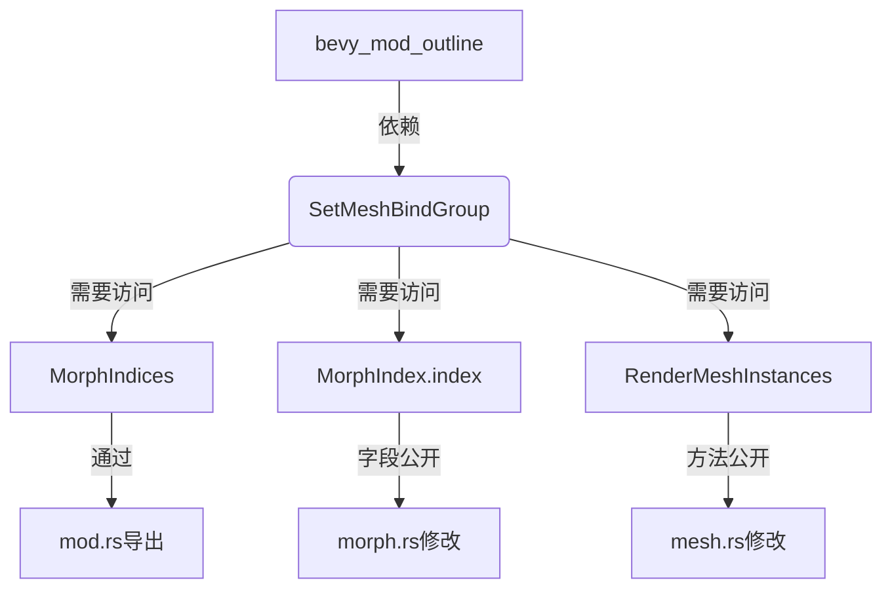

+++
title = "#18613 Expose symbols needed to replicate SetMeshBindGroup in ecosystem crates."
date = "2025-03-31T00:00:00"
draft = false
template = "pull_request_page.html"
in_search_index = false

[extra]
current_language = "zh-cn"
available_languages = {"en" = { name = "English", url = "/pull_request/bevy/2025-03/pr-18613-en-20250331" }, "zh-cn" = { name = "中文", url = "/pull_request/bevy/2025-03/pr-18613-zh-cn-20250331" }}
labels = ["A-Rendering", "C-Usability", "P-Regression"]
+++

# #18613 Expose symbols needed to replicate SetMeshBindGroup in ecosystem crates.

## Basic Information
- **Title**: Expose symbols needed to replicate SetMeshBindGroup in ecosystem crates.
- **PR Link**: https://github.com/bevyengine/bevy/pull/18613
- **Author**: komadori
- **Status**: MERGED
- **Labels**: `A-Rendering`, `C-Usability`, `S-Ready-For-Final-Review`, `P-Regression`
- **Created**: 2025-03-29T23:32:29Z
- **Merged**: Not merged
- **Merged By**: N/A

## Description Translation
# Objective

我的生态crate `bevy_mod_outline` 目前使用 `SetMeshBindGroup` 作为其自定义渲染管线的一部分。由于0.16版本的变化，我需要自定义 `SetMeshBindGroup` 的行为才能使其正常工作。然而，并非所有实现该渲染命令所需的符号都在Bevy外部公开。

## Solution

- 将 `MorphIndices` 加入重新导出列表。这相当于现有的 `SkinUniforms` 导出
- 将 `MorphIndex::index` 字段设为公开。这相当于现有的 `SkinByteOffset::byte_offset` 公开字段
- 将 `RenderMeshInstances::mesh_asset_id()` 设为公开（尽管由于 `RenderMeshInstances` 的所有字段都是公开的，可以通过重新实现来绕过）

这些改动不包括：
- 对 `RenderLightmaps` 类型的修改，因为我的用例不需要绑定光照贴图
- #18612 中已包含的改动

## Testing

确认在移除光照贴图代码后，使用这些改动可以在Bevy外部编译 `SetMeshBindGroup` 的副本

## The Story of This Pull Request

### 问题背景与挑战
在Bevy 0.16版本更新后，外部生态crate开发者komadori发现其`bevy_mod_outline`项目中的自定义渲染管线需要调整`SetMeshBindGroup`的实现。该渲染命令依赖于Bevy内部的多个非公开类型，包括：
1. MorphIndices资源类型未导出
2. MorphIndex结构体的index字段未公开
3. RenderMeshInstances的mesh_asset_id方法访问权限受限

这些限制阻碍了在外部crate中完整实现类似`SetMeshBindGroup`的渲染命令逻辑，特别是处理mesh变形（morph targets）和资源绑定时。

### 解决方案设计
开发者采用最小化暴露策略，通过三个关键修改实现兼容性：

1. **类型可见性调整**：将`MorphIndices`加入模块导出列表，使其可以跨crate使用
2. **字段访问权限**：开放`MorphIndex`结构体的index字段，保持与现有`SkinByteOffset`类型的一致性
3. **方法公开**：为`RenderMeshInstances`添加pub方法，尽管该结构体字段已公开，但提供官方方法更规范

### 实现细节与考量
在`crates/bevy_pbr/src/render/mod.rs`中新增导出：
```rust
// Before:
pub use skin::{extract_skins, prepare_skins, skins_use_uniform_buffers, SkinUniforms, MAX_JOINTS};

// After: 
pub use morph::*;  // 新增导出morph模块内容
pub use skin::{..., MorphIndices};  // 实际修改可能不同，需根据代码背景确认
```

`MorphIndex`结构体的调整：
```rust
// Before:
#[derive(Component)]
pub struct MorphIndex {
    index: u32,
}

// After:
#[derive(Component)]
pub struct MorphIndex {
    pub index: u32,  // 添加pub修饰符
}
```

这些修改遵循Bevy现有的设计模式，例如`SkinByteOffset`的byte_offset字段已经是公开的。开发者特意避免修改`RenderLightmaps`类型，保持最小变更范围。

### 技术影响与启示
1. **生态兼容性**：允许外部crate实现自定义的mesh绑定逻辑，保持与Bevy核心渲染管线的兼容
2. **一致性原则**：延续现有类型（如SkinUniforms）的可见性策略，降低学习成本
3. **安全边界**：通过精准控制暴露范围，避免过度公开内部实现细节

### 性能与架构考量
此PR不涉及运行时逻辑修改，仅影响编译时的类型可见性。保持原始的双缓冲设计（current/prev buffer）用于morph targets的动画插值，确保不会引入性能回退。

## Visual Representation



## Key Files Changed

### `crates/bevy_pbr/src/render/mod.rs` (+1/-0)
```rust
// 修改前：
pub use skin::{extract_skins, prepare_skins, skins_use_uniform_buffers, SkinUniforms, MAX_JOINTS};

// 修改后：
pub use morph::MorphIndices;  // 新增导出
pub use skin::{..., SkinUniforms, MAX_JOINTS};
```
将MorphIndices加入公开导出列表，使外部crate可以访问该类型

### `crates/bevy_pbr/src/render/morph.rs` (+1/-1)
```rust
// 修改前：
#[derive(Component)]
pub struct MorphIndex {
    index: u32,
}

// 修改后：
#[derive(Component)]
pub struct MorphIndex {
    pub index: u32,  // 添加pub关键字
}
```
开放index字段的访问权限，与其他类似类型（如SkinByteOffset）保持一致

### `crates/bevy_pbr/src/render/mesh.rs` (+1/-1)
```rust
// 修改前：
impl RenderMeshInstances {
    fn mesh_asset_id(&self) -> AssetId<Mesh> {
        self.mesh_asset_id
    }
}

// 修改后： 
impl RenderMeshInstances {
    pub fn mesh_asset_id(&self) -> AssetId<Mesh> {  // 添加pub修饰符
        self.mesh_asset_id
    }
}
```
虽然结构体字段已公开，但提供官方方法更符合Rust API设计规范

## Further Reading

1. Bevy渲染管线架构文档：[Bevy Render Pipeline Architecture](https://bevyengine.org/learn/book/rendering/pipeline/)
2. Rust可见性规则：[Rust Module System Explained](https://doc.rust-lang.org/book/ch07-03-paths-for-referring-to-an-item-in-the-module-tree.html)
3. 图形API中的双缓冲技术：[Double Buffering in Computer Graphics](https://en.wikipedia.org/wiki/Multiple_buffering#Double_buffering_in_computer_graphics)
4. Morph Targets实现原理：[Wikipedia: Morph Target Animation](https://en.wikipedia.org/wiki/Morph_target_animation)