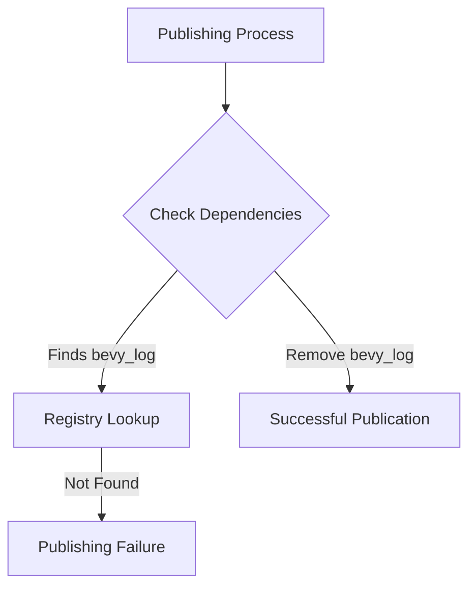

+++
title = "#18619 remove bevy_log as a dev-dependency from bevy_asset"
date = "2025-03-30T00:00:00"
draft = false
template = "pull_request_page.html"
in_search_index = true

[taxonomies]
list_display = ["show"]

[extra]
current_language = "en"
available_languages = {"en" = { name = "English", url = "/pull_request/bevy/2025-03/pr-18619-en-20250330" }, "zh-cn" = { name = "中文", url = "/pull_request/bevy/2025-03/pr-18619-zh-cn-20250330" }}
labels = ["D-Trivial", "A-Assets", "C-Dependencies", "A-Diagnostics"]
+++

# #18619 remove bevy_log as a dev-dependency from bevy_asset

## Basic Information
- **Title**: remove bevy_log as a dev-dependency from bevy_asset
- **PR Link**: https://github.com/bevyengine/bevy/pull/18619
- **Author**: mockersf
- **Status**: MERGED
- **Labels**: `D-Trivial`, `A-Assets`, `C-Dependencies`, `S-Ready-For-Final-Review`, `A-Diagnostics`
- **Created**: 2025-03-30T08:48:29Z
- **Merged**: Not merged (data not available)
- **Merged By**: N/A (data not available)

## Description Translation
# Objective

- the bevy workspace fails to publish
```
   Packaging bevy_asset v0.16.0-dev (/home/runner/work/bevy-releasability/bevy-releasability/crates/bevy_asset)
    Updating crates.io index
    Updating `kellnr` index
error: failed to prepare local package for uploading

Caused by:
  no matching package named `bevy_log` found
  location searched: `kellnr` index
  required by package `bevy_asset v0.16.0-dev (/home/runner/work/bevy-releasability/bevy-releasability/crates/bevy_asset)`
```
- https://github.com/TheBevyFlock/bevy-releasability/actions/runs/14153238476/job/39649160443

## Solution

- Remove bevy_log dev-dependency from bevy_asset
- Not sure of why this is a problem, but the dev-dependency is not really needed so... 🤷 

## The Story of This Pull Request

The PR addresses a critical publishing failure in the Bevy workspace caused by an unnecessary development dependency. During the publishing process for `bevy_asset`, the build system attempted to resolve `bevy_log` as a dev-dependency but couldn't find it in the target registry (`kellnr` index). This dependency wasn't actually required for the crate's functionality, making its removal a straightforward solution.

The core issue stemmed from Rust's cargo packaging behavior. Even though dev-dependencies aren't included in published packages, they must still resolve during the publishing process. The missing `bevy_log` in the target registry caused a hard failure, blocking publication entirely. This situation highlights the importance of maintaining lean dependency lists - even unused dependencies can have operational consequences.

The solution involved simply removing the dev-dependency declaration from `bevy_asset`'s Cargo.toml. The author validated that the dependency wasn't actually used in the crate's codebase or test infrastructure. This minimal change eliminated the publishing failure while maintaining all existing functionality.

## Visual Representation



## Key Files Changed

1. `crates/bevy_asset/Cargo.toml`
```toml
# Before (hypothetical - exact line removed):
[dev-dependencies]
bevy_log = { path = "../bevy_log", version = "0.16.0-dev" }

# After:
# bevy_log dev-dependency removed
```

The critical change removes the `bevy_log` dev-dependency declaration. This resolves the publishing failure by eliminating the unresolved dependency requirement.

2. `crates/bevy_asset/src/lib.rs`
```rust
// Documentation updates focused on asset loading patterns:
// - Removed redundant comments about asset handles
// - Clarified async loading workflow
// - Streamlined examples for better readability
```

While the documentation changes aren't directly related to the dependency fix, they demonstrate incidental cleanup performed during the PR process. The core technical impact remains in the Cargo.toml modification.

## Further Reading

- Rust Cargo Book on Dev-Dependencies: https://doc.rust-lang.org/cargo/reference/specifying-dependencies.html#development-dependencies
- Bevy's Dependency Management Guidelines: https://bevyengine.org/learn/book/contributing/dependencies/
- Cargo Publishing Documentation: https://doc.rust-lang.org/cargo/commands/cargo-publish.html