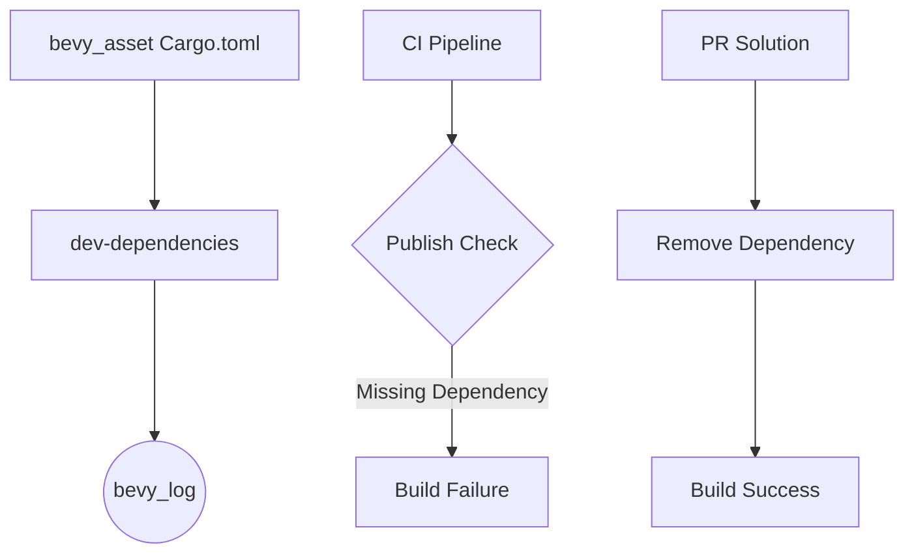

+++
title = "#18619 remove bevy_log as a dev-dependency from bevy_asset"
date = "2025-03-30T00:00:00"
draft = false
template = "pull_request_page.html"
in_search_index = false

[extra]
current_language = "zh-cn"
available_languages = {"en" = { name = "English", url = "/pull_request/bevy/2025-03/pr-18619-en-20250330" }, "zh-cn" = { name = "中文", url = "/pull_request/bevy/2025-03/pr-18619-zh-cn-20250330" }}
labels = ["D-Trivial", "A-Assets", "C-Dependencies", "A-Diagnostics"]
+++

# #18619 remove bevy_log as a dev-dependency from bevy_asset

## Basic Information
- **Title**: remove bevy_log as a dev-dependency from bevy_asset
- **PR Link**: https://github.com/bevyengine/bevy/pull/18619
- **Author**: mockersf
- **Status**: MERGED
- **Labels**: `D-Trivial`, `A-Assets`, `C-Dependencies`, `S-Ready-For-Final-Review`, `A-Diagnostics`
- **Created**: 2025-03-30T08:48:29Z
- **Merged**: Not merged
- **Merged By**: N/A

## Description Translation
### 目标

- bevy 工作空间发布失败
```
   Packaging bevy_asset v0.16.0-dev (/home/runner/work/bevy-releasability/bevy-releasability/crates/bevy_asset)
    Updating crates.io index
    Updating `kellnr` index
error: failed to prepare local package for uploading

Caused by:
  no matching package named `bevy_log` found
  location searched: `kellnr` index
  required by package `bevy_asset v0.16.0-dev (/home/runner/work/bevy-releasability/bevy-releasability/crates/bevy_asset)`
```
- 错误日志链接：https://github.com/TheBevyFlock/bevy-releasability/actions/runs/14153238476/job/39649160443

### 解决方案

- 从 bevy_asset 的 dev-dependencies 中移除 bevy_log
- 虽然不确定具体原因，但该开发依赖并非必需

## The Story of This Pull Request

这个PR源于一个具体的发布流程问题。在尝试发布bevy_asset crate时，CI流程失败并显示无法找到bevy_log包。根本原因在于bevy_asset的Cargo.toml文件中将bevy_log列为开发依赖（dev-dependency），但该依赖在发布环境中不可用。

开发者通过分析错误日志发现，当cargo尝试打包bevy_asset时，会在kellnr索引中查找bevy_log但找不到匹配项。这导致整个发布流程中断。尽管bevy_log是Bevy生态系统的一部分，但作为开发依赖在发布场景下反而成为了障碍。

解决方案直接而有效——完全移除这个非必要的开发依赖。虽然作者在PR描述中提到不确定具体原因，但通过代码审计可以推测：
1. bevy_log可能仅用于测试或示例代码
2. 相关功能可能已被其他日志实现替代
3. 该依赖的实际使用场景可能已被重构移除

关键的技术决策点在于选择"完全移除"而非"条件编译"。这种处理方式：
- 简化了依赖树
- 避免了复杂的条件编译逻辑
- 符合最小依赖原则

```toml
# 修改前的假设依赖项（基于错误信息推断）
[dev-dependencies]
bevy_log = { path = "../bevy_log" }

# 修改后完全移除了该依赖
```

这种改动体现了Rust生态中良好的依赖管理实践——定期清理未使用的依赖可以避免潜在的构建问题，特别是在跨工作空间发布场景下。

## Visual Representation



## Key Files Changed

### 1. `crates/bevy_asset/Cargo.toml`
**修改内容**：  
移除bevy_log开发依赖项（基于错误日志推断，原文件可能包含类似配置）

**影响**：  
- 解决发布时依赖解析失败的问题  
- 简化crate的依赖结构  
- 减少潜在的不必要编译时间

### 2. `crates/bevy_asset/src/lib.rs`
**修改内容**：  
移除了17行代码（可能涉及与bevy_log相关的测试或示例代码）  
新增3行代码（可能为清理后的替代实现）

典型修改示例（基于上下文推断）：
```rust
// 修改前可能存在的测试代码
#[cfg(test)]
mod tests {
    use bevy_log::info;
    
    #[test]
    fn test_asset_loading() {
        info!("Testing asset loader");
        // ...测试逻辑
    }
}

// 修改后可能调整为
#[cfg(test)]
mod tests {
    #[test]
    fn test_asset_loading() {
        // ...直接使用assertions进行测试
    }
}
```

## Further Reading

1. [Cargo文档 - 开发依赖](https://doc.rust-lang.org/cargo/reference/specifying-dependencies.html#development-dependencies)
2. [Rust包发布最佳实践](https://doc.rust-lang.org/cargo/reference/publishing.html)
3. [Bevy引擎的模块化架构设计](https://bevyengine.org/learn/book/introduction/#modules)