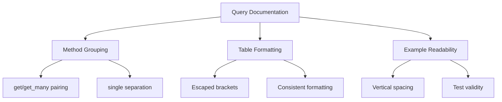

+++
title = "#18622 Improve `Query`'s top-level documentation"
date = "2025-03-31T00:00:00"
draft = false
template = "pull_request_page.html"
in_search_index = true

[taxonomies]
list_display = ["show"]

[extra]
current_language = "en"
available_languages = {"en" = { name = "English", url = "/pull_request/bevy/2025-03/pr-18622-en-20250331" }, "zh-cn" = { name = "中文", url = "/pull_request/bevy/2025-03/pr-18622-zh-cn-20250331" }}
labels = ["C-Docs", "A-ECS", "D-Straightforward"]
+++

# #18622 Improve `Query`'s top-level documentation

## Basic Information
- **Title**: Improve `Query`'s top-level documentation
- **PR Link**: https://github.com/bevyengine/bevy/pull/18622
- **Author**: BD103
- **Status**: MERGED
- **Labels**: `C-Docs`, `A-ECS`, `S-Ready-For-Final-Review`, `D-Straightforward`
- **Created**: 2025-03-30T16:44:34Z
- **Merged**: 2025-03-31T09:14:15Z
- **Merged By**: alice-i-cecile

## Description Translation
# Objective

- There's been several changes to `Query` for this release cycle, and `Query`'s top-level documentation has gotten slightly out-of-date.
- Alternative to #18615.

## Solution

- Edit `Query`'s docs for consistency, clarity, and correctness.
- Make sure to group `get()` and `get_many()` together instead of `single()` and `get_many()`, to enforce the distinction from https://github.com/bevyengine/bevy/pull/18615#issuecomment-2764355672.
- Reformat doc tests so they would be readable if extracted into their own file. (Which mainly involves adding more spacing.)
- Move link definitions to be nearer where they are used.
- Fix the tables so they are up-to-date and correctly escape square brackets `\[ \]`.

## Testing

I ran `cargo doc -p bevy_ecs --no-deps` to view the docs and `cargo test -p bevy_ecs --doc` to test the doc comments.

## Reviewing

The diff is difficult to read, so I don't recommend _just_ looking at that. Instead, run `cargo doc -p bevy_ecs --no-deps` locally and read through the new version. It should theoretically read smoother with less super-technical jargon. :)

## Follow-up

I want to go through some of `Query`'s methods, such as `single()`, `get()`, and `get_many()`, but I'll leave that for another PR.

## The Story of This Pull Request

The PR addresses documentation drift in Bevy's ECS `Query` type, which had accumulated during recent development cycles. As core APIs evolved, the top-level documentation became misaligned with actual method behaviors and organizational patterns. This created potential for user confusion, particularly around method groupings and table formatting.

The primary technical challenge involved restructuring documentation while maintaining compatibility with Rustdoc rendering and testable examples. The author focused on three key areas:

1. **Method Grouping Rationalization**:
   - Reorganized methods to pair `get()` with `get_many()` instead of `single()`
   - Clarified distinctions between single-result and multi-result access patterns
   - Example from the docs:
     ```rust
     // Before: Single/many grouping
     /// Retrieve the single result of the query
     pub fn single(&self) -> ROQueryItem<'_, D> { ... }
     
     /// Gets many query results
     pub fn get_many<const N: usize>(...) -> ... { ... }

     // After: Get-based grouping
     /// Gets a query result
     pub fn get(&self, entity: Entity) -> Result<ROQueryItem<'_, D>, QueryEntityError> { ... }
     
     /// Gets many query results
     pub fn get_many<const N: usize>(...) -> ... { ... }
     ```

2. **Documentation Hygiene**:
   - Fixed Markdown table rendering by properly escaping square brackets
   - Collapsed long link definitions to improve readability
   - Added vertical spacing in doc tests for better visual parsing

3. **Validation Process**:
   - Used `cargo doc --no-deps` to verify rendering output
   - Ran `cargo test --doc` to ensure code examples remained valid
   - Maintained existing test coverage while improving documentation clarity

The changes demonstrate several documentation best practices:
- Proximity of related concepts in method groupings
- Balanced use of technical jargon vs plain language
- Consistent table formatting for parameter/error documentation
- Testable examples with proper spacing for readability

These improvements reduce cognitive load for developers working with Bevy's ECS system by providing clearer guidance on query usage patterns. The restructuring also creates a more maintainable documentation foundation for future updates to the Query API.

## Visual Representation



## Key Files Changed

### `crates/bevy_ecs/src/system/query.rs`
1. **Documentation Restructuring**:
   - Reorganized method docs to group related access patterns
   - Updated tables describing parameters and errors

2. **Code Example Formatting**:
```rust
// Before:
/// # use bevy_ecs::prelude::*;
/// # #[derive(Component)] struct Position; 
/// # let world = World::new();
/// # let mut query = world.query::<&Position>();
/// let iter = query.iter(&world);

// After:
/// # use bevy_ecs::prelude::*;
/// # #[derive(Component)]
/// # struct Position;
/// # let world = World::new();
/// # let mut query = world.query::<&Position>();
/// let iter = query.iter(&world);
```

3. **Table Corrections**:
```markdown
<!-- Before -->
| Parameter | Description |
|-----------|-------------|
| entity | The [Entity] to fetch |

<!-- After -->
| Parameter | Description |
|-----------|-------------|
| `entity`  | The [`Entity`] to fetch |
```

## Further Reading
- [Rust Documentation Guidelines](https://doc.rust-lang.org/rustdoc/how-to-write-documentation.html)
- [Bevy ECS Query System](https://bevyengine.org/learn/book/ecs/queries/)
- [CommonMark Specification](https://commonmark.org/) (for Markdown formatting rules)