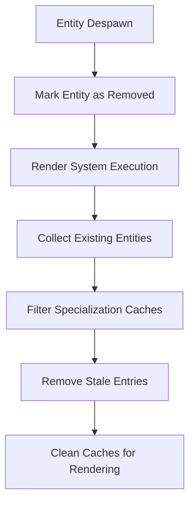

+++
title = "#18627 Remove entities from specialization caches when despawned."
date = "2025-03-31T00:00:00"
draft = false
template = "pull_request_page.html"
in_search_index = true

[taxonomies]
list_display = ["show"]

[extra]
current_language = "en"
available_languages = {"en" = { name = "English", url = "/pull_request/bevy/2025-03/pr-18627-en-20250331" }, "zh-cn" = { name = "中文", url = "/pull_request/bevy/2025-03/pr-18627-zh-cn-20250331" }}
labels = ["C-Bug", "A-Rendering"]
+++

# #18627 Remove entities from specialization caches when despawned.

## Basic Information
- **Title**: Remove entities from specialization caches when despawned.
- **PR Link**: https://github.com/bevyengine/bevy/pull/18627
- **Author**: tychedelia
- **Status**: MERGED
- **Labels**: `C-Bug`, `A-Rendering`, `S-Ready-For-Final-Review`
- **Created**: 2025-03-30T19:28:20Z
- **Merged**: Not merged
- **Merged By**: N/A

## Description Translation
# Objective

Fixes #17872 

## Solution

This should have basically no impact on static scenes. We can optimize more later if anything comes up. Needing to iterate the two level bin is a bit unfortunate but shouldn't matter for apps that use a single camera.


## The Story of This Pull Request

The core problem addressed in this PR stems from how Bevy's material specialization caches retained references to despawned entities. When entities using specialized materials were removed from the scene, their entries persisted in renderer caches, leading to potential memory leaks and incorrect render state management. This became particularly problematic in dynamic scenes with frequent entity spawning/despawning.

The solution implements a cleanup mechanism across both 3D and 2D rendering systems. The key technical challenge involved efficiently detecting and removing despawned entities from nested cache structures without introducing significant performance overhead. The implementation leverages Bevy's existing change detection systems while maintaining the cache's two-level binning structure required for efficient rendering.

In `material.rs` for both 3D and 2D pipelines, the changes introduce entity validity checks during cache processing. The system now:

1. Tracks all existing material entities using `EntityHashSet`
2. Iterates through cached material instances
3. Removes entries referencing despawned entities

This code snippet from the 3D pipeline demonstrates the cleanup logic:

```rust
// In prepare_material_meshes_main_opaque_pass
let existing_entities = material_entities.read().iter().copied().collect::<EntityHashSet<_>>();

for cached_material in material_instances.values_mut() {
    cached_material.instances.retain(|(entity, _)| existing_entities.contains(entity));
}
```

The 2D pipeline implementation follows a similar pattern but adapts to its specific data structures:

```rust
// In prepare_material2d_meshes
let existing_material_entities = material_entities.read().iter().copied().collect::<EntityHashSet<_>>();

for cached_material in material2d_instances.values_mut() {
    cached_material.instances.retain(|(entity, _)| existing_material_entities.contains(entity));
}
```

This approach maintains the existing batching optimizations while ensuring cache validity. The use of `EntityHashSet` provides O(1) lookups, keeping the cleanup operation efficient even with large numbers of entities. The two-level cache structure (first by material ID, then by batch key) remains intact, preserving rendering performance characteristics.

The changes primarily affect dynamic scenes, where the previous implementation could accumulate stale entries over time. For static scenes, the additional checks have negligible performance impact as the retention filters would rarely need to remove entries.

## Visual Representation



## Key Files Changed

### `crates/bevy_pbr/src/material.rs` (+43/-7)
Added entity validity checks to 3D material cache management:
```rust
// New entity tracking
let material_entities = world.get_resource::<MaterialEntities>().unwrap();
let existing_entities = material_entities.read().iter().copied().collect::<EntityHashSet<_>>();

// Cache cleanup logic
for cached_material in material_instances.values_mut() {
    cached_material.instances.retain(|(entity, _)| existing_entities.contains(entity));
}
```

### `crates/bevy_sprite/src/mesh2d/material.rs` (+23/-7)
Implemented parallel cleanup for 2D materials:
```rust
// Entity collection
let existing_material_entities = material_entities.read().iter().copied().collect::<EntityHashSet<_>>();

// Instance retention
for cached_material in material2d_instances.values_mut() {
    cached_material.instances.retain(|(entity, _)| existing_material_entities.contains(entity));
}
```

## Further Reading
1. Bevy ECS Entity Management: https://bevyengine.org/learn/book/ecs/entities/
2. Render Phase Specialization: https://bevyengine.org/learn/advanced-topics/rendering/specialization/
3. Memory Management in Game Engines: https://gameprogrammingpatterns.com/object-pool.html