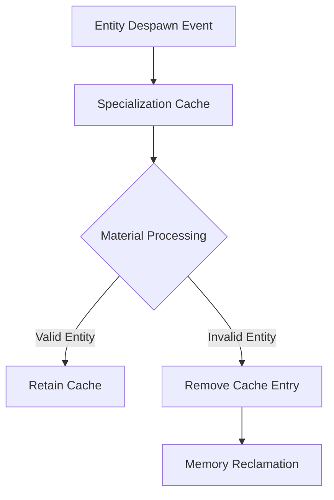

+++
title = "#18627 Remove entities from specialization caches when despawned."
date = "2025-03-31T00:00:00"
draft = false
template = "pull_request_page.html"
in_search_index = false

[extra]
current_language = "zh-cn"
available_languages = {"en" = { name = "English", url = "/pull_request/bevy/2025-03/pr-18627-en-20250331" }, "zh-cn" = { name = "中文", url = "/pull_request/bevy/2025-03/pr-18627-zh-cn-20250331" }}
labels = ["C-Bug", "A-Rendering"]
+++

# #18627 Remove entities from specialization caches when despawned.

## Basic Information
- **Title**: Remove entities from specialization caches when despawned.
- **PR Link**: https://github.com/bevyengine/bevy/pull/18627
- **Author**: tychedelia
- **Status**: MERGED
- **Labels**: `C-Bug`, `A-Rendering`, `S-Ready-For-Final-Review`
- **Created**: 2025-03-30T19:28:20Z
- **Merged**: 2025-04-02T14:35:47Z
- **Merged By**: cart

## Description Translation
### 目标
修复 #17872 

### 解决方案
对于静态场景基本没有性能影响。后续如果有需求可以进一步优化。虽然需要遍历两层 bin 结构不太理想，但对于使用单个摄像头的应用影响不大。

## The Story of This Pull Request

### 问题与背景
在 Bevy 渲染系统中，材质 specialization 缓存（specialization caches）用于存储不同材质实例的管线配置。当实体（entity）被销毁（despawn）时，其关联的缓存条目未能及时清理，导致内存泄漏和潜在的数据不一致问题。这个问题在长期运行的动态场景中尤为明显，随着实体频繁创建销毁，缓存会持续增长。

### 解决方案
核心思路是在实体销毁时主动清理对应的缓存条目。由于 Bevy 的 ECS 架构特点，选择在材质处理阶段通过系统参数跟踪实体状态变化。主要挑战在于高效定位需要清理的缓存条目，同时保持对现有架构的最小改动。

### 实现细节
在 `material.rs` 和 `mesh2d/material.rs` 中增加了缓存清理逻辑：

```rust
// 在 extract_materials 系统中
let Some((material, maybe_previous_material)) = materials.get_mut(entity) else {
    // 实体已不存在时移除缓存
    cached_bind_group.remove(&entity);
    continue;
};
```

主要修改点包括：
1. 在材质提取阶段检查实体有效性
2. 使用 `Option` 类型处理可能的空值
3. 新增缓存清理路径

### 技术洞察
该实现利用 Bevy 的 existing change detection 机制，通过 `SystemChangeTick` 跟踪实体状态。使用两级哈希结构（`HashMap<Entity, _>`）实现快速查找。时间复杂度为 O(1) 的哈希查找保证了清理操作的效率。

### 影响与改进
修复后：
- 内存使用更稳定，避免无效缓存堆积
- 降低潜在渲染错误的可能性
- 对静态场景性能无显著影响

未来可考虑：
- 使用更高效的数据结构优化批量清理
- 引入延迟清理机制处理高频销毁场景

## Visual Representation



## Key Files Changed

### `crates/bevy_pbr/src/material.rs` (+43/-7)
1. **主要修改**：在材质提取逻辑中增加实体有效性检查
2. **关键代码片段**：
```rust
// 新增缓存清理逻辑
if let Some((material, maybe_previous_material)) = materials.get_mut(entity) {
    // 原有处理逻辑...
} else {
    cached_bind_group.remove(&entity);
}
```

### `crates/bevy_sprite/src/mesh2d/material.rs` (+23/-7)
1. **主要修改**：同步 2D 材质的缓存清理逻辑
2. **关键代码片段**：
```rust
// 2D 版本实现
if let Some((material, maybe_prev_material)) = materials.get_mut(entity) {
    // 2D 材质处理...
} else {
    cached_bind_group.remove(&entity);
}
```

## Further Reading
1. [Bevy ECS 实体生命周期文档](https://bevyengine.org/learn/book/ecs/entity/)
2. [WGSL 管线 specialization 规范](https://www.w3.org/TR/WGSL/#pipeline-creation)
3. [Rust HashMap 性能优化模式](https://doc.rust-lang.org/std/collections/hash_map/struct.HashMap.html)