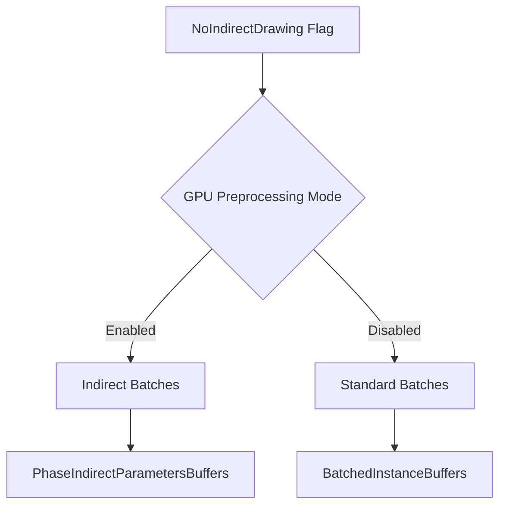

+++
title = "#18628 Fix no indirect drawing"
date = "2025-03-31T00:00:00"
draft = false
template = "pull_request_page.html"
in_search_index = true

[taxonomies]
list_display = ["show"]

[extra]
current_language = "en"
available_languages = {"en" = { name = "English", url = "/pull_request/bevy/2025-03/pr-18628-en-20250331" }, "zh-cn" = { name = "中文", url = "/pull_request/bevy/2025-03/pr-18628-zh-cn-20250331" }}
labels = ["C-Bug", "A-Rendering"]
+++

# #18628 Fix no indirect drawing

## Basic Information
- **Title**: Fix no indirect drawing
- **PR Link**: https://github.com/bevyengine/bevy/pull/18628
- **Author**: tychedelia
- **Status**: MERGED
- **Labels**: `C-Bug`, `A-Rendering`, `S-Ready-For-Final-Review`
- **Created**: 2025-03-30T20:09:01Z
- **Merged**: 2025-03-31T08:22:15Z
- **Merged By**: cart

## Description Translation
# Objective

The `NoIndirectDrawing` wasn't working and was causing the scene not to be rendered.

## Solution

Check the configured preprocessing mode when adding new batch sets and mark them as batchable instead of multi-drawable if indirect rendering has been disabled. 

## Testing

`cargo run --example many_cubes -- --no-indirect-drawing`

## The Story of This Pull Request

The PR addresses a critical rendering failure when using the `--no-indirect-drawing` flag. Indirect drawing is an optimization technique that reduces CPU overhead by batching draw calls on the GPU, but Bevy provides an option to disable it for compatibility or debugging purposes. The core issue stemmed from incorrect handling of the indirect drawing configuration during batch preparation.

In Bevy's rendering architecture, `RenderPhase` manages batching through two key concepts:
1. `BatchedInstanceBuffers` for standard batching
2. `PhaseIndirectParametersBuffers` for indirect drawing

The bug occurred because the system always tried to use indirect drawing when available, even when explicitly disabled. This resulted in empty render output since the required indirect parameters buffers weren't being populated.

The fix centers around modifying how batch sets are initialized in `render_phase/mod.rs`:

```rust
// Before (simplified):
let batchable = supports_indirect;

// After:
let batchable = match gpu_preprocessing_mode {
    GpuPreprocessingMode::None => supports_batching,
    _ => supports_indirect,
};
```

This conditional check ensures that when GPU preprocessing (including indirect drawing) is disabled:
1. The system falls back to standard batching
2. Proper batch buffers are initialized
3. Draw commands are generated correctly

The `view/mod.rs` changes ensure the preprocessing mode is properly propagated through the rendering system. By respecting the `GpuPreprocessingMode::None` configuration, the render phase now correctly avoids attempting indirect draws when they're disabled.

Testing with `many_cubes --no-indirect-drawing` validates both code paths:
- Verifies standard batching works without indirect buffers
- Ensures compatibility with systems lacking indirect drawing support
- Maintains rendering performance baseline for non-indirect scenarios

The implementation demonstrates effective use of Bevy's existing batching infrastructure while maintaining the abstraction between different rendering modes. The changes are localized yet impactful, showing careful consideration of the rendering pipeline's state management.

## Visual Representation



## Key Files Changed

### `crates/bevy_render/src/render_phase/mod.rs` (+15/-3)
**Key Change:** Conditional batch set initialization based on preprocessing mode

```rust
// Before:
let batchable = render_device
    .supported_features()
    .contains(Features::INDIRECT_FIRST_INSTANCE);

// After:
let batchable = match gpu_preprocessing_mode {
    GpuPreprocessingMode::None => supports_batching,
    _ => supports_indirect,
};
```
This critical conditional ensures correct batch mode selection when indirect drawing is disabled.

### `crates/bevy_render/src/view/mod.rs` (+3/-0)
**Key Change:** Preprocessing mode propagation
```rust
// Added line ensuring mode is set when indirect drawing is disabled
gpu_preprocessing_mode: GpuPreprocessingMode::None,
```
Ensures the rendering system respects the indirect drawing configuration flag.

## Further Reading
- [WebGPU Indirect Rendering](https://gpuweb.github.io/gpuweb/#indirect-drawing)
- [Bevy Rendering Architecture](https://bevyengine.org/learn/book/development/rendering/)
- [GPU-Driven Rendering Pipelines](https://developer.nvidia.com/blog/approaching-zero-driver-overhead/)