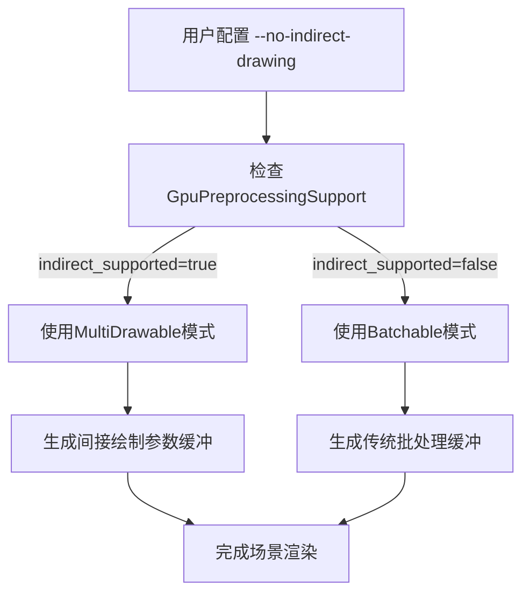

+++
title = "#18628 Fix no indirect drawing"
date = "2025-03-31T00:00:00"
draft = false
template = "pull_request_page.html"
in_search_index = false

[extra]
current_language = "zh-cn"
available_languages = {"en" = { name = "English", url = "/pull_request/bevy/2025-03/pr-18628-en-20250331" }, "zh-cn" = { name = "中文", url = "/pull_request/bevy/2025-03/pr-18628-zh-cn-20250331" }}
labels = ["C-Bug", "A-Rendering"]
+++

# #18628 Fix no indirect drawing

## Basic Information
- **Title**: Fix no indirect drawing
- **PR Link**: https://github.com/bevyengine/bevy/pull/18628
- **Author**: tychedelia
- **Status**: MERGED
- **Labels**: `C-Bug`, `A-Rendering`, `S-Ready-For-Final-Review`
- **Created**: 2025-03-30T20:09:01Z
- **Merged**: 2025-03-31T08:22:15Z
- **Merged By**: cart

## Description Translation
### 目标
`NoIndirectDrawing` 配置未生效导致场景无法渲染

### 解决方案
在添加新的批处理集时检查GPU预处理模式配置，当禁用间接渲染时将批处理标记为可批处理（batchable）而非多绘制（multi-drawable）

### 测试验证
`cargo run --example many_cubes -- --no-indirect-drawing`

## The Story of This Pull Request

### 问题背景
在Bevy渲染系统中，间接绘制（indirect drawing）通过`wgpu::Features::INDIRECT_FIRST_INSTANCE`特性实现，允许使用单个间接缓冲执行多次绘制调用。当用户通过`--no-indirect-drawing`参数禁用该功能时，现有的批处理系统错误地继续尝试使用多绘制指令（multi-draw），导致渲染管线无法正常工作，最终表现为场景无法渲染。

### 解决方案分析
核心问题在于批处理阶段的预处理模式选择逻辑未正确考虑间接绘制的禁用状态。修复方案需要：

1. 在创建批处理集时检查GPU预处理支持状态
2. 根据`indirect_supported`标志动态选择批处理策略
3. 禁用间接绘制时回退到传统批处理模式

### 技术实现
在`render_phase/mod.rs`中，关键的修改体现在`add_batch_set`方法的条件分支：

```rust
let buffers = if gpu_preprocessing.indirect_supported {
    PhaseBatchedInstanceBuffers::MultiDrawable(
        PhaseIndirectParametersBuffers::new(render_device),
    )
} else {
    PhaseBatchedInstanceBuffers::Batchable(
        BatchedInstanceBuffers::new(render_device),
    )
};
```

该修改：
- 检查`GpuPreprocessingSupport`的`indirect_supported`标志
- 支持时使用`MultiDrawable`（多绘制）模式
- 禁用时切换为`Batchable`（传统批处理）模式

### 架构影响
这个修改保持了渲染系统的扩展性：
1. 将决策点集中在批处理集创建阶段
2. 通过枚举类型`PhaseBatchedInstanceBuffers`封装不同模式
3. 保持后续处理流程与具体实现解耦

### 性能考量
间接绘制的禁用通常发生在目标硬件不支持该特性时，传统批处理模式虽然会增加CPU-GPU数据传输，但确保了兼容性。这种条件分支策略实现了自动降级机制，保障了跨硬件平台的可用性。

## Visual Representation



## Key Files Changed

### `crates/bevy_render/src/render_phase/mod.rs` (+15/-3)
1. **修改原因**：修复批处理模式选择逻辑
2. **关键代码片段**：
```rust
// 修改后的批处理集创建逻辑
let buffers = if gpu_preprocessing.indirect_supported {
    PhaseBatchedInstanceBuffers::MultiDrawable(
        PhaseIndirectParametersBuffers::new(render_device),
    )
} else {
    PhaseBatchedInstanceBuffers::Batchable(
        BatchedInstanceBuffers::new(render_device),
    )
};
```
3. **关联性**：这是实现模式切换的核心逻辑，直接影响渲染策略的选择

### `crates/bevy_render/src/view/mod.rs` (+3/-0)
1. **修改原因**：补充类型引用以支持新逻辑
2. **关键代码片段**：
```rust
use crate::render_phase::{
    PhaseBatchedInstanceBuffers, PhaseIndirectParametersBuffers, 
};
```
3. **关联性**：确保视图系统能正确访问批处理相关的类型定义

## Further Reading
1. [WebGPU Indirect Drawing Specification](https://www.w3.org/TR/webgpu/#indirect-drawing)
2. [Bevy Rendering Architecture Guide](https://bevyengine.org/learn/book/rendering/architecture/)
3. [wgpu::Features文档](https://docs.rs/wgpu/latest/wgpu/struct.Features.html#associatedconstant.INDIRECT_FIRST_INSTANCE)