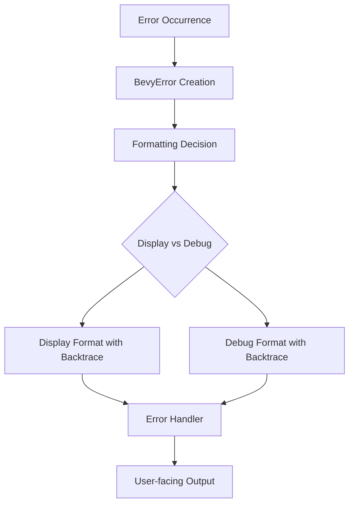

+++
title = "#18629 Use Display instead of Debug in the default error handler"
date = "2025-03-31T00:00:00"
draft = false
template = "pull_request_page.html"
in_search_index = true

[taxonomies]
list_display = ["show"]

[extra]
current_language = "en"
available_languages = {"en" = { name = "English", url = "/pull_request/bevy/2025-03/pr-18629-en-20250331" }, "zh-cn" = { name = "中文", url = "/pull_request/bevy/2025-03/pr-18629-zh-cn-20250331" }}
labels = ["A-ECS", "C-Usability"]
+++

# #18629 Use Display instead of Debug in the default error handler

## Basic Information
- **Title**: Use Display instead of Debug in the default error handler
- **PR Link**: https://github.com/bevyengine/bevy/pull/18629
- **Author**: chescock
- **Status**: MERGED
- **Labels**: `A-ECS`, `C-Usability`, `S-Ready-For-Final-Review`
- **Created**: 2025-03-30T20:38:38Z
- **Merged**: Not merged
- **Merged By**: N/A

## Description Translation
# Objective

Improve error messages for missing resources.  

The default error handler currently prints the `Debug` representation of the error type instead of `Display`.  Most error types use `#[derive(Debug)]`, resulting in a dump of the structure, but will have a user-friendly message for `Display`.  

Follow-up to #18593

## Solution

Change the default error handler to use `Display` instead of `Debug`.  

Change `BevyError` to include the backtrace in the `Display` format in addition to `Debug` so that it is still included.  

## Showcase

Before: 

```
Encountered an error in system `system_name`: SystemParamValidationError { skipped: false, message: "Resource does not exist", param: "bevy_ecs::change_detection::Res<app_name::ResourceType>" }

Encountered an error in system `other_system_name`: "String message with\nmultiple lines."
```

After

```
Encountered an error in system `system_name`: Parameter `Res<ResourceType>` failed validation: Resource does not exist

Encountered an error in system `other_system_name`: String message with
multiple lines.
```

## The Story of This Pull Request

The PR addresses a common pain point in Bevy's error reporting system. When systems encountered errors, the default handler would display the `Debug` representation of error types. While technically accurate, this often produced verbose output showing internal struct layouts rather than actionable messages. For example, a missing resource error would display field names like `skipped` and `param` alongside the actual message, adding noise to debugging sessions.

The core issue stemmed from how Rust's error traits are typically implemented. Many error types derive `Debug` automatically but require explicit `Display` implementations for user-friendly messages. Bevy's existing error handling pipeline used `Debug` formatting at the point of logging, missing out on more readable `Display` implementations.

The solution involved two key changes:
1. Modifying `BevyError`'s formatting to include backtraces in both `Debug` and `Display` outputs
2. Updating the default error handler to use `Display` formatting instead of `Debug`

In `bevy_error.rs`, the implementation was refactored to separate backtrace formatting logic. The `Display` implementation now delegates to a shared `format_error` function that includes both the error message and backtrace:

```rust
impl Display for BevyError {
    fn fmt(&self, f: &mut core::fmt::Formatter<'_>) -> core::fmt::Result {
        self.format_error(f)
    }
}

impl Debug for BevyError {
    fn fmt(&self, f: &mut core::fmt::Formatter<'_>) -> core::fmt::Result {
        self.format_error(f)
    }
}
```

This ensures backtrace information remains available regardless of formatting method. The `format_backtrace` function handles environment variable configuration for full vs trimmed backtraces.

In `handler.rs`, the error logging was updated to use `Display` formatting:

```rust
// Before
error!("Encountered an error in system `{}`: {:?}", name, error);

// After
error!("Encountered an error in system `{}`: {}", name, error);
```

This simple change leverages existing `Display` implementations of error types while maintaining critical diagnostic information through `BevyError`'s enhanced formatting.

The implementation demonstrates several important engineering considerations:
1. **Backward Compatibility**: By preserving backtrace output in both formatting methods, existing debugging workflows remain functional
2. **Environment Awareness**: The `BEVY_BACKTRACE` variable continues to control backtrace verbosity
3. **Error Context Preservation**: System names and other metadata are still included in logs
4. **Trait Utilization**: Proper use of Rust's standard formatting traits ensures consistency with ecosystem expectations

The changes particularly benefit common error scenarios like missing resources. For example, a `SystemParamValidationError` that previously displayed as:

```
SystemParamValidationError { skipped: false, message: "Resource does not exist", param: "Res<MyResource>" }
```

Now appears as:

```
Parameter `Res<MyResource>` failed validation: Resource does not exist
```

This makes error messages more focused and actionable for developers. The PR also updates documentation examples to demonstrate the improved formatting, helping users understand the new behavior.

## Visual Representation



## Key Files Changed

1. `crates/bevy_ecs/src/error/bevy_error.rs`
```rust
// Before:
impl Debug for BevyError {
    fn fmt(&self, f: &mut core::fmt::Formatter<'_>) -> core::fmt::Result {
        // Debug format without backtrace
    }
}

// After:
impl Display for BevyError {
    fn fmt(&self, f: &mut core::fmt::Formatter<'_>) -> core::fmt::Result {
        self.format_error(f)
    }
}

impl Debug for BevyError {
    fn fmt(&self, f: &mut core::fmt::Formatter<'_>) -> core::fmt::Result {
        self.format_error(f)
    }
}
```
Centralizes error formatting logic and ensures backtrace inclusion in both display modes.

2. `crates/bevy_ecs/src/error/handler.rs`
```rust
// Before:
error!("Encountered an error in system `{}`: {:?}", name, error);

// After:
error!("Encountered an error in system `{}`: {}", name, error);
```
Switches error logging to use Display formatting instead of Debug.

3. `examples/ecs/error_handling.rs`
Updated example outputs to reflect new formatting behavior, demonstrating the improved user experience.

## Further Reading

1. [Rust Error Handling Book Chapter](https://doc.rust-lang.org/book/ch09-00-error-handling.html)
2. [Bevy ECS Error Handling Documentation](https://bevyengine.org/learn/book/error-handling/)
3. [Rust Formatting Traits Explained](https://doc.rust-lang.org/std/fmt/index.html#formatting-traits)
4. [Backtrace Handling in Rust](https://doc.rust-lang.org/std/backtrace/index.html)