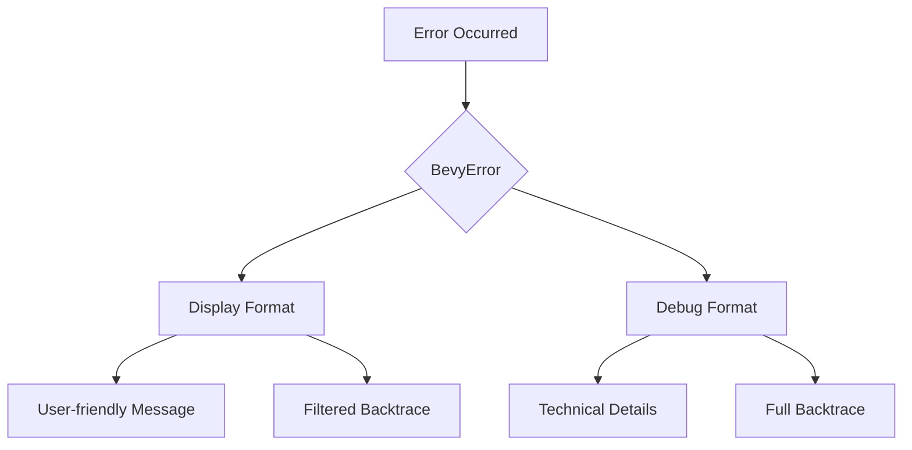

+++
title = "#18629 Use Display instead of Debug in the default error handler"
date = "2025-03-31T00:00:00"
draft = false
template = "pull_request_page.html"
in_search_index = false

[extra]
current_language = "zh-cn"
available_languages = {"en" = { name = "English", url = "/pull_request/bevy/2025-03/pr-18629-en-20250331" }, "zh-cn" = { name = "中文", url = "/pull_request/bevy/2025-03/pr-18629-zh-cn-20250331" }}
labels = ["A-ECS", "C-Usability"]
+++

# #18629 Use Display instead of Debug in the default error handler

## Basic Information
- **Title**: Use Display instead of Debug in the default error handler
- **PR Link**: https://github.com/bevyengine/bevy/pull/18629
- **Author**: chescock
- **Status**: MERGED
- **Labels**: `A-ECS`, `C-Usability`, `S-Ready-For-Final-Review`
- **Created**: 2025-03-30T20:38:38Z
- **Merged**: 2025-03-31T09:12:15Z
- **Merged By**: alice-i-cecile

## Description Translation
### 目标
改进缺失资源时的错误信息。当前默认错误处理器打印错误类型的`Debug`表示形式而非`Display`。大多数错误类型使用`#[derive(Debug)]`会输出结构体转储，而`Display`会提供用户友好的消息。这是#18593的后续改进。

### 解决方案
将默认错误处理器改为使用`Display`而非`Debug`。修改`BevyError`使其在`Display`格式中包含backtrace（同时保留`Debug`中的展示）。

### 效果对比
修改前：
```
Encountered an error in system `system_name`: SystemParamValidationError { skipped: false, message: "Resource does not exist", param: "bevy_ecs::change_detection::Res<app_name::ResourceType>" }
```
修改后：
```
Encountered an error in system `system_name`: Parameter `Res<ResourceType>` failed validation: Resource does not exist
```

## The Story of This Pull Request

### 问题背景与挑战
在Bevy引擎的错误处理机制中，开发团队注意到现有实现存在信息展示不友好的问题。当系统参数验证失败时，错误信息会以`Debug` trait的格式输出，导致显示类似`SystemParamValidationError { ... }`的结构体转储。这对开发者调试不够直观，特别是当错误消息包含多行信息时，原始实现会导致换行符显示为`\n`转义字符。

问题的核心在于Bevy的全局错误处理器默认使用`Debug`格式输出错误。虽然Rust的`Debug` trait对于开发调试很有用，但大多数错误类型通过`Display` trait提供了更友好的用户消息。这个问题在#18593的后续优化中被识别，需要统一改进错误展示方式。

### 解决方案与技术实现
PR通过三个关键修改点解决问题：

1. **错误格式化策略调整**  
   在`BevyError`的`Display`实现中增加backtrace信息，同时保持`Debug`实现的完整性。这使得无论使用哪种格式都能获取完整的调试信息。

```rust
// crates/bevy_ecs/src/error/bevy_error.rs
impl Display for BevyError {
    fn fmt(&self, f: &mut core::fmt::Formatter<'_>) -> core::fmt::Result {
        write!(f, "{}", self.inner.error)?;
        self.format_backtrace(f)?; // 新增backtrace展示
        Ok(())
    }
}
```

2. **全局错误处理器改造**  
   将默认错误处理器从使用`Debug`格式改为`Display`格式，直接影响错误信息的展示方式：

```rust
// crates/bevy_ecs/src/error/handler.rs
// 修改前使用{:?}格式
eprintln!("Encountered an error in system `{}`: {:?}", context, error);

// 修改后使用{}格式
eprintln!("Encountered an error in system `{}`: {}", context, error);
```

3. **示例与测试更新**  
   在`error_handling.rs`示例中更新错误处理逻辑，验证新的展示格式是否符合预期。

### 技术洞察与工程决策
- **双格式支持**：保留`Debug`实现中的完整技术细节，同时在`Display`中增加backtrace信息。这种设计平衡了调试需求与用户友好性。
- **环境变量控制**：通过`BEVY_BACKTRACE=full`环境变量控制backtrace的详细程度，避免默认输出过于冗长。
- **向后兼容**：修改仅影响错误展示形式，不改变现有错误处理的工作流程，保证API兼容性。

### 影响与改进
该PR带来的主要改进包括：
1. 错误信息可读性提升：典型错误消息从结构体转储变为自然语言描述
2. 多行错误支持：`Display`格式正确保留原始换行符
3. 调试信息保留：backtrace同时存在于两种格式中，满足不同场景需求
4. 统一错误处理模式：为后续错误处理改进建立规范

## Visual Representation



## Key Files Changed

### 1. `crates/bevy_ecs/src/error/bevy_error.rs`
**修改重点**：增强`Display`实现，整合backtrace信息
```rust
// Before:
impl Display for BevyError {
    fn fmt(&self, f: &mut core::fmt::Formatter<'_>) -> core::fmt::Result {
        write!(f, "{}", self.inner.error)
    }
}

// After:
impl Display for BevyError {
    fn fmt(&self, f: &mut core::fmt::Formatter<'_>) -> core::fmt::Result {
        write!(f, "{}", self.inner.error)?;
        self.format_backtrace(f)?;
        Ok(())
    }
}
```

### 2. `crates/bevy_ecs/src/error/handler.rs`
**修改重点**：变更错误打印格式
```rust
// Before:
eprintln!("...: {:?}", error);

// After: 
eprintln!("...: {}", error);
```

### 3. `examples/ecs/error_handling.rs`
**修改重点**：更新示例验证新格式
```rust
// 修改前使用Debug输出
info!("Debug format: {:?}", err);

// 修改后使用Display输出
info!("Display format: {}", err);
```

## Further Reading
1. [Rust Error Handling Book](https://doc.rust-lang.org/book/ch09-00-error-handling.html) - Rust官方错误处理指南
2. [Bevy ECS SystemParam Documentation](https://bevyengine.org/learn/book/next/ecs/system-param/) - 系统参数验证机制
3. [std::fmt Module](https://doc.rust-lang.org/std/fmt/) - Rust格式化输出标准库文档
4. [Backtrace Handling in Rust](https://rust-lang-nursery.github.io/rust-cookbook/development_tools/debugging/backtrace.html) - Backtrace处理最佳实践