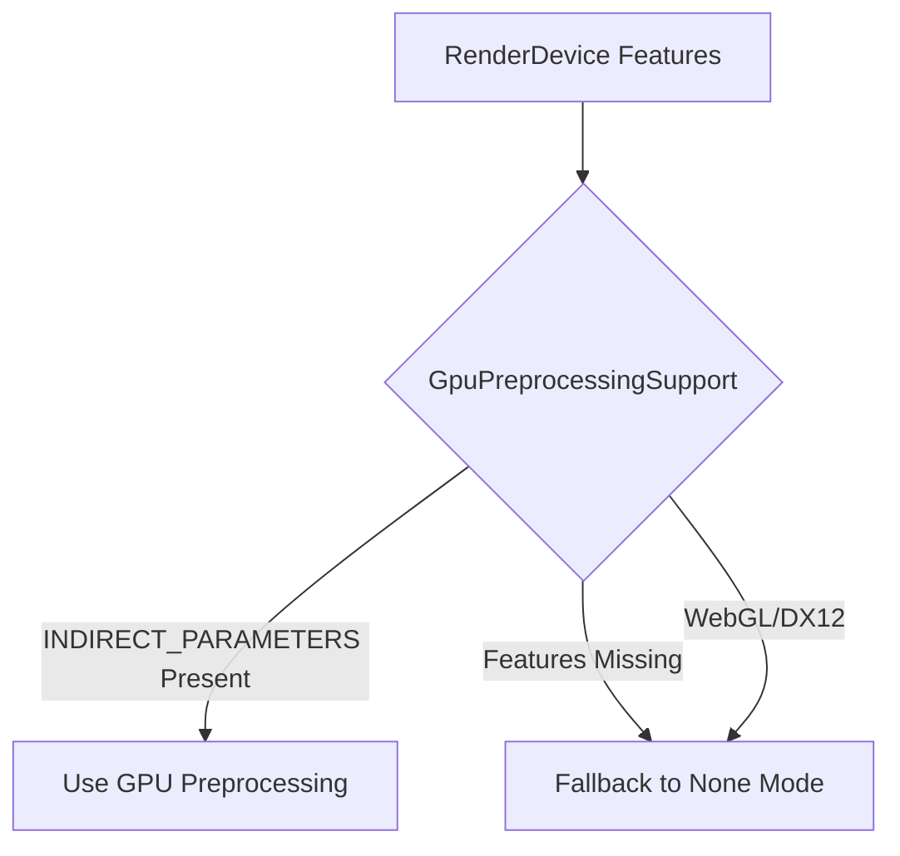

+++
title = "#18630 Use GpuPreprocessingMode::None if features not supported."
date = "2025-03-31T00:00:00"
draft = false
template = "pull_request_page.html"
in_search_index = true

[taxonomies]
list_display = ["show"]

[extra]
current_language = "en"
available_languages = {"en" = { name = "English", url = "/pull_request/bevy/2025-03/pr-18630-en-20250331" }, "zh-cn" = { name = "中文", url = "/pull_request/bevy/2025-03/pr-18630-zh-cn-20250331" }}
labels = ["C-Bug", "A-Rendering"]
+++

# #18630 Use GpuPreprocessingMode::None if features not supported.

## Basic Information
- **Title**: Use GpuPreprocessingMode::None if features not supported.
- **PR Link**: https://github.com/bevyengine/bevy/pull/18630
- **Author**: tychedelia
- **Status**: MERGED
- **Labels**: `C-Bug`, `A-Rendering`, `S-Ready-For-Final-Review`
- **Created**: 2025-03-30T21:23:34Z
- **Merged**: Not merged
- **Merged By**: N/A

## Description Translation
# Objective

Fixes #18463 

## Solution

The features didn't seem to be getting checked for selecting `GpuPreprocessingMode::None`.

## The Story of This Pull Request

The core issue stemmed from Bevy's rendering system improperly handling GPU capability checks when configuring preprocessing modes. The renderer's batching system uses `GpuPreprocessingMode` to determine how to handle indirect draw parameters, but critical feature checks were missing in the mode selection logic.

In the original implementation, the `GpuPreprocessingSupport` resource determined its mode through device properties but didn't properly validate required features. This led to situations where systems without the `INDIRECT_PARAMETERS` feature or compute shader support would attempt to use unsupported preprocessing modes, causing rendering errors.

The fix centered around enhancing the feature checking in `GpuPreprocessingSupport` initialization. The key modification appears in the `FromWorld` implementation where device capabilities are now properly evaluated:

```rust
// Before: Incomplete feature checks
let supports_indirect_parameters = adapter.get_downlevel_capabilities().flags
    .contains(DownlevelFlags::INDIRECT_PARAMETERS);

// After: Comprehensive feature validation
let supports_indirect_parameters = render_device
    .features()
    .contains(Features::INDIRECT_PARAMETERS)
    && adapter.get_downlevel_capabilities().flags
        .contains(DownlevelFlags::INDIRECT_PARAMETERS);
```

This change ensures both the hardware adapter capabilities and explicit feature enablement are verified. The logic now properly falls back to `GpuPreprocessingMode::None` when:
1. The platform is WebGL (lacking compute support)
2. The `INDIRECT_PARAMETERS` feature is unavailable
3. Using DX12 backend (due to wgpu limitations)

A secondary but important adjustment was made to buffer usage flags when indirect parameter copies are allowed:

```rust
// Modified buffer usage based on debug flags
let usage = if self.allow_copies_from_indirect_parameters {
    BufferUsages::COPY_SRC | BufferUsages::COPY_DST
} else {
    BufferUsages::empty()
};
```

This prevents invalid buffer operations when working with indirect parameters in restricted environments. The changes collectively ensure Bevy's rendering system makes appropriate technical decisions based on actual device capabilities rather than making optimistic assumptions.

## Visual Representation



## Key Files Changed

### `crates/bevy_render/src/batching/gpu_preprocessing.rs` (+2/-1)
1. **Feature Check Enhancement**
```rust
// Before: Single capability check
let supports_indirect_parameters = adapter.get_downlevel_capabilities().flags
    .contains(DownlevelFlags::INDIRECT_PARAMETERS);

// After: Comprehensive feature validation
let supports_indirect_parameters = render_device
    .features()
    .contains(Features::INDIRECT_PARAMETERS)
    && adapter.get_downlevel_capabilities().flags
        .contains(DownlevelFlags::INDIRECT_PARAMETERS);
```
This change ensures both the adapter capabilities and explicit feature enablement are verified before enabling preprocessing.

2. **Buffer Usage Adjustment**
```rust
// Modified buffer usage logic
let usage = if self.allow_copies_from_indirect_parameters {
    BufferUsages::COPY_SRC | BufferUsages::COPY_DST
} else {
    BufferUsages::empty()
};
```
Prevents invalid buffer operations when indirect parameter copies are not permitted.

## Further Reading
- [WebGPU Feature Matrix](https://github.com/gpuweb/gpuweb/wiki/Implementation-Status)
- [Bevy Rendering Architecture](https://bevyengine.org/learn/book/rendering/)
- [wgpu Buffer Usage Documentation](https://docs.rs/wgpu/latest/wgpu/struct.BufferUsages.html)