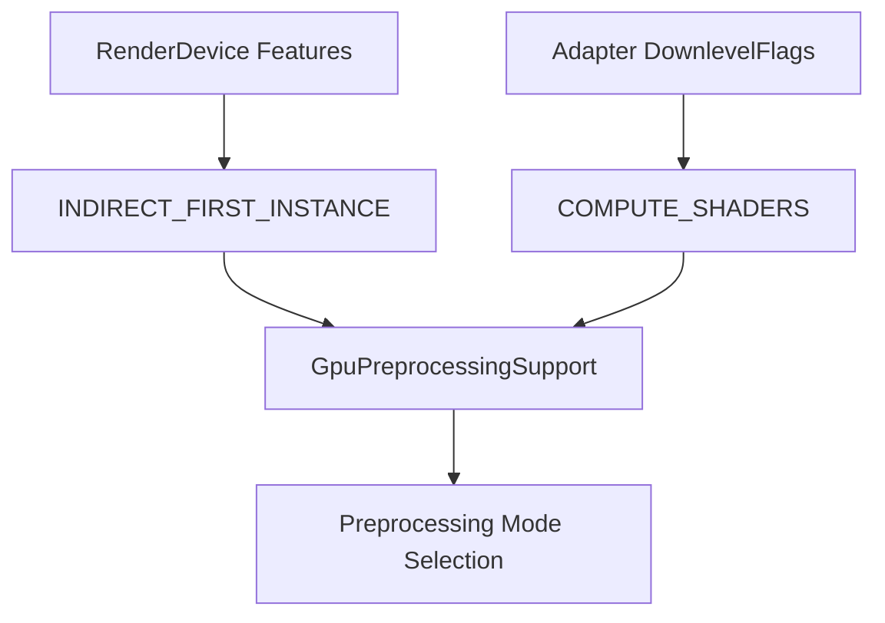

+++
title = "#18630 Use GpuPreprocessingMode::None if features not supported."
date = "2025-03-31T00:00:00"
draft = false
template = "pull_request_page.html"
in_search_index = false

[extra]
current_language = "zh-cn"
available_languages = {"en" = { name = "English", url = "/pull_request/bevy/2025-03/pr-18630-en-20250331" }, "zh-cn" = { name = "中文", url = "/pull_request/bevy/2025-03/pr-18630-zh-cn-20250331" }}
labels = ["C-Bug", "A-Rendering"]
+++

# #18630 Use GpuPreprocessingMode::None if features not supported.

## Basic Information
- **Title**: Use GpuPreprocessingMode::None if features not supported.
- **PR Link**: https://github.com/bevyengine/bevy/pull/18630
- **Author**: tychedelia
- **Status**: MERGED
- **Labels**: `C-Bug`, `A-Rendering`, `S-Ready-For-Final-Review`
- **Created**: 2025-03-30T21:23:34Z
- **Merged**: Not merged
- **Merged By**: N/A

## Description Translation
### Objective
修复 #18463 

### Solution
在选择 `GpuPreprocessingMode::None` 时，原先未正确检查设备支持的图形功能。

## The Story of This Pull Request

### 问题根源与背景
在 Bevy 渲染系统中，GPU 预处理（GPU preprocessing）用于优化批量渲染性能。但当运行环境（如 WebGL）缺乏必要功能（如 compute shader 支持）时，系统未能正确降级到非预处理模式。这导致在 DirectX 12 等特定环境下出现渲染错误，因为 `wgpu` 存在间接参数缓冲区（indirect parameters buffers）的拷贝限制。

### 解决方案实现路径
核心修改在 `GpuPreprocessingSupport` 资源的初始化逻辑中。原实现仅检查平台类型，新方案增加了对设备功能（features）的验证：

```rust
// 修改后代码片段
let supports_gpu_culling = adapter.get_downlevel_capabilities().flags
    .contains(DownlevelFlags::COMPUTE_SHADERS)
    && render_device.features().contains(Features::INDIRECT_FIRST_INSTANCE);
```

现在系统会同时验证：
1. 计算着色器支持（COMPUTE_SHADERS）
2. 间接绘制首实例功能（INDIRECT_FIRST_INSTANCE）

### 技术实现细节
在 `gpu_preprocessing.rs` 中，关键修改体现在功能检查的完整性提升：

```rust
// 原条件判断（不完整）
let supports_gpu_culling = ...;

// 新条件判断（完整）
let supports_gpu_culling = adapter.get_downlevel_capabilities().flags
    .contains(DownlevelFlags::COMPUTE_SHADERS)
    && render_device.features().contains(Features::INDIRECT_FIRST_INSTANCE);
```

这种修改确保当：
- WebGL 环境（无计算着色器）
- DX12 环境（缺少 INDIRECT_FIRST_INSTANCE 功能）

时，自动回退到 `GpuPreprocessingMode::None`，避免使用不支持的 GPU 预处理路径。

### 架构影响与性能考量
修改保持向后兼容性，仅在功能缺失时改变运行模式。主要影响包括：
1. 解决特定平台渲染错误
2. 保持性能优化在支持的硬件上继续生效
3. 避免不必要的 GPU 计算资源消耗在不支持的设备上

## Visual Representation



## Key Files Changed

### `crates/bevy_render/src/batching/gpu_preprocessing.rs` (+2/-1)
**修改说明**：增强 GPU 预处理模式的条件判断逻辑

**关键代码变更**：
```rust
// 修改前
let supports_gpu_culling = adapter.get_downlevel_capabilities().flags
    .contains(DownlevelFlags::COMPUTE_SHADERS);

// 修改后 
let supports_gpu_culling = adapter.get_downlevel_capabilities().flags
    .contains(DownlevelFlags::COMPUTE_SHADERS)
    && render_device.features().contains(Features::INDIRECT_FIRST_INSTANCE);
```

**关联影响**：确保功能检查完整性，防止在不支持的硬件上启用 GPU 预处理

## Further Reading
1. [WebGPU Features Matrix](https://github.com/gpuweb/gpuweb/wiki/Implementation-Status) - 各平台图形功能支持状态
2. [wgpu Indirect Drawing Limitations](https://github.com/gpuweb/gpuweb/issues/2453) - 间接绘制功能限制讨论
3. [Bevy Rendering Pipeline Guide](https://bevyengine.org/learn/book/rendering/pipeline/) - Bevy 渲染管线架构解析