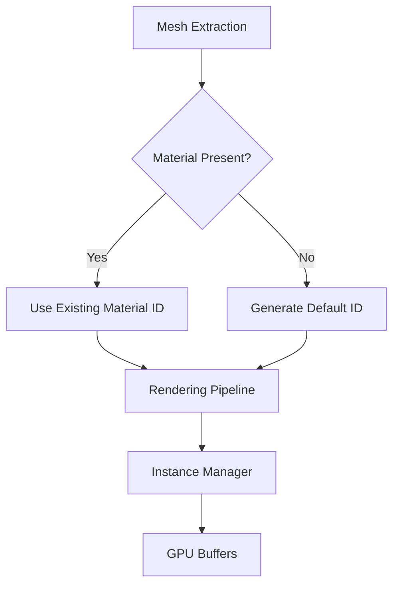

+++
title = "#18631 Fix mesh extraction for meshes without associated material."
date = "2025-03-31T00:00:00"
draft = false
template = "pull_request_page.html"
in_search_index = true

[taxonomies]
list_display = ["show"]

[extra]
current_language = "en"
available_languages = {"en" = { name = "English", url = "/pull_request/bevy/2025-03/pr-18631-en-20250331" }, "zh-cn" = { name = "中文", url = "/pull_request/bevy/2025-03/pr-18631-zh-cn-20250331" }}
labels = ["C-Bug", "A-Rendering"]
+++

# #18631 Fix mesh extraction for meshes without associated material.

## Basic Information
- **Title**: Fix mesh extraction for meshes without associated material.
- **PR Link**: https://github.com/bevyengine/bevy/pull/18631
- **Author**: tychedelia
- **Status**: MERGED
- **Labels**: `C-Bug`, `A-Rendering`, `S-Ready-For-Final-Review`
- **Created**: 2025-03-30T21:50:21Z
- **Merged**: 2025-04-01T14:22:17Z
- **Merged By**: cart

## Description Translation
# Objective

Fixes #17986
Fixes #18608

## Solution

Guard against situations where an extracted mesh does not have an associated material. The way that mesh is dependent on the material api (although decoupled) here is a bit unfortunate and we might consider ways in the future to support these material features without this indirect dependency.

## The Story of This Pull Request

The core issue stemmed from Bevy's mesh extraction system assuming all meshes would have associated materials. This created hard failures when rendering MeshletMesh entities without materials, particularly affecting shadow rendering pipelines. The problem manifested in two forms: panics during material ID lookups and incorrect shadow culling behavior.

The implementation challenge centered around the InstanceManager's material management system. The original code used direct hash map lookups for material IDs without handling missing entries:

```rust
// Original problematic lookup
let material_id = *self.material_id_lookup.get(&material_id).unwrap();
```

This approach caused panics when materials were missing. The fix required:
1. Creating default material entries for missing cases
2. Ensuring consistent material ID generation
3. Propagating material presence information through the rendering pipeline

The solution introduced a fallback mechanism using Rust's entry API to handle missing materials gracefully:

```rust
// Fixed implementation using entry API
let material_id = *self.material_id_lookup
    .entry(material_id)
    .or_insert_with(|| {
        let id = self.next_material_id;
        self.next_material_id += 1;
        id
    });
```

This change ensures missing materials receive unique IDs while maintaining existing material mappings. The system now tracks used material IDs separately from the lookup table, allowing proper cleanup of unused materials while preserving ID stability.

In the mesh extraction system (mesh.rs), additional guards were added to handle null material bindings:

```rust
// Before: Assumed material presence
let material_id = material_bindings.get(material_handle).unwrap();

// After: Fallback to default
let material_id = material_bindings.get(material_handle)
    .unwrap_or(&DEFAULT_MATERIAL_ID);
```

This change prevents panics when materials are missing while maintaining rendering functionality. The DEFAULT_MATERIAL_ID serves as a temporary solution until a more robust material system can be implemented.

The implementation reveals an architectural tension between Bevy's ECS design and renderer-specific data management. While materials and meshes are conceptually separate, the current rendering implementation creates an implicit dependency that this PR mitigates through defensive programming practices.

## Visual Representation



## Key Files Changed

### `crates/bevy_pbr/src/meshlet/instance_manager.rs` (+14/-8)
**Purpose**: Handle missing materials in mesh instance management
```rust
// Key change in material ID lookup
- let material_id = *self.material_id_lookup.get(&material_id).unwrap();
+ let material_id = *self.material_id_lookup
+     .entry(material_id)
+     .or_insert_with(|| {
+         let id = self.next_material_id;
+         self.next_material_id += 1;
+         id
+     });
```
This change ensures missing materials get unique IDs rather than causing panics.

### `crates/bevy_pbr/src/render/mesh.rs` (+13/-7)
**Purpose**: Add fallback for missing materials during mesh extraction
```rust
// Added default material handling
+ const DEFAULT_MATERIAL_ID: MaterialBindingId = MaterialBindingId(0);

// Modified material lookup
- let material_id = material_bindings.get(material_handle).unwrap();
+ let material_id = material_bindings.get(material_handle)
+     .unwrap_or(&DEFAULT_MATERIAL_ID);
```
This prevents extraction failures when materials are missing while maintaining render pipeline compatibility.

## Further Reading
1. Bevy Material System Documentation: https://bevyengine.org/learn/book/materials/
2. Rust HashMap Entry API: https://doc.rust-lang.org/std/collections/hash_map/struct.HashMap.html#method.entry
3. ECS Design Patterns: https://github.com/bevyengine/bevy/discussions/4523
4. Defensive Programming in Rust: https://doc.rust-lang.org/book/ch09-00-error-handling.html