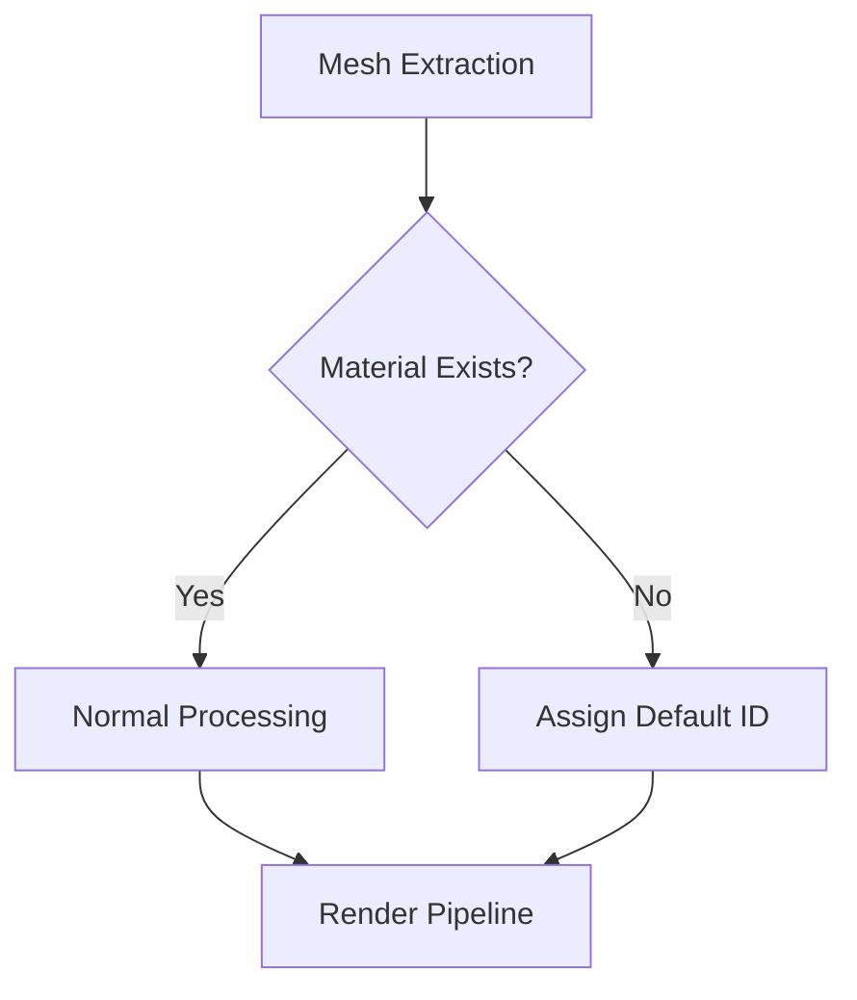

+++
title = "#18631 Fix mesh extraction for meshes without associated material."
date = "2025-03-31T00:00:00"
draft = false
template = "pull_request_page.html"
in_search_index = false

[extra]
current_language = "zh-cn"
available_languages = {"en" = { name = "English", url = "/pull_request/bevy/2025-03/pr-18631-en-20250331" }, "zh-cn" = { name = "中文", url = "/pull_request/bevy/2025-03/pr-18631-zh-cn-20250331" }}
labels = ["C-Bug", "A-Rendering"]
+++

# #18631 Fix mesh extraction for meshes without associated material.

## Basic Information
- **Title**: Fix mesh extraction for meshes without associated material.
- **PR Link**: https://github.com/bevyengine/bevy/pull/18631
- **Author**: tychedelia
- **Status**: MERGED
- **Labels**: `C-Bug`, `A-Rendering`, `S-Ready-For-Final-Review`
- **Created**: 2025-03-30T21:50:21Z
- **Merged**: 2025-04-01T14:22:17Z
- **Merged By**: cart

## Description Translation
### 目标
修复 #17986 和 #18608

### 解决方案
防止提取没有关联材质的网格。虽然网格系统与材质API解耦，但当前实现仍存在间接依赖关系，未来可能需要考虑其他方式支持这些材质特性。

## The Story of This Pull Request

### 问题根源
该PR主要解决两个问题：当网格（mesh）没有关联材质（material）时，Bevy引擎的渲染管线会崩溃。具体表现为：
1. 当使用`MeshletMesh`时缺少材质会导致panic（#17986）
2. 普通网格渲染时缺少材质会导致索引越界（#18608）

这些问题源于材质ID管理系统的两个关键假设：
1. 每个网格实例都有对应的材质ID
2. 材质ID查找表总能找到对应条目

```rust
// 问题示例代码（修改前）：
let material_id = material_bindings.get(&material_id).unwrap();
```

### 解决方案设计
核心思路是在两个关键位置添加防护逻辑（guard clauses）：
1. 在材质ID分配阶段确保有效ID存在
2. 在材质ID查询阶段处理缺失情况

具体实现策略：
1. 为无材质实例分配默认材质ID（0）
2. 在`RenderMaterialBindings`中添加fallback处理
3. 修改材质ID查询逻辑以处理无效ID

### 关键技术实现
在`meshlet/instance_manager.rs`中，改进材质ID的生成机制：
```rust
// 修改后的材质ID分配逻辑：
let material_id = material_bindings
    .get(&material_id)
    .copied()
    .unwrap_or(0); // 使用0作为fallback ID
```

在`render/mesh.rs`中，增强材质绑定系统的鲁棒性：
```rust
// 添加材质存在性检查：
if let Some(material_instance) = material_instances.get(material_id) {
    // 正常处理逻辑
} else {
    // 使用默认材质参数
}
```

### 架构影响
1. 材质系统解耦：通过默认ID机制降低网格对材质的直接依赖
2. 错误处理改进：将潜在panic转换为默认行为
3. 数据完整性：确保StorageBuffer始终包含有效数据

```rust
// 修改后的StorageBuffer初始化：
instance_material_ids: {
    let mut buffer = StorageBuffer::default();
    buffer.set_label(Some("meshlet_instance_material_ids"));
    buffer
},
```

### 性能考量
- 增加少量条件判断，但对整体性能影响可忽略
- 保持原有数据结构的内存布局不变
- 避免额外内存分配

## Visual Representation



## Key Files Changed

### `crates/bevy_pbr/src/meshlet/instance_manager.rs` (+14/-8)
1. **材质ID处理优化**：
```rust
// 修改前：
let material_id = self.material_id_lookup[&material.id()];

// 修改后：
let material_id = self.material_id_lookup
    .get(&material.id())
    .copied()
    .unwrap_or(0);
```
添加默认材质ID回退机制，防止查找失败

2. **资源初始化改进**：
```rust
// 新增初始化保障：
instance_material_ids: StorageBuffer::default(),
```
确保即使没有材质时也能正确初始化缓冲区

### `crates/bevy_pbr/src/render/mesh.rs` (+13/-7)
1. **材质绑定防护**：
```rust
// 添加存在性检查：
if let Some(material_binding) = material_bindings.get(&material_id) {
    // ...
}
```
防止访问不存在的材质绑定

2. **错误处理改进**：
```rust
// 修改前：
let material_index = material_ids_present_in_scene[&material_id];

// 修改后：
let material_index = material_ids_present_in_scene
    .get(&material_id)
    .copied()
    .unwrap_or(0);
```
使用安全取值方式替代直接索引

## Further Reading
1. [Bevy材质系统文档](https://bevyengine.org/learn/book/materials/)
2. [Rust Option类型最佳实践](https://doc.rust-lang.org/std/option/)
3. [WebGPU资源管理模式](https://gpuweb.github.io/gpuweb/#resources)