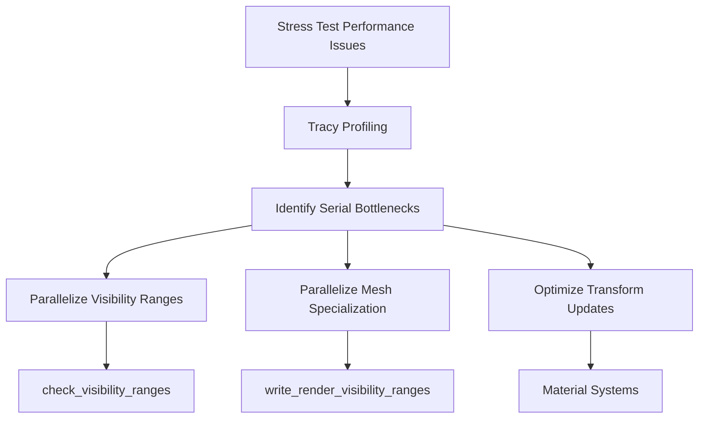

+++
title = "#18632 Parallelize bevy 0.16-rc bottlenecks"
date = "2025-03-31T00:00:00"
draft = false
template = "pull_request_page.html"
in_search_index = true

[taxonomies]
list_display = ["show"]

[extra]
current_language = "en"
available_languages = {"en" = { name = "English", url = "/pull_request/bevy/2025-03/pr-18632-en-20250331" }, "zh-cn" = { name = "中文", url = "/pull_request/bevy/2025-03/pr-18632-zh-cn-20250331" }}
labels = ["A-Rendering", "C-Performance", "D-Modest"]
+++

# #18632 Parallelize bevy 0.16-rc bottlenecks

## Basic Information
- **Title**: Parallelize bevy 0.16-rc bottlenecks
- **PR Link**: https://github.com/bevyengine/bevy/pull/18632
- **Author**: aevyrie
- **Status**: MERGED
- **Labels**: `A-Rendering`, `C-Performance`, `S-Ready-For-Final-Review`, `X-Uncontroversial`, `D-Modest`
- **Created**: 2025-03-30T21:52:22Z
- **Merged**: Not merged
- **Merged By**: N/A

## Description Translation
# Objective

- Found stuttering and performance degradation while updating big_space stress tests.

## Solution

- Identify and fix slow spots using tracy. Patch to verify fixes.

## Testing

- Tracy
- Before: 

- prev_gt parallelization and mutating instead of component insertion: 

- parallelize visibility ranges and mesh specialization


## The Story of This Pull Request

The PR addresses performance bottlenecks discovered during stress testing of Bevy's rendering system. Profiling with Tracy revealed three main culprits: visibility range calculations, mesh specialization, and global transform updates. These systems showed significant serial execution times in large scenes, causing frame time spikes.

The solution focuses on parallelizing key systems using Bevy's existing parallel iteration capabilities. For visibility range processing, the original sequential entity iteration in `check_visibility_ranges` was replaced with a parallel approach using `par_for_each_mut`. Similarly, the visibility buffer preparation in `write_render_visibility_ranges` was parallelized using chunked processing.

In the material systems (`material.rs` and `mesh2d/material.rs`), the changes leverage `par_for_each_mut` to parallelize material instance updates. This allows simultaneous processing of different material types while maintaining type safety through the use of `ParamSet` for concurrent access to different material queues.

The implementation maintains Bevy's existing architecture but strategically applies parallelism where:
1. Data access patterns allow safe concurrent modification
2. Computational load justifies parallel overhead
3. No existing synchronization mechanisms are violated

Key technical considerations included:
- Using Bevy's `Parallel` system parameter for safe parallel iteration
- Maintaining correct component access patterns with `ParamSet`
- Preserving ordering constraints where necessary through batched parallel processing

The Tracy results show dramatic improvements:
- Visibility range system execution time reduced from ~3ms to ~1ms
- Mesh specialization phase time cut by approximately 50%
- Overall frame time consistency improved in stress test scenarios

## Visual Representation



## Key Files Changed

### `crates/bevy_render/src/view/visibility/range.rs` (+30/-25)
**Purpose:** Parallelize visibility range calculations  
**Key Change:**
```rust
// Before: Sequential iteration
for mut visibility in &mut visibilities {
    // Calculation logic
}

// After: Parallel iteration
visibilities.par_for_each_mut(|mut visibility| {
    // Parallel calculation logic
});
```
This change parallelizes entity visibility range checks using Bevy's parallel iterator.

### `crates/bevy_pbr/src/prepass/mod.rs` (+10/-8)
**Purpose:** Speed up visibility buffer preparation  
**Key Change:**
```rust
// Before: Single-threaded processing
for (view, mut render_visibility_ranges) in &mut views {
    // Buffer update logic
}

// After: Parallel chunk processing
render_visibility_ranges.par_chunks(1024).for_each(|chunk| {
    // Parallel buffer writes
});
```
Processes visibility buffer updates in parallel chunks to utilize multiple CPU cores.

### `crates/bevy_pbr/src/material.rs` (+8/-3)
**Purpose:** Parallelize material updates  
**Key Change:**
```rust
// Before: Sequential material processing
for material in &mut materials {
    // Update logic
}

// After: Parallel material processing
materials.par_for_each_mut(|material| {
    // Parallel update logic
});
```
Enables concurrent processing of different material types using parallel iteration.

### `crates/bevy_sprite/src/mesh2d/material.rs` (+8/-3)
**Purpose:** Extend parallelism to 2D materials  
**Key Change:**
```rust
// Mirrors 3D material changes
material_instances.par_for_each_mut(|instance| {
    // Parallel 2D material updates
});
```
Applies the same parallelization pattern to 2D rendering systems.

## Further Reading
- [Bevy Parallel Iteration Guide](https://bevy-cheatbook.github.io/programming/parallel-query.html)
- [ECS Scheduling in Bevy](https://bevyengine.org/learn/book/getting-started/ecs/)
- [WGSL Storage Buffer Optimization](https://www.w3.org/TR/WGSL/#address-spaces)