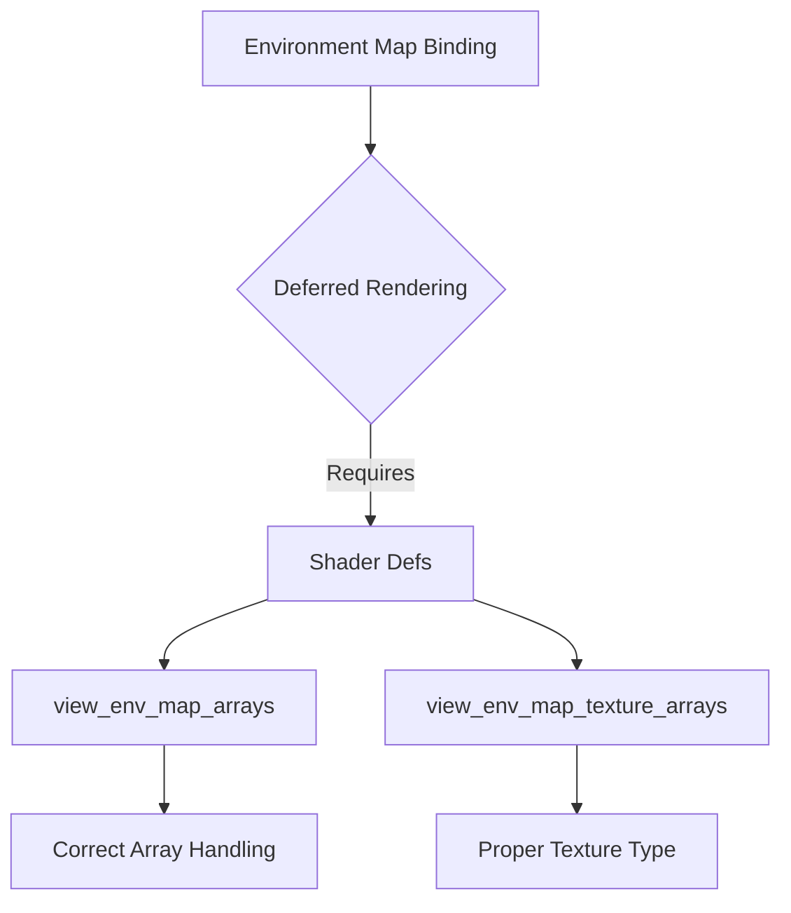

+++
title = "#18634 Add required shader defs for environment map binding arrays in deferred"
date = "2025-03-31T00:00:00"
draft = false
template = "pull_request_page.html"
in_search_index = true

[taxonomies]
list_display = ["show"]

[extra]
current_language = "en"
available_languages = {"en" = { name = "English", url = "/pull_request/bevy/2025-03/pr-18634-en-20250331" }, "zh-cn" = { name = "中文", url = "/pull_request/bevy/2025-03/pr-18634-zh-cn-20250331" }}
labels = ["C-Bug", "A-Rendering"]
+++

# #18634 Add required shader defs for environment map binding arrays in deferred

## Basic Information
- **Title**: Add required shader defs for environment map binding arrays in deferred
- **PR Link**: https://github.com/bevyengine/bevy/pull/18634
- **Author**: tychedelia
- **Status**: MERGED
- **Labels**: `C-Bug`, `A-Rendering`, `S-Ready-For-Final-Review`
- **Created**: 2025-03-30T23:31:32Z
- **Merged**: Not merged
- **Merged By**: N/A

## Description Translation
# Objective

Fixes #18468

## Solution

Missing shader defs caused shader compilation failure.

## The Story of This Pull Request

The problem surfaced when using environment maps with Bevy's deferred rendering pipeline. Users encountered shader compilation failures due to missing preprocessor definitions required for handling environment map texture arrays. This broke rendering workflows that relied on environment maps in deferred mode, a critical issue for projects using this combination of features.

The root cause was identified in the shader preprocessing stage. The deferred rendering pipeline needed two specific shader definitions (shader defs) to properly handle environment map arrays:
1. `view_env_map_arrays` to indicate array usage
2. `view_env_map_texture_arrays` to specify texture array type

Without these defs, the shader code attempted to access environment maps as regular textures rather than texture arrays, leading to compilation errors. The solution required modifying the deferred rendering setup to include these critical shader definitions when environment maps are present.

In `crates/bevy_pbr/src/deferred/mod.rs`, the implementation adds the missing shader defs during the environment map binding process:

```rust
// Added in queue_view_env_maps_bind_group
shader_defs.extend([
    "view_env_map_arrays".into(),
    "view_env_map_texture_arrays".into(),
]);
```

These lines ensure that when the renderer compiles shaders for deferred rendering with environment maps, the necessary preprocessor conditions are met. The `view_env_map_texture_arrays` def specifically addresses the texture type difference between regular textures and texture arrays in WGSL shaders.

The change demonstrates Bevy's approach to conditional shader compilation through shader defs. By including these flags:
- Shaders gain awareness of environment map array structures
- Correct texture sampling operations are generated
- Existing non-deferred rendering paths remain unaffected

The impact is immediate and focused: environment maps now work correctly in deferred rendering setups. This maintains consistency with forward rendering capabilities while addressing a specific pipeline configuration. The fix required minimal code changes but resolved a critical compatibility issue between two important rendering features.

## Visual Representation



## Key Files Changed

### `crates/bevy_pbr/src/deferred/mod.rs` (+4/-0)
**Purpose**: Add missing shader definitions for environment map arrays in deferred rendering

Key modifications:
```rust
// Within queue_view_env_maps_bind_group function
shader_defs.extend([
    "view_env_map_arrays".into(),
    "view_env_map_texture_arrays".into(),
]);
```

These lines enable proper shader compilation by providing the required preprocessor definitions when environment maps are used with deferred rendering. The changes directly address the shader compilation failures reported in the original issue.

## Further Reading
- [Bevy Shader Defs Documentation](https://docs.rs/bevy/latest/bevy/render/render_resource/struct.ShaderDefs.html)
- [WGSL Texture Arrays Specification](https://www.w3.org/TR/WGSL/#textures)
- [Bevy Deferred Rendering Guide](https://bevyengine.org/learn/book/next/render/deferred-rendering/)