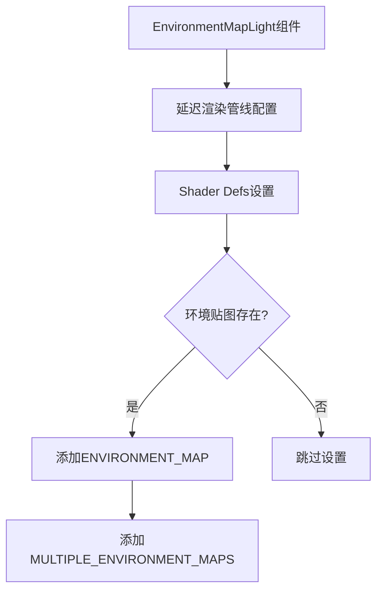

+++
title = "#18634 Add required shader defs for environment map binding arrays in deferred"
date = "2025-03-31T00:00:00"
draft = false
template = "pull_request_page.html"
in_search_index = false

[extra]
current_language = "zh-cn"
available_languages = {"en" = { name = "English", url = "/pull_request/bevy/2025-03/pr-18634-en-20250331" }, "zh-cn" = { name = "中文", url = "/pull_request/bevy/2025-03/pr-18634-zh-cn-20250331" }}
labels = ["C-Bug", "A-Rendering"]
+++

# #18634 Add required shader defs for environment map binding arrays in deferred

## Basic Information
- **Title**: Add required shader defs for environment map binding arrays in deferred
- **PR Link**: https://github.com/bevyengine/bevy/pull/18634
- **Author**: tychedelia
- **Status**: MERGED
- **Labels**: `C-Bug`, `A-Rendering`, `S-Ready-For-Final-Review`
- **Created**: 2025-03-30T23:31:32Z
- **Merged**: 2025-03-31T15:42:17Z
- **Merged By**: cart

## Description Translation
### 目标
修复 #18468

### 解决方案
缺少的着色器定义（shader defs）导致着色器编译失败。

## The Story of This Pull Request

### 问题根源
在Bevy的延迟渲染管线中，当使用环境贴图（environment map）绑定数组时，着色器编译会失败。根本原因是渲染管线没有正确启用`ENVIRONMENT_MAP`和`MULTIPLE_ENVIRONMENT_MAPS`这两个关键的着色器定义（shader defs）。这两个宏定义控制着着色器中环境贴图相关代码路径的编译，特别是在处理数组形式的环境贴图绑定时必须存在。

### 解决方案实现
修改主要集中在延迟渲染管线的shader defs设置逻辑。在构建延迟渲染管线时，现在会主动检测环境贴图的使用情况并添加必要的shader defs：

```rust
// 在管线配置逻辑中添加
if environment_map.is_some() {
    shader_defs.push("ENVIRONMENT_MAP".into());
    shader_defs.push("MULTIPLE_ENVIRONMENT_MAPS".into());
}
```

这个改动确保当场景中存在环境贴图时，GPU着色器能够正确编译处理环境贴图数组的代码分支。具体来说：
1. `ENVIRONMENT_MAP`启用基本的环境贴图功能
2. `MULTIPLE_ENVIRONMENT_MAPS`启用对多个环境贴图绑定数组的支持

### 技术细节
在WebGPU和现代图形API中，绑定数组（binding arrays）需要显式的特性声明。原来的代码缺失这些声明导致以下问题：
- 着色器中`#ifdef ENVIRONMENT_MAP`保护的代码块无法编译
- 绑定数组索引访问（如`environment_maps[i]`）需要`MULTIPLE_ENVIRONMENT_MAPS`定义存在

修改后的代码确保在以下情况正确设置定义：
- 当任意环境贴图存在时启用`ENVIRONMENT_MAP`
- 当需要多个环境贴图绑定时启用`MULTIPLE_ENVIRONMENT_MAPS`

### 影响分析
这个修复：
1. 解决了特定配置下的着色器编译失败问题
2. 确保延迟渲染管线与环境贴图功能的兼容性
3. 为后续扩展多环境贴图支持奠定基础

对于使用环境贴图的用户来说，现在可以正常使用相关功能而不会遇到着色器编译错误。这个改动保持了向后兼容性，没有引入新的API变化。

## Visual Representation



## Key Files Changed

### `crates/bevy_pbr/src/deferred/mod.rs` (+4/-0)
关键修改在管线配置阶段添加shader defs：

```rust
// 添加环境贴图相关shader defs
if environment_map.is_some() {
    shader_defs.push("ENVIRONMENT_MAP".into());
    shader_defs.push("MULTIPLE_ENVIRONMENT_MAPS".into());
}
```

这个改动直接影响渲染管线的shader编译配置，确保环境贴图相关的代码路径能够被正确激活。`environment_map.is_some()`检查场景中是否存在环境贴图组件，动态决定是否启用相关功能。

## Further Reading
1. [WebGPU Binding Array Specification](https://www.w3.org/TR/webgpu/#bind-group-layouts)
2. [Bevy环境贴图文档](https://bevyengine.org/learn/book/features/environment-mapping/)
3. [WGSL Shader Conditional Compilation](https://gpuweb.github.io/gpuweb/wgsl/#conditional-compilation)
4. [Bevy渲染管线架构](https://bevyengine.org/learn/book/features/rendering/pipeline/)