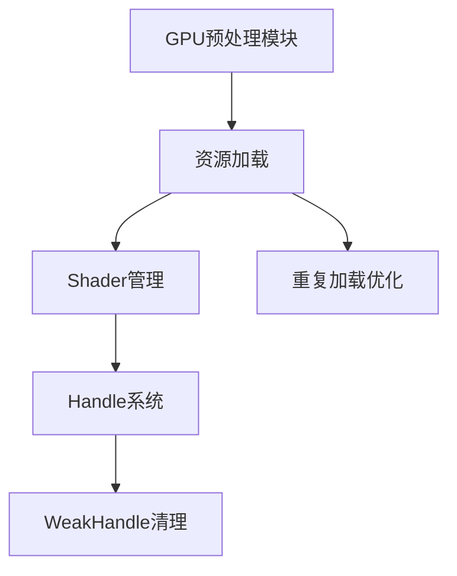

+++
title = "#18635 Delete unused weak handle and remove duplicate loads."
date = "2025-03-31T00:00:00"
draft = false
template = "pull_request_page.html"
in_search_index = false

[extra]
current_language = "zh-cn"
available_languages = {"en" = { name = "English", url = "/pull_request/bevy/2025-03/pr-18635-en-20250331" }, "zh-cn" = { name = "中文", url = "/pull_request/bevy/2025-03/pr-18635-zh-cn-20250331" }}
+++

# #18635 Delete unused weak handle and remove duplicate loads.

## Basic Information
- **标题**: Delete unused weak handle and remove duplicate loads.
- **PR链接**: https://github.com/bevyengine/bevy/pull/18635
- **作者**: andriyDev
- **状态**: MERGED
- **标签**: `D-Trivial`, `A-Rendering`, `A-Assets`, `C-Code-Quality`, `S-Ready-For-Final-Review`
- **创建时间**: 2025-03-30T23:43:25Z
- **合并时间**: Not merged
- **合并者**: N/A

## 描述翻译
### 目标
- 代码清理

### 解决方案
- 移除完全未使用的 weak_handle (`MESH_PREPROCESS_TYPES_SHADER_HANDLE`)。该值未被直接使用，也从未被初始化。
- 删除重复加载的 `BUILD_INDIRECT_PARAMS_SHADER_HANDLE`。我们在连续三行代码中重复加载该句柄，这似乎是复制粘贴导致的错误。

### 测试
- 无

## 本PR的技术故事

### 问题背景
在Bevy渲染模块的资源管理系统中，开发者发现了两个需要优化的代码质量问题。首先，存在一个未被使用的弱引用句柄（weak handle）`MESH_PREPROCESS_TYPES_SHADER_HANDLE`，这个句柄既没有被初始化，也没有在代码中被引用。其次，在相邻的三行代码中重复加载同一个着色器句柄`BUILD_INDIRECT_PARAMS_SHADER_HANDLE`，这是典型的复制粘贴错误导致的冗余操作。

### 解决方案
对于第一个问题，直接删除未使用的弱引用句柄。在Bevy的Asset系统设计中，弱引用句柄（WeakHandle）用于避免资源被自动回收，但如果该句柄从未被实际使用，保留它会带来不必要的内存占用和维护成本。

第二个问题的解决更值得注意。原始代码中连续三次调用：
```rust
let shader_defs = vec![...];
let shader = shaders.get(...);
let shader_defs = vec![...];  // 完全相同的定义
let shader = shaders.get(...); 
let shader_defs = vec![...];  // 第三次重复
let shader = shaders.get(...);
```
这种模式明显是开发过程中的复制粘贴残留。正确的做法应该是复用同一个shader_defs变量，避免重复初始化Vec和资源加载操作。

### 技术实现
关键修改体现在`gpu_preprocess.rs`文件中：
```rust
// 移除未使用的弱句柄定义
- pub(crate) static MESH_PREPROCESS_TYPES_SHADER_HANDLE: Lazy<WeakHandle<Shader>> =
-     Lazy::new(|| Handle::weak_from_u128(3251327365452654));

// 优化重复加载逻辑
let shader_defs = vec![...];  // 定义移到外层
let shader = shaders.get(...);

// 删除后续两个重复的shader_defs和shader.get调用
```

### 技术洞察
1. **资源管理优化**：Bevy使用`Handle`系统管理资源生命周期。弱引用句柄（WeakHandle）不会阻止资源卸载，适用于可选资源。但当其不再需要时，及时清理可以提升代码可维护性。

2. **DRY原则应用**：重复加载操作违反了Don't Repeat Yourself原则。虽然单次加载操作成本不高，但在高频执行的渲染代码中，冗余操作可能累积成性能问题。

3. **静态分析辅助**：这类问题可以通过clippy等静态分析工具检测。开发者应当配置适当的lint规则来预防类似错误。

### 影响评估
- **代码质量提升**：消除两个技术债务点，使代码更易于理解和维护
- **潜在性能改善**：减少不必要的Vec分配和资源查询操作
- **资源使用优化**：释放未被使用的句柄占用的内存空间

## 可视化表示



## 关键文件变更

### `crates/bevy_pbr/src/render/gpu_preprocess.rs` (+0/-15)
1. **未使用句柄清理**
```rust
// 移除静态弱句柄定义
- pub(crate) static MESH_PREPROCESS_TYPES_SHADER_HANDLE: Lazy<WeakHandle<Shader>> =
-     Lazy::new(|| Handle::weak_from_u128(3251327365452654));
```

2. **重复加载优化**
```rust
// 修改前：三次重复定义和加载
let shader_defs = vec![...];
let shader = shaders.get(...);
let shader_defs = vec![...];  // 重复
let shader = shaders.get(...);
let shader_defs = vec![...];  // 重复
let shader = shaders.get(...);

// 修改后：单次定义复用
let shader_defs = vec![...];
let shader = shaders.get(...);
// 删除后续两次重复代码
```

## 扩展阅读
1. [Bevy Asset System Guide](https://bevyengine.org/learn/book/assets/) - 官方资源管理系统文档
2. [Rust Clippy Lints](https://rust-lang.github.io/rust-clippy/master/) - 静态分析工具文档
3. [ECS Pattern in Bevy](https://bevyengine.org/learn/book/ecs/) - 实体组件系统架构说明