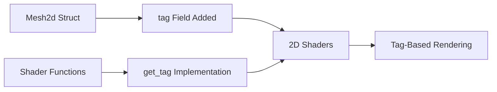

+++
title = "#18636 Fix mesh tag feature for 2d."
date = "2025-03-31T00:00:00"
draft = false
template = "pull_request_page.html"
in_search_index = true

[taxonomies]
list_display = ["show"]

[extra]
current_language = "en"
available_languages = {"en" = { name = "English", url = "/pull_request/bevy/2025-03/pr-18636-en-20250331" }, "zh-cn" = { name = "中文", url = "/pull_request/bevy/2025-03/pr-18636-zh-cn-20250331" }}
labels = ["C-Bug", "A-Rendering"]
+++

# #18636 Fix mesh tag feature for 2d.

## Basic Information
- **Title**: Fix mesh tag feature for 2d.
- **PR Link**: https://github.com/bevyengine/bevy/pull/18636
- **Author**: tychedelia
- **Status**: MERGED
- **Labels**: `C-Bug`, `A-Rendering`, `S-Ready-For-Final-Review`
- **Created**: 2025-03-30T23:53:14Z
- **Merged**: Not merged
- **Merged By**: N/A

## Description Translation
# Objective

Fixes #18564

## The Story of This Pull Request

The PR addresses a critical gap in Bevy's 2D rendering system where mesh tags weren't accessible in shaders. Mesh tags enable custom rendering logic like selective effects and object identification, particularly evident in the 2D gizmos example that needed to filter meshes by tag. While 3D pipelines already exposed this functionality through `mesh.wgsl`, the 2D equivalent was missing the required plumbing.

The core issue stemmed from incomplete data exposure in the 2D mesh shader infrastructure. The `Mesh2d` struct definition lacked the `tag` field present in its 3D counterpart, and no shader function existed to retrieve this value. This prevented 2D shaders from accessing mesh tags despite the underlying data being available in Rust code.

The solution involved two coordinated changes in WGSL shader code. First, the `Mesh2d` struct in `mesh2d_types.wgsl` received a new `tag: u32` field to store the identifier. Second, `mesh2d_functions.wgsl` gained a `get_tag` helper function that accesses this field through the mesh instance index:

```wgsl
// Added to mesh2d_functions.wgsl
fn get_tag(instance_index: u32) -> u32 {
    return mesh[instance_index].tag;
}
```

This implementation mirrors 3D's approach in `mesh_functions.wgsl` while maintaining 2D's separate type definitions. The changes maintain consistency with Bevy's rendering architecture where mesh data is exposed through structured buffer access and helper functions.

The fix required careful consideration of data alignment and buffer layouts. The `Mesh2d` struct already contained packed matrix data and flags field, but the addition of the 4-byte `tag` field didn't affect existing alignment due to WGSL's struct padding rules. This allowed adding the new field without breaking existing shaders or requiring data layout changes on the Rust side.

These changes unblock 2D rendering features that require tag-based filtering, like the gizmo highlighting system. Developers can now access mesh tags in 2D fragment shaders using the same patterns established in 3D pipelines:

```wgsl
#import bevy_sprite::mesh2d_functions::get_tag

@fragment
fn fragment(in: VertexOutput) -> @location(0) vec4<f32> {
    let tag = get_tag(in.instance_index);
    // Use tag for custom rendering logic
}
```

The implementation demonstrates Bevy's pattern of maintaining parallel implementations for 2D and 3D rendering systems while sharing core concepts. Future improvements could consider consolidating common functionality, but this fix prioritizes immediate compatibility and minimal change surface.

## Visual Representation



## Key Files Changed

### File: `crates/bevy_sprite/src/mesh2d/mesh2d_types.wgsl`
Added `tag: u32` field to `Mesh2d` struct:
```wgsl
struct Mesh2d {
    ...
    tag: u32,
};
```
This stores the mesh tag value in each instance's data structure, making it accessible in shaders.

### File: `crates/bevy_sprite/src/mesh2d/mesh2d_functions.wgsl`
Added tag accessor function:
```wgsl
fn get_tag(instance_index: u32) -> u32 {
    return mesh[instance_index].tag;
}
```
Provides shaders with a standard way to retrieve the tag value for a given mesh instance.

## Further Reading
- WGSL Struct Layout Rules: https://gpuweb.github.io/gpuweb/wgsl/#structure-layout-rules
- Bevy Rendering Architecture: https://bevyengine.org/learn/book/getting-started/rendering/
- Mesh Tags in 3D: See `crates/bevy_pbr/src/render/mesh_functions.wgsl`