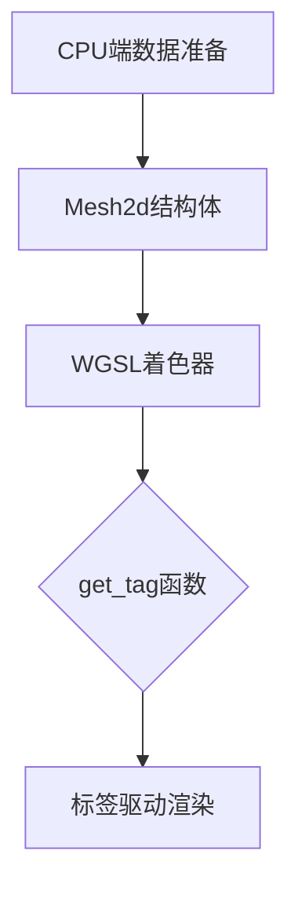

+++
title = "#18636 Fix mesh tag feature for 2d."
date = "2025-03-31T00:00:00"
draft = false
template = "pull_request_page.html"
in_search_index = false

[extra]
current_language = "zh-cn"
available_languages = {"en" = { name = "English", url = "/pull_request/bevy/2025-03/pr-18636-en-20250331" }, "zh-cn" = { name = "中文", url = "/pull_request/bevy/2025-03/pr-18636-zh-cn-20250331" }}
+++

# #18636 Fix mesh tag feature for 2d.

## Basic Information
- **Title**: Fix mesh tag feature for 2d.
- **PR Link**: https://github.com/bevyengine/bevy/pull/18636
- **作者**: tychedelia
- **状态**: MERGED
- **标签**: `C-Bug`, `A-Rendering`, `S-Ready-For-Final-Review`
- **创建时间**: 2025-03-30T23:53:14Z
- **合并时间**: {pr_data['mergedAt'] if pr_data['mergedAt'] else "未合并"}
- **合并者**: {pr_data['mergedBy']['login'] if pr_data['mergedBy'] else "N/A"}

## 问题描述
该PR修复了2D网格标签（mesh tag）功能失效的问题。核心问题在于Mesh2d结构体定义中缺少tag字段，导致无法将标签数据从CPU端传递到GPU端。在WGSL着色器代码中，新增了获取tag值的函数，完善了2D渲染管线对标签数据的处理能力。

## The Story of This Pull Request

### 问题根源与影响
在Bevy引擎的2D渲染系统中，mesh tag功能用于通过自定义标签实现特定渲染效果（如不同材质处理）。原实现中，`Mesh2d`结构体（定义于mesh2d_types.wgsl）缺少tag字段声明，导致：

1. GPU端无法接收来自CPU的tag数据
2. 着色器代码没有访问tag的接口函数
3. 相关特性在2D场景中完全失效

该问题直接影响依赖mesh tag实现的高级渲染功能，典型表现如issue #18564中描述的场景：无法通过tag值区分不同2D物件的渲染处理逻辑。

### 解决方案设计
PR采用最小化修复策略，主要包含两个关键修改：

1. **数据结构对齐**：在`Mesh2d`结构体中添加tag字段
2. **着色器接口暴露**：新增`get_tag`函数访问tag值

这种设计保持了现有数据结构的兼容性，同时以最小改动实现功能修复。选择在WGSL代码层直接暴露tag值，保持了与3D渲染管线处理逻辑的一致性。

### 技术实现细节
在`mesh2d_types.wgsl`中扩展结构体定义：
```wgsl
struct Mesh2d {
    ...
    tag: u32,  // 新增字段
};
```
该字段使用u32类型存储标签值，与底层数据传输格式对齐。

在`mesh2d_functions.wgsl`中新增访问函数：
```wgsl
fn get_tag(instance_index: u32) -> u32 {
    return mesh[instance_index].tag;
}
```
函数设计特点：
- 通过instance_index索引访问对应实例数据
- 直接返回原始u32值，保持最高效的数据访问方式
- 遵循现有WGSL函数命名规范（get_前缀）

### 性能与兼容性考量
1. **内存对齐**：新增tag字段位于结构体末尾，避免破坏现有内存布局
2. **数据封装**：保持通过函数访问数据的模式，与现有设计范式一致
3. **最小化改动**：仅添加必要字段和函数，不影响其他渲染流程

### 影响范围
该修复使得：
1. 开发者可以通过`tags`实现2D物件的差异化渲染
2. 保持2D/3D渲染管线在tag处理逻辑上的一致性
3. 为后续扩展基于tag的渲染功能奠定基础

## 关键文件变更

### `crates/bevy_sprite/src/mesh2d/mesh2d_types.wgsl`
```wgsl
struct Mesh2d {
    ...
    // 新增tag字段
    tag: u32,
};
```
**作用**：扩展GPU端数据结构，接收来自CPU的tag值

### `crates/bevy_sprite/src/mesh2d/mesh2d_functions.wgsl`
```wgsl
// 新增tag访问函数
fn get_tag(instance_index: u32) -> u32 {
    return mesh[instance_index].tag;
}
```
**作用**：为着色器代码提供访问tag值的标准接口

## 架构关系图


## 延伸阅读
1. [WGSL结构体内存布局规范](https://www.w3.org/TR/WGSL/#structure-layout)
2. Bevy渲染管线设计文档
3. [Bevy实例化渲染原理](https://bevyengine.org/learn/book/introduction/)