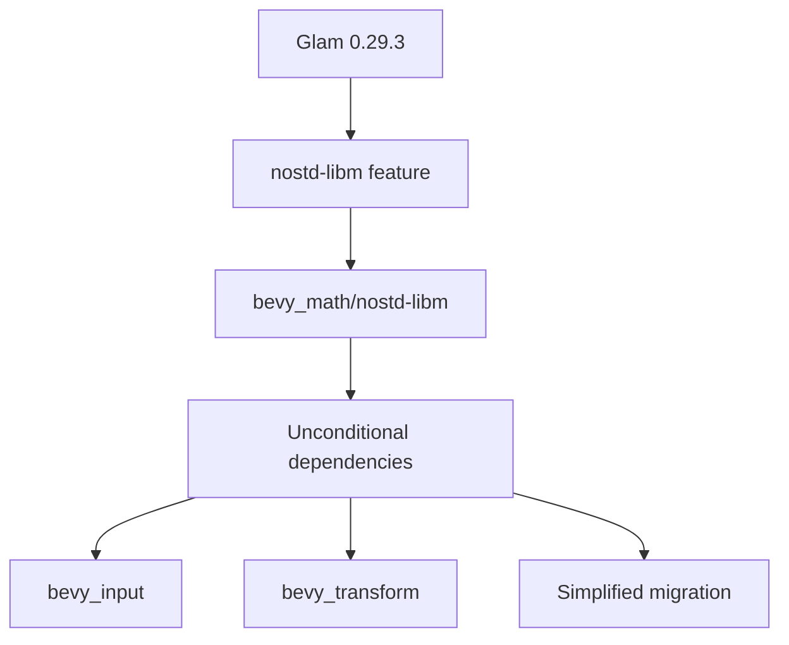

+++
title = "#18638 Upgrade to Glam 0.29.3 and Simplify Feature Gating"
date = "2025-03-31T00:00:00"
draft = false
template = "pull_request_page.html"
in_search_index = true

[taxonomies]
list_display = ["show"]

[extra]
current_language = "en"
available_languages = {"en" = { name = "English", url = "/pull_request/bevy/2025-03/pr-18638-en-20250331" }, "zh-cn" = { name = "中文", url = "/pull_request/bevy/2025-03/pr-18638-zh-cn-20250331" }}
labels = ["C-Dependencies", "A-Math", "X-Contentious", "D-Straightforward"]
+++

# #18638 Upgrade to Glam 0.29.3 and Simplify Feature Gating

## Basic Information
- **Title**: Upgrade to Glam 0.29.3 and Simplify Feature Gating
- **PR Link**: https://github.com/bevyengine/bevy/pull/18638
- **Author**: bushrat011899
- **Status**: MERGED
- **Labels**: `C-Dependencies`, `S-Ready-For-Final-Review`, `A-Math`, `X-Contentious`, `D-Straightforward`
- **Created**: 2025-03-31T02:47:03Z
- **Merged**: 2025-04-01T15:22:18Z
- **Merged By**: cart

## Description Translation

# Objective

- Fixes #18397
- Supersedes #18474
- Simplifies 0.16 migration

## Solution

- Upgrade to Glam 0.29.3, which has backported the `nostd-libm` feature.
- Expose a similar feature in `bevy_math` and enable it in `bevy_internal`, allowing `bevy_math`, `bevy_input`, and `bevy_transform` to be unconditional dependencies again.

## Testing

- CI

---

## Notes

- This includes `libm` as a dependency, but this was already the case in the common scenario where `rand` or many other features were enabled. Considering `libm` is an official Rust crate, it's a very low-risk dependency to unconditionally include.
- For users who do not want `libm` included, simply import Bevy's subcrates directly, since `bevy_math/nostd-libm` will not be enabled.
- I know we are _very_ late in the RC cycle for 0.16, but this has a substantial impact on the usability of `bevy` that I consider worth including.


## The Story of This Pull Request

This PR addresses a dependency management challenge in Bevy's math infrastructure. The core problem stemmed from conditional compilation requirements in `bevy_math` that forced several key crates (`bevy_input`, `bevy_transform`) to become optional dependencies. This created complexity for users migrating to Bevy 0.16 and limited functionality in no_std environments.

The solution emerged through strategic use of Glam's updated feature flags. By upgrading to Glam 0.29.3, which backported the `nostd-libm` feature, the team could:

1. Remove conditional compilation guards around math operations
2. Standardize floating-point behavior across platforms
3. Restore essential crates as unconditional dependencies

Key implementation steps included:

```toml
# crates/bevy_math/Cargo.toml
[features]
nostd-libm = ["dep:libm", "glam/nostd-libm"]
```

This feature gate allows using libm (a pure-Rust math library) as a fallback when std isn't available. The `bevy_internal` crate then enables this feature unconditionally:

```toml
# crates/bevy_internal/Cargo.toml
[features]
default = ["std", "rand", "curve", "nostd-libm"]
```

The math operations in `ops.rs` were refactored to leverage libm when needed:

```rust
// crates/bevy_math/src/ops.rs
#[cfg(all(feature = "libm", not(feature = "std")))]
#[inline(always)]
pub fn powf(x: f32, y: f32) -> f32 {
    libm::powf(x, y)
}
```

This approach maintains platform consistency while eliminating complex feature gating. The libm dependency was deemed acceptable as it's already pulled in through other common features like `rand`, and it's an officially blessed Rust crate.

## Visual Representation



## Key Files Changed

1. `crates/bevy_math/Cargo.toml`
```toml
# Added feature
nostd-libm = ["dep:libm", "glam/nostd-libm"]
# Updated std feature
std = [
  "alloc",
  "glam/std",
  # ... other deps
  "nostd-libm"  # New addition
]
```

2. `crates/bevy_internal/Cargo.toml`
```toml
# Enabled nostd-libm in default features
default = ["std", "rand", "curve", "nostd-libm"]
```

3. `crates/bevy_math/src/ops.rs`
```rust
// Before: Complex conditional compilation
#[cfg(all(not(feature = "libm"), feature = "std"))]

// After: Simplified logic using libm fallback
#[cfg(all(feature = "libm", not(feature = "std")))]
pub fn powf(x: f32, y: f32) -> f32 {
    libm::powf(x, y)
}
```

## Further Reading

- [libm crate documentation](https://docs.rs/libm/latest/libm/)
- [Glam's feature flags](https://github.com/bitshifter/glam-rs/blob/main/docs/features.md)
- [Rust's no_std compatibility guide](https://rust-embedded.github.io/book/intro/no-std.html)