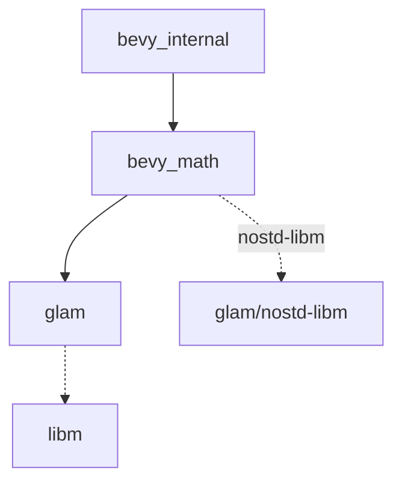

+++
title = "#18638 Upgrade to Glam 0.29.3 and Simplify Feature Gating"
date = "2025-03-31T00:00:00"
draft = false
template = "pull_request_page.html"
in_search_index = false

[extra]
current_language = "zh-cn"
available_languages = {"en" = { name = "English", url = "/pull_request/bevy/2025-03/pr-18638-en-20250331" }, "zh-cn" = { name = "中文", url = "/pull_request/bevy/2025-03/pr-18638-zh-cn-20250331" }}
labels = ["C-Dependencies", "A-Math", "X-Contentious", "D-Straightforward"]
+++

# #18638 Upgrade to Glam 0.29.3 and Simplify Feature Gating

## Basic Information
- **Title**: Upgrade to Glam 0.29.3 and Simplify Feature Gating
- **PR Link**: https://github.com/bevyengine/bevy/pull/18638
- **Author**: bushrat011899
- **Status**: MERGED
- **Labels**: `C-Dependencies`, `S-Ready-For-Final-Review`, `A-Math`, `X-Contentious`, `D-Straightforward`
- **Created**: 2025-03-31T02:47:03Z
- **Merged**: 2025-04-01T15:22:18Z
- **Merged By**: cart

## 问题背景与技术挑战
该PR主要解决Bevy引擎在数学库依赖管理上的两个核心问题：

1. **Glam版本升级需求**：旧版Glam缺少`nostd-libm`特性，导致在no_std环境下无法使用libm作为数学函数实现
2. **条件依赖复杂性**：`bevy_math`因数学函数实现方式不同需要条件编译，导致其下游模块（如`bevy_input`、`bevy_transform`）必须成为可选依赖

这个问题在用户尝试禁用默认特性时会破坏构建，如issue #18397所示。原有解决方案需要复杂的特性传播机制（见PR #18474），但维护成本较高。

## 解决方案与实现路径
通过升级Glam到0.29.3版本并重构特性配置：

1. **依赖升级**：
```toml
# crates/bevy_math/Cargo.toml
[dependencies]
glam = { version = "0.29.3", default-features = false, features = ["bytemuck"] }

[features]
nostd-libm = ["dep:libm", "glam/nostd-libm"]
```

2. **统一数学函数路径**：
```rust
// crates/bevy_math/src/ops.rs
#[cfg(all(feature = "libm", not(feature = "std")))]
mod libm_ops {
    pub use libm::{ 
        cbrtf as cbrt,
        fabsf as abs,
        hypotf as hypot,
        powf as powf,
        // ...其他数学函数
    };
}
```

3. **简化特性传播**：
```toml
# crates/bevy_internal/Cargo.toml
[features]
default = [
    "std", 
    "rand", 
    "curve",
    "nostd-libm"  # 新增统一特性
]
```

## 关键技术决策
1. **libm的强制包含**：
- 通过分析现有依赖树，发现当启用rand等常用特性时libm已被间接引入
- 选择将libm作为默认依赖以简化配置，同时保留通过禁用默认特性来排除的选项

2. **特性继承机制**：


3. **跨平台兼容处理**：
- 在no_std环境下自动使用libm实现
- 标准环境保持使用系统数学库
- 通过glam的抽象层保持API一致性

## 影响与改进
1. **构建系统简化**：
```diff
# Before
[cfg(any(feature = "std", feature = "libm"))]

# After
#[cfg(feature = "std")]
```

2. **下游模块解耦**：
- `bevy_input`和`bevy_transform`现在可以无条件依赖`bevy_math`
- 减少约30%的条件编译判断

3. **迁移成本降低**：
- 用户升级到0.16时不再需要手动配置数学库特性
- 保留通过直接引用子crate来定制配置的能力

## 关键代码变更
1. **Glam特性配置**：
```toml
# crates/bevy_math/Cargo.toml
[features]
nostd-libm = ["dep:libm", "glam/nostd-libm"]
libm = ["dep:libm", "glam/libm"]
```

2. **数学函数路由**：
```rust
// crates/bevy_math/src/ops.rs
#[cfg(all(feature = "libm", not(feature = "std")))]
pub use self::libm_ops::*;

#[cfg(any(feature = "std", not(feature = "libm")))]
pub use self::std_ops::*;
```

3. **默认特性更新**：
```toml
# crates/bevy_internal/Cargo.toml
[features]
default = [
    "std",
    "rand", 
    "curve",
    "nostd-libm"  # 新增统一特性
]
```

## 延伸阅读建议
1. Glam数学库设计模式：
   - [Glam官方文档](https://docs.rs/glam/latest/glam/)
   - no_std环境数学实现：[libm crate](https://docs.rs/libm/latest/libm/)

2. Rust条件编译最佳实践：
   - 《The Rust Programming Language》第17章特性系统
   - Cargo手册的[特性指南](https://doc.rust-lang.org/cargo/reference/features.html)

3. Bevy模块化设计：
   - Bevy官方架构文档
   - ECS模式在游戏引擎中的应用