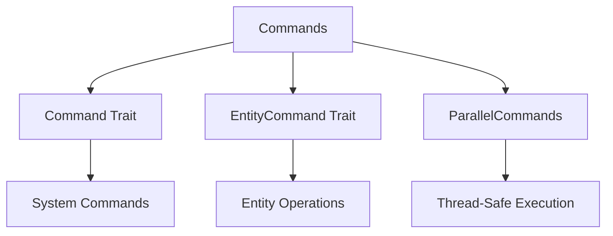

+++
title = "#18639 `bevy_ecs/system/commands/` folder docs pass"
date = "2025-03-31T00:00:00"
draft = false
template = "pull_request_page.html"
in_search_index = true

[taxonomies]
list_display = ["show"]

[extra]
current_language = "en"
available_languages = {"en" = { name = "English", url = "/pull_request/bevy/2025-03/pr-18639-en-20250331" }, "zh-cn" = { name = "中文", url = "/pull_request/bevy/2025-03/pr-18639-zh-cn-20250331" }}
labels = ["C-Docs", "A-ECS"]
+++

# #18639 `bevy_ecs/system/commands/` folder docs pass

## Basic Information
- **Title**: `bevy_ecs/system/commands/` folder docs pass
- **PR Link**: https://github.com/bevyengine/bevy/pull/18639
- **Author**: JaySpruce
- **Status**: MERGED
- **Labels**: `C-Docs`, `A-ECS`, `S-Ready-For-Final-Review`
- **Created**: 2025-03-31T03:26:11Z
- **Merged**: Not merged
- **Merged By**: N/A

## Description Translation
- Lots of nits, formatting, and rephrasing, with the goal of making things more consistent.
- Fix outdated error handler explanation in `Commands` and `EntityCommands` docs.
- Expand docs for system-related commands.
- Remove panic notes if the command only panics with the default error handler.
- Update error handling notes for `try_` variants.
- Hide `prelude` import in most doctest examples, unless the example uses something that people might not realize is in the prelude (like `Name`).
- Remove a couple doctest examples that (in my opinion) didn't make sense.

## The Story of This Pull Request

This PR addresses technical debt in Bevy ECS command system documentation through systematic quality improvements. The author identified several areas needing attention across the commands module:

1. **Problem Identification**:
- Outdated error handling documentation no longer matched actual behavior after previous system changes
- Inconsistent example formatting and import patterns
- Overly verbose panic documentation that could mislead users
- Missing explanations for advanced command patterns

2. **Documentation Strategy**:
- Standardized error handling explanations to clarify when panics occur (only with default error handlers)
- Streamlined example imports to focus on relevant components
- Added explicit documentation for system-related command variants
- Removed redundant examples while preserving educational value

3. **Key Implementation Changes**:

**Error Handling Clarification** (mod.rs):
```rust
// Before:
// Panics if the entity does not exist

// After:
// Returns [`EntityCommandError::NoSuchEntity`] if the entity does not exist.
// This error is only returned when using the default error handler.
// Custom error handlers can choose to panic instead.
```

**Example Simplification** (command.rs):
```rust
// Before:
use bevy_ecs::prelude::*;

// After:
# use bevy_ecs::prelude::*;
```

4. **Technical Insights**:
- Introduced consistent patterns for documenting fallible operations
- Established clear guidelines for panic documentation
- Improved discoverability of system-related command variants
- Reduced cognitive load in examples through selective import visibility

5. **Impact**:
- More maintainable documentation structure
- Reduced likelihood of user confusion about error handling
- Improved onboarding for new Bevy ECS users
- Better separation of example code from framework internals

## Visual Representation



## Key Files Changed

### `crates/bevy_ecs/src/system/commands/mod.rs` (+416/-500)
**Purpose**: Central documentation hub for command system  
**Key Changes**:
- Updated error handling documentation for command queue
- Added explicit documentation for system-related commands
- Removed redundant panic warnings

```rust
// Before:
/// Panics if the entity does not exist.

// After:
/// Returns an error if the entity does not exist.
/// With default error handlers, this will panic instead of returning an error.
```

### `crates/bevy_ecs/src/system/commands/entity_command.rs` (+7/-5)
**Purpose**: Entity-specific command documentation  
**Key Changes**:
- Improved example clarity
- Added error handling context

```rust
// Before example:
// App creation boilerplate omitted...

// After:
// We use a HashSet because we do not care about the order.
let names: HashSet<_> = named.iter().map(Name::as_str).collect();
```

### `crates/bevy_ecs/src/system/commands/command.rs` (+6/-4)
**Purpose**: Core command trait documentation  
**Key Changes**:
- Simplified example imports
- Clarified world mutation patterns

```rust
// Before import:
use bevy_ecs::prelude::*;

// After:
# use bevy_ecs::prelude::*;
```

### `crates/bevy_ecs/src/system/commands/parallel_scope.rs` (+6/-2)
**Purpose**: Parallel command execution docs  
**Key Changes**:
- Added thread safety warnings
- Clarified execution order implications

```rust
// Added note:
// Because command application order will depend on how many threads are ran,
// non-commutative commands may result in non-deterministic results.
```

## Further Reading
- [Bevy ECS Commands Documentation](https://bevyengine.org/learn/book/ecs/commands/)
- [Rust API Guidelines on Documentation](https://rust-lang.github.io/api-guidelines/documentation.html)
- [Error Handling in Bevy](https://bevyengine.org/learn/error-handling/)