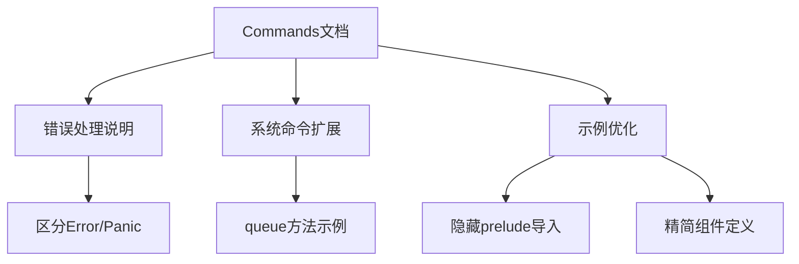

+++
title = "#18639 `bevy_ecs/system/commands/` folder docs pass"
date = "2025-03-31T00:00:00"
draft = false
template = "pull_request_page.html"
in_search_index = false

[extra]
current_language = "zh-cn"
available_languages = {"en" = { name = "English", url = "/pull_request/bevy/2025-03/pr-18639-en-20250331" }, "zh-cn" = { name = "中文", url = "/pull_request/bevy/2025-03/pr-18639-zh-cn-20250331" }}
labels = ["C-Docs", "A-ECS"]
+++

# #18639 `bevy_ecs/system/commands/` folder docs pass

## Basic Information
- **Title**: `bevy_ecs/system/commands/` folder docs pass
- **PR Link**: https://github.com/bevyengine/bevy/pull/18639
- **Author**: JaySpruce
- **Status**: MERGED
- **Labels**: `C-Docs`, `A-ECS`, `S-Ready-For-Final-Review`
- **Created**: 2025-03-31T03:26:11Z
- **Merged**: Not merged
- **Merged By**: N/A

## Description Translation
该PR主要对`bevy_ecs`模块的命令系统文档进行优化，具体包括：
- 大量格式调整和用词优化，提升文档一致性
- 修正`Commands`和`EntityCommands`中过时的错误处理说明
- 扩展系统相关命令的文档说明
- 移除仅在使用默认错误处理器时才会panic的警告说明
- 更新`try_`变体方法的错误处理说明
- 在大多数doctest示例中隐藏`prelude`导入，除非示例使用了非显式导入的类型（如`Name`）
- 删除部分被认为不合理的doctest示例

## The Story of This Pull Request

### 问题背景与改进动机
Bevy ECS的commands系统作为操作World的核心API，其文档质量直接影响开发者体验。原文档存在几个关键问题：
1. 错误处理说明与实际代码行为不一致，可能误导开发者
2. 系统命令（system-related commands）文档覆盖不完整
3. 示例代码中存在不必要的prelude导入，影响代码简洁性
4. panic说明未区分默认错误处理器与其他情况

### 解决方案与技术实现
PR通过以下结构化改进提升文档质量：

**1. 错误处理说明重构**
- 更新`Commands`和`EntityCommands`的错误处理文档，明确区分普通方法和`try_`变体
```rust
// Before:
/// # Panics
/// If the entity doesn't exist.

// After:
/// # Errors
/// Returns [`EntityCommandError::NoSuchEntity`] if the entity doesn't exist.
/// 
/// # Panics
/// Only panics when using the default error handler
```

**2. 系统命令文档扩展**
- 为`queue`方法添加完整的使用示例，说明如何组合自定义命令
```rust
/// # Example: 组合多个命令
/// ```
/// commands.queue((cmd1, cmd2, cmd3));
/// ```

**3. 示例代码优化**
- 使用`# #[derive(Component)]`隐式处理组件定义
- 隐藏不必要的prelude导入，除非需要强调特定类型
```rust
// Before:
use bevy_ecs::prelude::*;

// After:
# use bevy_ecs::prelude::*;
```

### 技术洞察与工程决策
1. **错误处理分层说明**：明确区分方法可能返回的错误类型和panic条件，帮助开发者选择合适的错误处理策略

2. **文档一致性优化**：
   - 统一命令方法文档结构（Examples, Errors, Panics等部分）
   - 标准化示例代码格式（组件定义、系统参数声明等）

3. **性能与安全平衡**：
   - 保留对关键panic场景的说明，但限定在默认错误处理器场景
   - 移除冗余的panic警告，减少文档噪音

### 实际影响与改进
1. **开发者体验提升**：更清晰的错误处理说明可减少API误用
2. **维护成本降低**：标准化的文档结构便于后续维护
3. **代码可读性增强**：精简后的示例更聚焦核心功能演示

## Visual Representation



## Key Files Changed

### File: `crates/bevy_ecs/src/system/commands/mod.rs`
**修改重点**：重构核心命令文档结构
```rust
// Before:
/// A command queue to perform structural changes to the World

// After:
/// A [`Command`] queue to perform structural changes to the [`World`]
///
/// Since each command requires exclusive access to the `World`,
/// all queued commands are automatically applied in sequence
/// when the `ApplyDeferred` system runs...
```

### File: `crates/bevy_ecs/src/system/commands/entity_command.rs`
**修改重点**：完善EntityCommand错误处理文档
```rust
// 新增错误类型说明
#[derive(thiserror::Error, Debug)]
pub enum EntityCommandError<E> {
    #[error("Entity does not exist")]
    NoSuchEntity,
    #[error(transparent)]
    Custom(E)
}
```

### File: `crates/bevy_ecs/src/system/commands/command.rs`
**修改重点**：优化命令组合示例
```rust
// 新增组合命令示例
/// ```
/// commands.queue((spawn_empty(), insert(Health::default())));
/// ```
```

## Further Reading
1. [Bevy ECS Commands官方文档](https://docs.rs/bevy_ecs/latest/bevy_ecs/system/struct.Commands.html)
2. [Rust API文档编写指南](https://rust-lang.github.io/api-guidelines/documentation.html)
3. [thiserror crate文档](https://docs.rs/thiserror/latest/thiserror/)（用于标准错误处理）