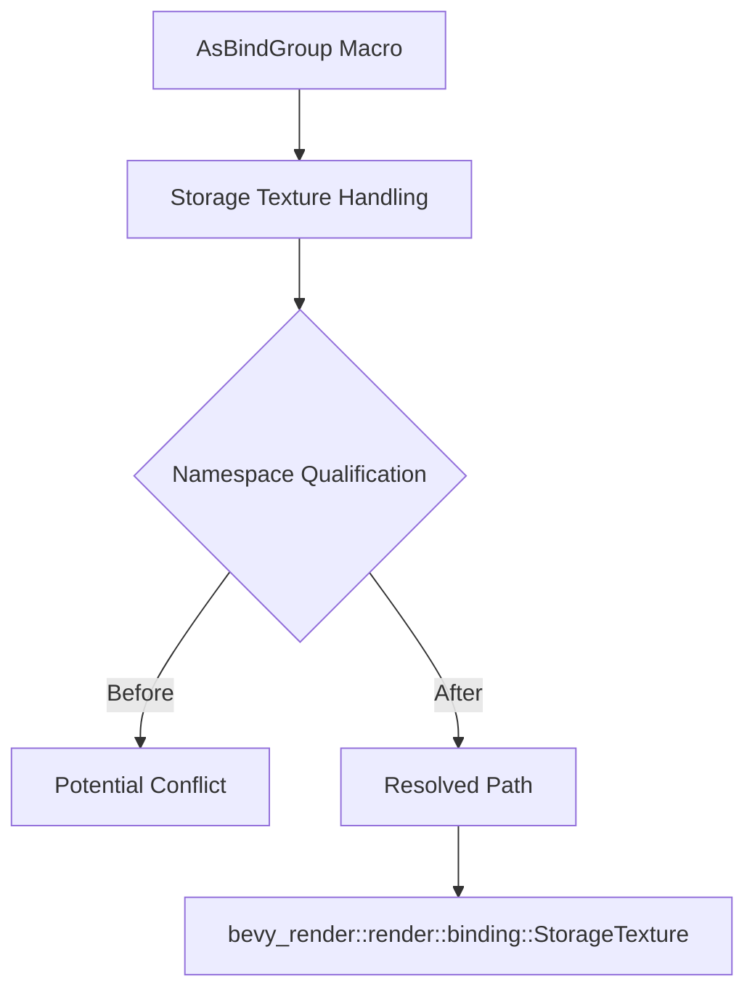

+++
title = "#18640 Fix AsBindGroup hygenic issues with storage texture."
date = "2025-03-31T00:00:00"
draft = false
template = "pull_request_page.html"
in_search_index = true

[taxonomies]
list_display = ["show"]

[extra]
current_language = "en"
available_languages = {"en" = { name = "English", url = "/pull_request/bevy/2025-03/pr-18640-en-20250331" }, "zh-cn" = { name = "中文", url = "/pull_request/bevy/2025-03/pr-18640-zh-cn-20250331" }}
labels = ["C-Bug", "A-Rendering"]
+++

# #18640 Fix AsBindGroup hygenic issues with storage texture.

## Basic Information
- **Title**: Fix AsBindGroup hygenic issues with storage texture.
- **PR Link**: https://github.com/bevyengine/bevy/pull/18640
- **Author**: tychedelia
- **Status**: MERGED
- **Labels**: `C-Bug`, `A-Rendering`, `S-Ready-For-Final-Review`
- **Created**: 2025-03-31T03:42:07Z
- **Merged**: Not merged
- **Merged By**: N/A

## Description Translation
# Objective

Fixes #18573

## The Story of This Pull Request

The PR addresses a specific hygiene issue in Bevy's `AsBindGroup` derive macro when handling storage textures. The problem stemmed from how the macro generated internal type references without proper namespace qualification, potentially causing conflicts when user code had similar names in scope.

In the original implementation, the macro generated references to `render::binding::StorageTexture` without fully qualifying the path. This worked when the render module was in scope, but could fail in cases where users' code environments didn't have the expected imports. The core issue was a missing namespace prefix for Bevy's internal render types.

The fix involved modifying the code generation to use fully qualified paths through Bevy's manifest system. By retrieving the correct render path via `BevyManifest` and using it to prefix the storage texture type reference, the macro ensures generated code always references the correct internal type regardless of external imports.

Key technical points:
1. The macro now uses `#render_path::render::binding::StorageTexture` instead of `render::binding::StorageTexture`
2. `render_path` is obtained from `BevyManifest::get_path("bevy_render")`
3. This follows established patterns used elsewhere in the macro for other resource types

The solution maintains consistency with how other binding types (like uniforms and samplers) are handled in the same macro. This approach avoids special casing while ensuring proper namespace hygiene across all generated code paths.

## Visual Representation



## Key Files Changed

### File: `crates/bevy_render/macros/src/as_bind_group.rs`

**Change Description**: Fixed storage texture type reference to use fully qualified path via Bevy manifest.

Before (simplified):
```rust
let binding_type = quote! { render::binding::StorageTexture };
```

After (simplified):
```rust
let binding_type = quote! { #render_path::render::binding::StorageTexture };
```

This change ensures the generated code references the correct internal type regardless of external namespace context. The `#render_path` variable contains the proper crate path retrieved from Bevy's manifest, following existing patterns used for other resource types in the same file.

## Further Reading

1. [Rust Macro Hygiene Documentation](https://doc.rust-lang.org/reference/macros.html#hygiene)
2. [Bevy's AsBindGroup Documentation](https://docs.rs/bevy/latest/bevy/render/render_resource/trait.AsBindGroup.html)
3. [Proc Macro Best Practices](https://veykril.github.io/tlborm/decl-macros/minutiae/hygiene.html)