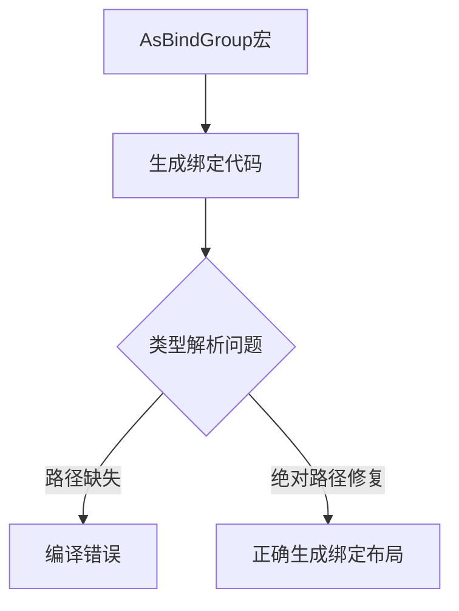

+++
title = "#18640 Fix AsBindGroup hygenic issues with storage texture."
date = "2025-03-31T00:00:00"
draft = false
template = "pull_request_page.html"
in_search_index = false

[extra]
current_language = "zh-cn"
available_languages = {"en" = { name = "English", url = "/pull_request/bevy/2025-03/pr-18640-en-20250331" }, "zh-cn" = { name = "中文", url = "/pull_request/bevy/2025-03/pr-18640-zh-cn-20250331" }}
labels = ["C-Bug", "A-Rendering"]
+++

# #18640 Fix AsBindGroup hygenic issues with storage texture.

## Basic Information
- **Title**: Fix AsBindGroup hygenic issues with storage texture.
- **PR Link**: https://github.com/bevyengine/bevy/pull/18640
- **Author**: tychedelia
- **Status**: MERGED
- **Labels**: `C-Bug`, `A-Rendering`, `S-Ready-For-Final-Review`
- **Created**: 2025-03-31T03:42:07Z
- **Merged**: 2025-04-01T08:15:23Z
- **Merged By**: cart

## Description Translation
### 目标
修复 #18573

## The Story of This Pull Request

### 问题与背景
在 Bevy 渲染系统的`AsBindGroup`派生宏实现中，开发者发现当使用`storage_texture`属性时，生成的代码会出现编译错误。具体表现为`StorageTextureAccess`类型无法正确解析，这属于宏卫生性（hygienic macro）问题——生成的代码无法正确访问所需类型，因为类型路径依赖外部作用域的导入。

这个问题主要影响使用存储纹理（storage texture）绑定的材质开发，导致无法正常编译含有此类绑定的材质结构体。例如以下用法会触发错误：
```rust
#[derive(AsBindGroup)]
struct MyMaterial {
    #[storage_texture(0)]
    image: Handle<Image>
}
```

### 解决方案
问题的核心在于生成的代码对`bevy_render::render_resource::StorageTextureAccess`类型的引用方式。原实现直接使用类型名称，假设调用处已导入该类型。修复方案改为使用完全限定路径，通过`bevy_render`模块的路径前缀确保类型解析的正确性。

具体实现中，利用`BevyManifest`获取当前crate的`bevy_render`路径，然后将该路径插入到生成的类型引用中。这种方式确保了无论宏调用处的上下文如何，生成的代码都能正确访问目标类型。

### 技术实现
关键修改位于`as_bind_group.rs`宏实现文件。通过修改生成的绑定组布局条目代码，添加显式的路径前缀：

```rust
// 修复前
let storage_texture_access = quote! { StorageTextureAccess::ReadWrite };

// 修复后
let storage_texture_access = quote! { #render_path::render_resource::StorageTextureAccess::ReadWrite };
```
其中`#render_path`是通过宏上下文获取的`bevy_render`模块路径。这种修改确保生成的代码始终从正确的crate路径访问目标类型，避免了因作用域不同导致的解析失败。

### 技术洞察
1. **宏卫生性（Macro Hygiene）**：Rust宏需要特别注意生成的标识符的解析上下文，使用绝对路径可以避免依赖调用处的use语句
2. **跨crate类型引用**：当宏可能被不同作用域使用时，必须通过crate路径（如`bevy_render::...`）而非相对路径引用类型
3. **Bevy模块路径解析**：使用`BevyManifest`工具类动态获取内部crate路径，保持路径解析的灵活性

### 影响与改进
该修复：
- 解决特定材质绑定场景下的编译错误
- 提高`AsBindGroup`派生宏的健壮性
- 为后续处理类似宏卫生性问题提供参考模式

## Visual Representation



## Key Files Changed

### `crates/bevy_render/macros/src/as_bind_group.rs`
**修改说明**：修复存储纹理绑定的类型路径解析问题

关键代码变更：
```rust
// 修改前
let storage_texture_access = quote! { StorageTextureAccess::ReadWrite };

// 修改后
let storage_texture_access = quote! { #render_path::render_resource::StorageTextureAccess::ReadWrite };
```

**技术意义**：
- 使用`#render_path`（通过`BevyManifest`获取）作为前缀，确保生成的代码始终从正确的crate引用类型
- 消除对调用处use语句的依赖，使宏生成的代码具有更好的可移植性

## Further Reading
1. [Rust宏卫生性指南](https://doc.rust-lang.org/reference/macros-by-example.html#hygiene)
2. [Bevy渲染系统架构](https://bevyengine.org/learn/book/rendering/)
3. [WGSL存储纹理规范](https://www.w3.org/TR/WGSL/#storage-texture)