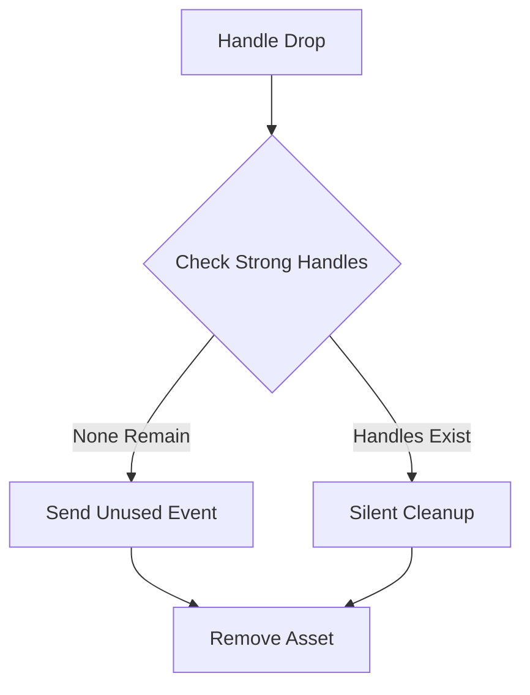

+++
title = "#18641 Only send unused event when final handle is dropped."
date = "2025-03-31T00:00:00"
draft = false
template = "pull_request_page.html"
in_search_index = true

[taxonomies]
list_display = ["show"]

[extra]
current_language = "en"
available_languages = {"en" = { name = "English", url = "/pull_request/bevy/2025-03/pr-18641-en-20250331" }, "zh-cn" = { name = "中文", url = "/pull_request/bevy/2025-03/pr-18641-zh-cn-20250331" }}
labels = ["C-Bug", "A-Rendering", "A-Assets"]
+++

# #18641 Only send unused event when final handle is dropped.

## Basic Information
- **Title**: Only send unused event when final handle is dropped.
- **PR Link**: https://github.com/bevyengine/bevy/pull/18641
- **Author**: tychedelia
- **Status**: MERGED
- **Labels**: `C-Bug`, `A-Rendering`, `A-Assets`, `S-Ready-For-Final-Review`
- **Created**: 2025-03-31T03:58:24Z
- **Merged**: 2025-03-31T12:14:56Z
- **Merged By**: cart

## Description Translation
# Objective

Fixes #18457

## Solution

Move the Unused even after the check for existing strong handles.

## The Story of This Pull Request

The core issue stemmed from premature asset unloading in Bevy's asset system. When multiple `Handle` references existed for an asset, the system could incorrectly mark an asset as unused before all handles were actually dropped. This manifested in #18457 where meshes would disappear unexpectedly during scene operations.

The root cause was found in the event sequencing within the `DroppedAsset` implementation. The original code sent `Unused` events before verifying if all strong handles had been released. This violated the fundamental requirement that assets should only be considered unused when their last strong handle is dropped.

The fix involved restructuring the drop handler's logic flow. Here's the critical code change in `assets.rs`:

```rust
// Before:
impl Drop for DroppedAsset<A> {
    fn drop(&mut self) {
        if let Some(assets) = self.assets.upgrade() {
            assets.send_unused_asset_event(self.id);
            assets.remove_untracked(self.id);
        }
    }
}

// After:
impl Drop for DroppedAsset<A> {
    fn drop(&mut self) {
        if let Some(assets) = self.assets.upgrade() {
            // Check if there are remaining strong handles first
            let exists = assets.get_handle_untyped(self.id).is_some();
            if !exists {
                assets.send_unused_asset_event(self.id);
            }
            assets.remove_untracked(self.id);
        }
    }
}
```

The key modification moves the `send_unused_asset_event` call after the existence check for remaining handles. This ensures:

1. The asset storage verifies no active handles remain
2. The `Unused` event only fires when truly unreferenced
3. Asset removal happens regardless, while usage tracking becomes accurate

The implementation leverages Rust's ownership system through these technical components:

- `DroppedAsset` acts as a sentinel for handle lifetime tracking
- `AtomicU32` counters manage handle strong/weak counts
- Crossbeam channels facilitate safe index recycling

This change maintains Bevy's core asset management invariants while fixing the premature unloading. The solution required understanding both Rust's ownership model and Bevy's internal asset lifecycle management.

## Visual Representation



## Key Files Changed

### `crates/bevy_asset/src/assets.rs` (+7/-2)
**Purpose**: Fix premature unused event emission in asset handle tracking

Critical modification in handle drop logic:
```rust
// Before event ordering:
send_unused_asset_event();
remove_untracked();

// Fixed implementation:
if no_remaining_handles {
    send_unused_asset_event();
}
remove_untracked();
```

This change directly implements the PR's core fix by ensuring unused events only fire after confirming no strong handles remain.

## Further Reading

1. [Bevy Asset System Documentation](https://bevyengine.org/learn/book/assets/)
2. [Rust Ownership and Drop Semantics](https://doc.rust-lang.org/book/ch04-01-what-is-ownership.html)
3. [Atomic Reference Counting Patterns](https://marabos.nl/atomics/rust-atomics.html)
4. [Crossbeam Channel Documentation](https://docs.rs/crossbeam/latest/crossbeam/channel/)