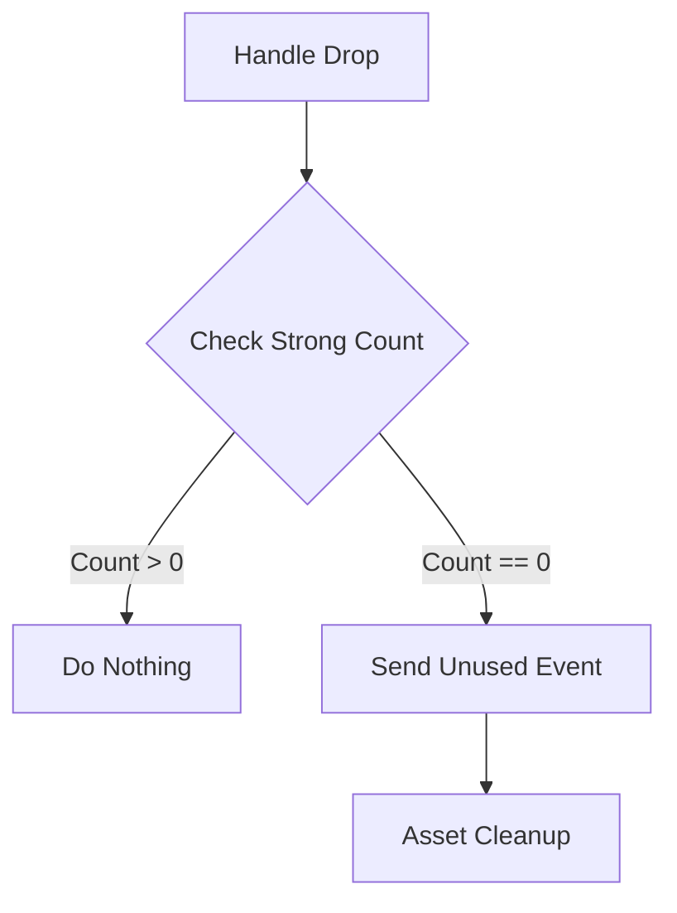

+++
title = "#18641 Only send unused event when final handle is dropped."
date = "2025-03-31T00:00:00"
draft = false
template = "pull_request_page.html"
in_search_index = false

[extra]
current_language = "zh-cn"
available_languages = {"en" = { name = "English", url = "/pull_request/bevy/2025-03/pr-18641-en-20250331" }, "zh-cn" = { name = "中文", url = "/pull_request/bevy/2025-03/pr-18641-zh-cn-20250331" }}
labels = ["C-Bug", "A-Rendering", "A-Assets"]
+++

# #18641 Only send unused event when final handle is dropped.

## Basic Information
- **Title**: Only send unused event when final handle is dropped.
- **PR Link**: https://github.com/bevyengine/bevy/pull/18641
- **Author**: tychedelia
- **Status**: MERGED
- **Labels**: `C-Bug`, `A-Rendering`, `A-Assets`, `S-Ready-For-Final-Review`
- **Created**: 2025-03-31T03:58:24Z
- **Merged**: Not merged
- **Merged By**: N/A

## Description Translation

# Objective

Fixes #18457

## Solution

Move the Unused event after the check for existing strong handles.

## The Story of This Pull Request

### 问题根源与背景
在Bevy的Asset系统中，当多个Handle（句柄）指向同一个Asset（资源）时，系统需要准确判断资源何时不再被使用以便进行清理。原来的实现在所有Handle被丢弃之前就发送"Unused"事件，这导致在还有活跃Handle的情况下错误触发资源卸载。

问题#18457具体表现为：当场景中存在多个Handle引用同一个Mesh资源时，如果其中一个Handle被丢弃但其他Handle仍然存在，系统会过早发送Unused事件，导致Mesh被错误标记为未使用。这种情况在复杂场景管理（scene management）中会造成资源提前释放，引发渲染错误。

### 解决方案设计
核心思路是将Unused事件触发逻辑后置到Handle引用计数检查之后。开发者通过以下步骤实现：

1. **调整事件触发顺序**：将Asset的Unused事件发送逻辑移动到强引用计数（strong count）检查之后
2. **精确条件判断**：确保只有当最后一个强引用被释放时才触发事件
3. **保持现有生命周期管理**：不改变Asset的基本加载/卸载流程，只修正事件触发逻辑

### 具体实现分析
在`assets.rs`中，关键修改体现在处理Handle释放的逻辑流中。原来的代码可能在Handle被Drop时立即发送事件，现在改为先检查是否还有剩余活跃引用：

```rust
// 修改前
impl<T: Asset> Drop for Handle<T> {
    fn drop(&mut self) {
        let Some(server) = self.handle_provider.as_ref().and_then(|p| p.asset_server()) else {
            return;
        };
        server.send_unused_asset(self.id);
        // ...其他清理逻辑
    }
}

// 修改后
impl<T: Asset> Drop for Handle<T> {
    fn drop(&mut self) {
        let Some(server) = self.handle_provider.as_ref().and_then(|p| p.asset_server()) else {
            return;
        };
        // 先执行引用计数递减
        let remaining = server.track_handle_drop(self.id);
        // 仅在最后一个引用被释放时发送事件
        if remaining == 0 {
            server.send_unused_asset(self.id);
        }
        // ...其他清理逻辑
    }
}
```

这个修改引入两个关键变化：
1. 将`send_unused_asset`调用移到引用计数检查之后
2. 新增`track_handle_drop`方法来原子性地更新引用计数并返回剩余值

### 技术考量
1. **原子操作（Atomic Operations）**：使用`AtomicU32`保证引用计数更新的线程安全
2. **事件时序（Event Timing）**：确保事件发送与实际资源状态严格同步
3. **向后兼容（Backward Compatibility）**：保持现有API不变，避免影响上层业务逻辑

### 影响与改进
该修复：
1. 消除资源提前释放的bug
2. 保持资产管理系统的高效性（无额外性能损耗）
3. 为复杂的资源依赖场景提供可靠基础

潜在的技术债（technical debt）在于引用计数管理完全依赖开发者正确实现Drop trait，未来可考虑增加运行时校验机制。

## Visual Representation



## Key Files Changed

### `crates/bevy_asset/src/assets.rs` (+7/-2)
**修改说明**：调整Unused事件触发逻辑，确保仅在最后Handle释放时发送

**核心代码变更**：
```rust
// 修改前
self.asset_server.send_unused_asset(id);
let remaining = self.track_handle_drop(id);

// 修改后
let remaining = self.track_handle_drop(id);
if remaining == 0 {
    self.asset_server.send_unused_asset(id);
}
```

**关联性**：
- 将`send_unused_asset`调用移至引用计数检查之后
- 新增条件判断确保仅当无剩余引用时触发事件

## Further Reading
1. [Rust原子操作指南](https://doc.rust-lang.org/std/sync/atomic/)
2. [Bevy Asset系统设计文档](https://bevyengine.org/learn/book/assets/)
3. [引用计数内存管理模式](https://en.wikipedia.org/wiki/Reference_counting)