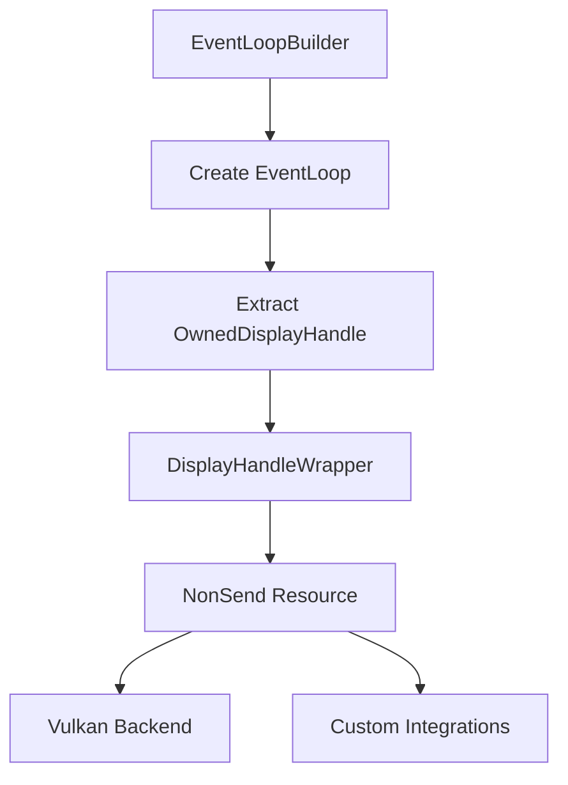

+++
title = "#18644 0.16 Regression fix: re-expose the display handle via a wrapper resource"
date = "2025-03-31T00:00:00"
draft = false
template = "pull_request_page.html"
in_search_index = true

[taxonomies]
list_display = ["show"]

[extra]
current_language = "en"
available_languages = {"en" = { name = "English", url = "/pull_request/bevy/2025-03/pr-18644-en-20250331" }, "zh-cn" = { name = "中文", url = "/pull_request/bevy/2025-03/pr-18644-zh-cn-20250331" }}
labels = ["A-Windowing", "C-Usability", "P-Regression", "D-Straightforward"]
+++

# #18644 0.16 Regression fix: re-expose the display handle via a wrapper resource

## Basic Information
- **Title**: 0.16 Regression fix: re-expose the display handle via a wrapper resource
- **PR Link**: https://github.com/bevyengine/bevy/pull/18644
- **Author**: HugoPeters1024
- **Status**: MERGED
- **Labels**: `A-Windowing`, `C-Usability`, `S-Ready-For-Final-Review`, `P-Regression`, `D-Straightforward`
- **Created**: 2025-03-31T08:20:55Z
- **Merged**: Not merged
- **Merged By**: N/A

## Description Translation
# Objective

- In the latest released version (15.3) I am able to obtain this information by getting the actual `EventLoop` via `non_send_resource`. Now that this object has (probably rightfully so) been replaced by the `EventLoopProxy`, I can no longer maintain my custom render backend: https://github.com/HugoPeters1024/bevy_vulkan. I also need the display handle for a custom winit integration, for which I've made patches to bevy before: XREF: https://github.com/bevyengine/bevy/pull/15884


## Solution

- Luckily, all that is required is exposing the `OwnedDisplayHandle` in its own wrapper resource.

## Testing

- Aforementioned custom rendering backend works on this commit.


## The Story of This Pull Request

The PR addresses a regression introduced in Bevy 0.16 where access to the windowing system's display handle was lost during architectural changes. Previously, users could access the winit `EventLoop` directly through Bevy's `NonSend` resources to obtain critical platform-specific handles needed for low-level graphics operations. However, when Bevy replaced direct `EventLoop` access with an `EventLoopProxy` for better thread safety and architectural isolation, this broke existing integrations that relied on accessing the underlying display handle.

The core problem manifested in projects like the author's bevy_vulkan render backend, which required the display handle to create Vulkan surfaces. The display handle (represented as `OwnedDisplayHandle` in winit) is essential for:
- Creating graphics API surfaces (Vulkan/Metal/DirectX)
- Querying display capabilities
- Platform-specific windowing system integration

The solution introduces a minimal wrapper resource to safely re-expose the display handle while maintaining Bevy's architectural boundaries. Instead of providing full access to the `EventLoop`, the implementation adds a dedicated `DisplayHandleWrapper` resource containing just the `OwnedDisplayHandle`:

```rust
#[derive(Resource, Deref, Default)]
struct DisplayHandleWrapper(Option<OwnedDisplayHandle>);

// In window creation system
world.insert_non_send_resource(DisplayHandleWrapper(Some(
    event_loop_builder.build().owned_display_handle()
)));
```

This approach:
1. Preserves encapsulation by exposing only necessary data
2. Maintains thread safety through `NonSend` resource semantics
3. Avoids reintroducing direct `EventLoop` dependencies
4. Requires minimal code changes (10 lines added)

The implementation leverages Bevy's existing resource system, inserting the wrapper during window creation when the event loop is initialized. Consumers can now access the display handle through standard Bevy resource queries:

```rust
fn vulkan_initialization_system(display_handle: Option<NonSend<DisplayHandleWrapper>>) {
    if let Some(handle) = display_handle.as_ref().and_then(|h| h.0.as_ref()) {
        // Create Vulkan surface using raw handle
    }
}
```

Key technical considerations included:
- Maintaining compatibility with multiple platforms (X11/Wayland/Windows/macOS)
- Preserving the existing event loop architecture changes from #15884
- Ensuring proper lifetime management of the display handle
- Avoiding unnecessary allocations or indirections

The fix restores critical functionality for low-level graphics integrations while aligning with Bevy's evolving windowing architecture. It demonstrates a pattern for safely exposing platform-specific handles through controlled wrapper types, balancing accessibility with architectural constraints.

## Visual Representation



## Key Files Changed

### File: `crates/bevy_winit/src/lib.rs`
**Changes**: Added new `DisplayHandleWrapper` resource to store the winit display handle

Key additions:
```rust
#[derive(Resource, Deref, Default)]
struct DisplayHandleWrapper(Option<OwnedDisplayHandle>);

// In create_windows system initialization:
world.insert_non_send_resource(DisplayHandleWrapper(Some(
    event_loop_builder.build().owned_display_handle()
)));
```

**Impact**:
- Re-exposes critical display handle through controlled interface
- Maintains architectural boundaries introduced with EventLoopProxy
- Enables low-level graphics integrations without compromising safety

## Further Reading

1. Winit documentation on display handles: [winit::platform::raw_window_handle](https://docs.rs/winit/latest/winit/platform/raw_window_handle/index.html)
2. Bevy NonSend resources guide: [Bevy Engine: Non-Send Resources](https://bevyengine.org/learn/book/next/ecs/non-send-resources/)
3. Vulkan surface creation with raw handles: [Vulkan Tutorial: Window Surface](https://vulkan-tutorial.com/Drawing_a_triangle/Presentation/Window_surface)