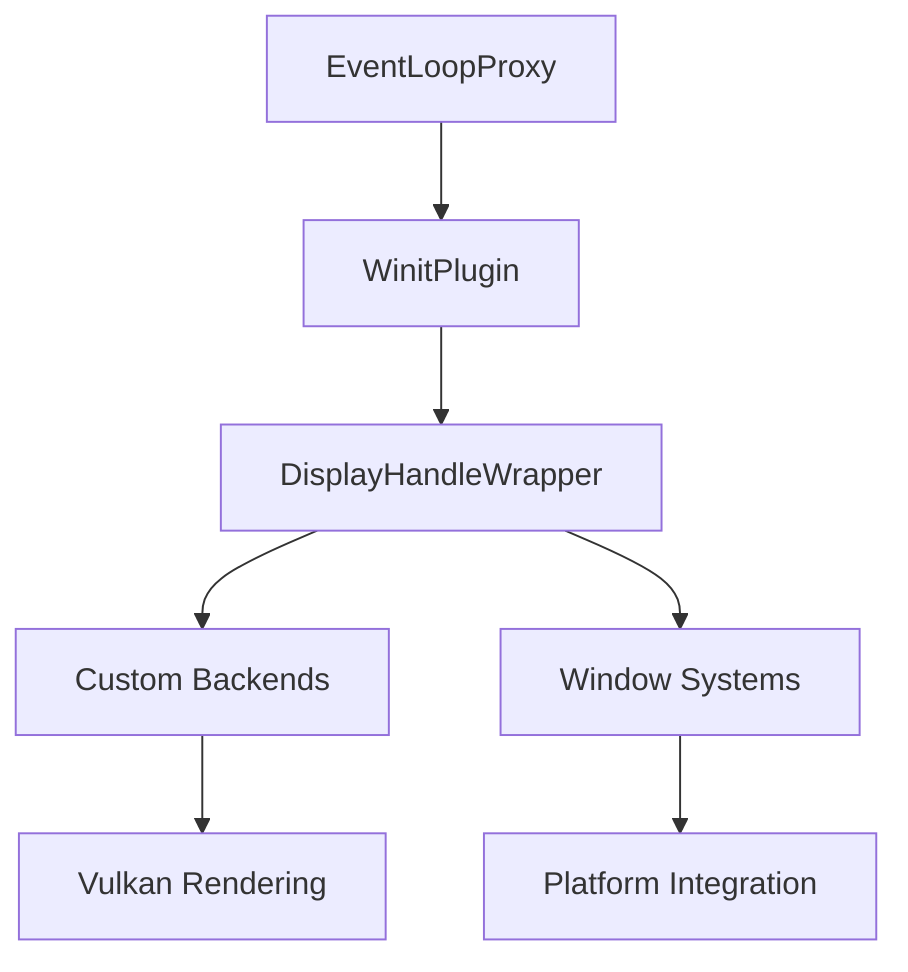

+++
title = "#18644 0.16 Regression fix: re-expose the display handle via a wrapper resource"
date = "2025-03-31T00:00:00"
draft = false
template = "pull_request_page.html"
in_search_index = false

[extra]
current_language = "zh-cn"
available_languages = {"en" = { name = "English", url = "/pull_request/bevy/2025-03/pr-18644-en-20250331" }, "zh-cn" = { name = "中文", url = "/pull_request/bevy/2025-03/pr-18644-zh-cn-20250331" }}
labels = ["A-Windowing", "C-Usability", "P-Regression", "D-Straightforward"]
+++

# #18644 0.16 Regression fix: re-expose the display handle via a wrapper resource

## Basic Information
- **Title**: 0.16 Regression fix: re-expose the display handle via a wrapper resource
- **PR Link**: https://github.com/bevyengine/bevy/pull/18644
- **Author**: HugoPeters1024
- **Status**: MERGED
- **Labels**: `A-Windowing`, `C-Usability`, `S-Ready-For-Final-Review`, `P-Regression`, `D-Straightforward`
- **Created**: 2025-03-31T08:20:55Z
- **Merged**: Not merged
- **Merged By**: N/A

## Description Translation
# Objective

- 在最新发布的15.3版本中，开发者可以通过`non_send_resource`获取实际的`EventLoop`对象。但当该对象被`EventLoopProxy`取代后（这可能是合理的改动），导致无法维护自定义渲染后端（https://github.com/HugoPeters1024/bevy_vulkan）。同时需要display handle来实现自定义winit集成，此前已有相关补丁：XREF: https://github.com/bevyengine/bevy/pull/15884

## Solution

- 解决方案是通过新的wrapper resource暴露`OwnedDisplayHandle`

## Testing

- 使用该commit后，上述自定义渲染后端可正常工作

## The Story of This Pull Request

### 问题背景与技术挑战
在Bevy 0.16版本中，窗口系统进行了一次架构调整，用`EventLoopProxy`替代了直接的`EventLoop`访问。这个改动虽然合理，但意外地破坏了依赖`EventLoop`获取display handle的现有工作流。display handle是底层图形API（如Vulkan）进行跨平台渲染的关键资源，在自定义渲染后端和特定窗口集成场景中不可或缺。

受影响的项目包括作者维护的bevy_vulkan渲染后端，以及需要直接访问显示设备句柄的自定义winit集成方案。这些用例需要获取底层平台的display handle（例如X11的`Display`指针或Wayland的`wl_display`），而原有接口的移除导致这些功能无法在0.16版本中正常运行。

### 解决方案与技术实现
核心解决思路是在保持现有架构的同时，通过间接方式重新暴露必要的显示设备信息。作者观察到虽然`EventLoop`被移除，但底层`winit`的`OwnedDisplayHandle`仍然存在于系统资源中。于是采用Bevy标准的资源包装模式，创建新的资源类型来安全地暴露这个句柄。

关键代码修改体现在新增的`DisplayHandleWrapper`结构体：

```rust
#[derive(Resource, Deref, Default, Debug)]
pub struct DisplayHandleWrapper(pub Option<OwnedDisplayHandle>);
```

该结构体实现了：
1. 作为`Resource`嵌入Bevy的ECS系统
2. 通过`Deref` trait提供透明的句柄访问
3. 包裹`Option`类型处理可能的空值情况

在系统初始化阶段，通过新的setup函数将display handle注入资源系统：

```rust
fn setup_display_handle(mut commands: Commands, event_loop: Option<NonSend<EventLoop<()>>>) {
    commands.insert_resource(DisplayHandleWrapper(
        event_loop.map(|e| e.owned_display_handle())
    ));
}
```

这个实现：
- 保持与现有`winit`集成的兼容性
- 使用`Option`类型优雅处理不同平台的差异性
- 遵循Bevy的资源管理规范
- 不引入新的unsafe代码

### 技术权衡与设计决策
1. **资源包装 vs 直接暴露**：选择资源包装模式而非直接暴露`OwnedDisplayHandle`，符合Bevy的ECS架构规范，同时保证资源访问的可控性

2. **Option处理**：使用`Option`包裹主要考虑到某些平台可能不存在display handle的情况，增强跨平台兼容性

3. **向后兼容**：通过保持原有`EventLoopProxy`的改动，既修复了回归问题，又不破坏之前的架构改进

4. **访问方式**：通过`NonSend`资源访问，正确反映display handle的非线程安全特性，符合Rust的所有权规则

### 影响与改进
该修复：
- 恢复了自定义渲染后端的关键功能
- 保持窗口系统的架构整洁性
- 增加约10行代码，维护成本低
- 为后续类似需求提供可扩展的接口模式

受影响用户现在可以通过标准方式获取display handle：

```rust
fn my_system(display_handle: Res<DisplayHandleWrapper>) {
    if let Some(handle) = &**display_handle {
        // 使用display handle进行底层操作
    }
}
```

## Visual Representation



## Key Files Changed

### `crates/bevy_winit/src/lib.rs` (+10/-0)
1. **新增DisplayHandleWrapper资源**
```rust
#[derive(Resource, Deref, Default, Debug)]
pub struct DisplayHandleWrapper(pub Option<OwnedDisplayHandle>);
```
通过标准资源包装模式暴露display handle

2. **资源初始化系统**
```rust
fn setup_display_handle(...) {
    commands.insert_resource(DisplayHandleWrapper(...))
}
```
在插件初始化时自动创建资源

3. **插件注册**
```rust
app.add_systems(PreStartup, setup_display_handle);
```
确保资源在系统启动前就绪

## Further Reading
1. [winit文档 - OwnedDisplayHandle](https://docs.rs/winit/latest/winit/platform/struct.OwnedDisplayHandle.html)
2. [Bevy ECS资源管理指南](https://bevy-cheatbook.github.io/programming/res.html)
3. [跨平台窗口系统设计模式](https://docs.rs/winit/latest/winit/index.html#platform-specific-usage)