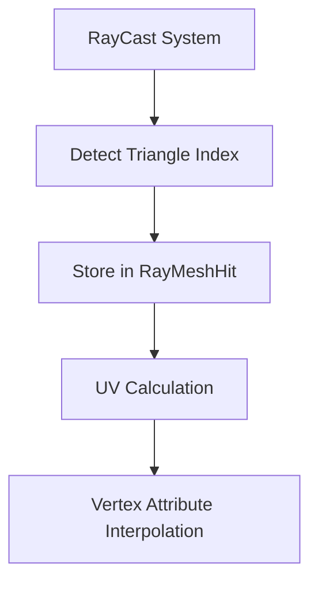

+++
title = "#18647"
date = "2025-03-31T00:00:00"
draft = false
template = "pull_request_page.html"
in_search_index = true

[taxonomies]
list_display = ["show"]

[extra]
current_language = "en"
available_languages = {"en" = { name = "English", url = "/pull_request/bevy/2025-03/pr-18647-en-20250331" }, "zh-cn" = { name = "中文", url = "/pull_request/bevy/2025-03/pr-18647-zh-cn-20250331" }}
+++

# #18647 Return triangle index instead of vertex index (Fixes #18081)

## The Story of This Pull Request

### The Problem and Context
The core issue (#18081) stemmed from an incorrect index being returned during mesh-ray intersections. The original implementation returned the first vertex index of the hit triangle, making it impossible to accurately retrieve per-vertex data like UV coordinates across the entire triangle surface. This fundamentally broke barycentric coordinate calculations needed for texture sampling and other interpolation-based operations.

### The Solution Approach
The fix required changing the fundamental index type being tracked. Instead of storing a single vertex index, the solution tracks the triangle index itself. This enables developers to:
1. Access all three vertices of the hit triangle
2. Correctly interpolate vertex attributes using barycentric coordinates
3. Work with both indexed and non-indexed meshes

### The Implementation
The key structural change appears in the `RayMeshHit` definition:

```rust
// Before:
pub vertex_index: Option<usize>,

// After:
pub triangle_index: Option<usize>,
```

This single field change ripples through the intersection logic. When processing triangles, the code now tracks the triangle's position in the index buffer rather than its first vertex:

```rust
// During triangle processing:
let hit = RayMeshHit {
    triangle_index: Some(triangle_index),
    // ... other fields
};
```

The testing code demonstrates proper usage:
```rust
// Accessing all three vertices via triangle index
indices[i * 3] // Vertex A
indices[i * 3 + 1] // Vertex B
indices[i * 3 + 2] // Vertex C
```

### Technical Insights
The implementation handles three mesh configurations:
1. **Indexed meshes (U16/U32)**: Uses triangle index to find vertex triplet
2. **Non-indexed meshes**: Assumes implicit triangle groupings of sequential vertices
3. **Malformed index buffers**: Early-exits if index count isn't divisible by 3

The barycentric coordinate calculation remains unchanged but now works correctly:
```rust
// Valid because all 3 vertices are available
all_uvs[a] * bary.x + all_uvs[b] * bary.y + all_uvs[c] * bary.z
```

### The Impact
This fix enables critical graphics functionality:
- Accurate UV coordinate interpolation
- Correct texture sampling
- Vertex color blending
- Any attribute interpolation across triangle surfaces

The changes maintain backward compatibility through the `Option<usize>` wrapper while fixing a fundamental data flow error in the picking system.

## Visual Representation



## Key Files Changed

### `crates/bevy_picking/src/mesh_picking/ray_cast/intersections.rs`
**Change:** Replaced `vertex_index` with `triangle_index` in hit data structure  
**Before:**
```rust
pub struct RayMeshHit {
    pub vertex_index: Option<usize>,
    // ... other fields
}
```

**After:**
```rust
pub struct RayMeshHit {
    pub triangle_index: Option<usize>,
    // ... other fields
}
```

This structural change propagates through the intersection detection logic, ensuring all triangle vertex indices become available for downstream calculations.

## Further Reading
1. [Barycentric Coordinate System](https://en.wikipedia.org/wiki/Barycentric_coordinate_system)
2. [Ray-Triangle Intersection Algorithms](https://www.scratchapixel.com/lessons/3d-basic-rendering/ray-tracing-rendering-a-triangle/ray-triangle-intersection-geometric-solution.html)
3. [Bevy Mesh Data Structures](https://bevyengine.org/learn/book/next/assets/meshes/)