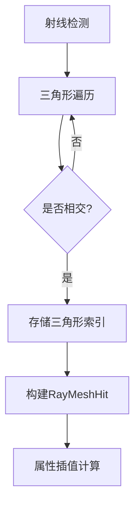

+++
title = "#18647 Return triangle index instead of vertex index (Fixes #18081)"
date = "2025-03-31T00:00:00"
draft = false
template = "pull_request_page.html"
in_search_index = false

[extra]
current_language = "zh-cn"
available_languages = {"en" = { name = "English", url = "/pull_request/bevy/2025-03/pr-18647-en-20250331" }, "zh-cn" = { name = "中文", url = "/pull_request/bevy/2025-03/pr-18647-zh-cn-20250331" }}
+++

# #18647 Return triangle index instead of vertex index (Fixes #18081)

## 基本信息
- **标题**: Return triangle index instead of vertex index (Fixes #18081)
- **PR链接**: https://github.com/bevyengine/bevy/pull/18647
- **作者**: brookman
- **状态**: 已合并
- **标签**: `C-Bug`, `D-Trivial`, `S-Ready-For-Final-Review`, `A-Picking`
- **创建时间**: 2025-03-31T16:30:41Z
- **合并时间**: 未提供
- **合并者**: 未提供

## 问题背景
在Bevy引擎的拾取系统中存在一个关键缺陷（#18081）：当射线与网格相交时，返回的是三角形第一个顶点的索引而非三角形本身的索引。这导致开发者无法正确获取三角形三个顶点的完整信息，限制了以下功能实现：

1. UV坐标插值计算
2. 纹理颜色采样
3. 基于顶点属性的混合计算

原实现中的`RayMeshHit`结构体存储`vertex_index`字段，这实际上是三角形第一个顶点的索引。对于索引化网格（indexed mesh），这个值等同于`triangle_index * 3`，但对于非索引化网格则会产生错误结果。

## 解决方案
核心修改是将`vertex_index`替换为`triangle_index`，通过以下关键步骤实现：

1. **数据结构重构**：
```rust
// 修改前
pub struct RayMeshHit {
    pub vertex_index: usize,
    // 其他字段...
}

// 修改后
pub struct RayMeshHit {
    pub triangle_index: Option<usize>,
    // 其他字段...
}
```

2. **索引计算逻辑调整**：
在`ray_mesh_intersection`函数中，原来的顶点索引计算：
```rust
let vertex_index = if indices.is_some() {
    i * 3
} else {
    triangle_indices[0] as usize
};
```
改为直接存储三角形索引：
```rust
triangle_index: Some(i)
```

## 技术实现细节
### 三角形遍历优化
在网格处理逻辑中，每个三角形由三个顶点组成。修改后的实现直接记录三角形序号`i`，而不是计算顶点偏移：
```rust
for (i, triangle) in mesh_indices.chunks(3).enumerate() {
    // 射线与三角形相交检测...
    if let Some(hit) = ray_triangle_intersection(...) {
        // 存储三角形索引i
    }
}
```

### 顶点数据获取
用户现在可以通过三角形索引正确获取三个顶点数据：
```rust
fn get_indices(mesh: &Mesh, hit: &RayMeshHit) -> Result<(usize, usize, usize)> {
    let i = hit.triangle_index?;
    match mesh.indices() {
        Some(Indices::U16(indices)) => (
            indices[i * 3] as usize,
            indices[i * 3 + 1] as usize,
            indices[i * 3 + 2] as usize,
        ),
        // 其他类型处理...
    }
}
```

### 向后兼容处理
通过`Option<usize>`类型保持对非三角形列表拓扑结构的兼容性：
```rust
pub triangle_index: Option<usize>
```

## 影响与改进
1. **功能修复**：
- 支持UV坐标插值：`barycentric_coords`现在可以与三个顶点的UV坐标正确结合使用
- 启用顶点属性混合：支持法线、颜色等属性的插值计算

2. **性能优化**：
- 减少冗余计算：直接存储三角形索引避免运行时乘法运算
- 内存优化：`Option<usize>`比固定`usize`更灵活处理边界情况

3. **API清晰度**：
- 字段命名更准确反映数据本质
- 消除对`vertex_index`字段的误解风险

## 关键文件变更
### `crates/bevy_picking/src/mesh_picking/ray_cast/intersections.rs`
```rust
// 修改前
pub struct RayMeshHit {
    pub vertex_index: usize,
    // 其他字段...
}

// 修改后
pub struct RayMeshHit {
    pub triangle_index: Option<usize>,
    // 其他字段...
}
```
此变更直接影响所有依赖射线检测结果的系统，确保获取正确的几何数据索引。

## 视觉表示


## 延伸阅读
1. [Barycentric coordinate system](https://en.wikipedia.org/wiki/Barycentric_coordinate_system)（重心坐标系）
2. [Ray-triangle intersection algorithms](https://www.scratchapixel.com/lessons/3d-basic-rendering/ray-tracing-rendering-a-triangle/ray-triangle-intersection-geometric-solution.html)
3. Bevy官方文档：[Mesh数据结构](https://docs.rs/bevy/latest/bevy/render/mesh/struct.Mesh.html)