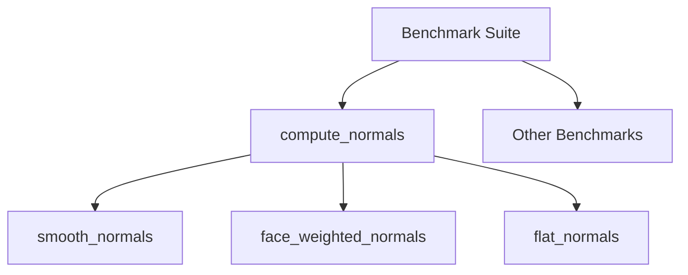

+++
title = "#18648 Add compute_*_normals benchmarks"
date = "2025-03-31T00:00:00"
draft = false
template = "pull_request_page.html"
in_search_index = true

[taxonomies]
list_display = ["show"]

[extra]
current_language = "en"
available_languages = {"en" = { name = "English", url = "/pull_request/bevy/2025-03/pr-18648-en-20250331" }, "zh-cn" = { name = "中文", url = "/pull_request/bevy/2025-03/pr-18648-zh-cn-20250331" }}
labels = ["A-Rendering", "C-Benchmarks", "D-Straightforward"]
+++

# #18648 Add compute_*_normals benchmarks

## Basic Information
- **Title**: Add compute_*_normals benchmarks
- **PR Link**: https://github.com/bevyengine/bevy/pull/18648
- **Author**: Waridley
- **Status**: MERGED
- **Labels**: `A-Rendering`, `S-Ready-For-Final-Review`, `C-Benchmarks`, `X-Uncontroversial`, `D-Straightforward`
- **Created**: 2025-03-31T17:37:41Z
- **Merged**: Not merged
- **Merged By**: N/A

## Description Translation
# Objective

Benchmark current `compute_*_normals` methods to get a baseline as requested in https://github.com/bevyengine/bevy/pull/18552#issuecomment-2764875143

## Solution

Since the change to the default smooth normals method will definitely cause a regression, but the previous method will remain as an option, I added two technically-redundant benchmarks but with different names: `smooth_normals` for whatever default weighting method is used, and `face_weighted_normals` to benchmark the area-weighted method regardless of what the default is. Then I'm adding `angle_weighted_normals` in #18552. I also added `flat_normals` for completeness.

## The Story of This Pull Request

The PR addresses the need for baseline performance metrics before changing Bevy's normal computation methods. When preparing to modify the default smooth normals algorithm in PR #18552, the author recognized the importance of establishing reliable benchmarks to measure potential performance impacts.

The core challenge was creating comparable benchmarks that could:
1. Accurately measure current implementations
2. Remain valid after algorithm changes
3. Support comparison between different normal calculation methods

The implementation uses Criterion.rs for precise benchmarking, constructing a 256x256 grid mesh with randomized Z-values to simulate real-world geometry variance. The mesh generation carefully replicates vertex sharing patterns found in typical indexed meshes:

```rust
(0..GRID_SIZE - 1)
    .flat_map(|i| std::iter::repeat(i).zip(0..GRID_SIZE - 1))
    .flat_map(|(i, j)| {
        let tl = ((GRID_SIZE * j) + i) as u32;
        let tr = tl + 1;
        let bl = ((GRID_SIZE * (j + 1)) + i) as u32;
        let br = bl + 1;
        [tl, bl, tr, tr, bl, br]
    })
```

Three distinct benchmarks were implemented:
1. `smooth_normals`: Tests the current default implementation
2. `face_weighted_normals`: Explicitly tests area-weighted method
3. `flat_normals`: Tests non-smooth normal generation

Notable implementation details:
- `black_box` usage prevents compiler optimizations from skewing results
- Custom iteration timing ensures accurate measurement of just the target computation
- Mesh regeneration per iteration controls for cache effects

The benchmark structure allows direct comparison between methods while maintaining backward compatibility. The redundant naming for face-weighted normals ensures this specific algorithm remains tracked even if defaults change.

## Visual Representation



## Key Files Changed

### `benches/benches/bevy_render/compute_normals.rs` (+96/-0)
**Purpose**: Implement normal computation benchmarks  
**Key Code**:
```rust
c.bench_function("smooth_normals", |b| {
    b.iter_custom(|iters| {
        // Setup and timing logic
        mesh.compute_smooth_normals();
    });
});

c.bench_function("flat_normals", |b| {
    let new_mesh = || {
        new_mesh()
            .with_duplicated_vertices()
            .with_computed_flat_normals()
    };
    // Benchmark logic
});
```
**Significance**: Contains all benchmarking logic for different normal computation methods using realistic mesh data.

### `benches/benches/bevy_render/main.rs` (+6/-1)
**Purpose**: Integrate new benchmarks into test suite  
**Key Change**:
```rust
criterion_main!(
    render_layers::benches,
    compute_normals::benches,  // Added
    torus::benches
);
```
**Significance**: Makes the new benchmarks part of the standard benchmarking suite.

## Further Reading
- [Criterion.rs Documentation](https://docs.rs/criterion/latest/criterion/) - For understanding benchmarking methodology
- [Bevy Mesh Documentation](https://docs.rs/bevy_render/latest/bevy_render/mesh/struct.Mesh.html) - Context on normal computation APIs
- [PR #18552](https://github.com/bevyengine/bevy/pull/18552) - Follow-up work using these benchmarks