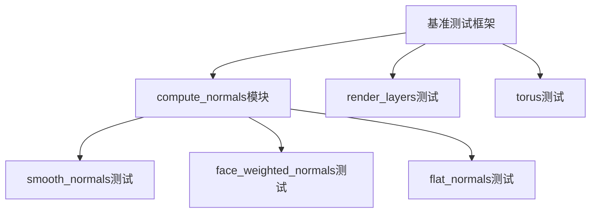

+++
title = "#18648 Add compute_*_normals benchmarks"
date = "2025-03-31T00:00:00"
draft = false
template = "pull_request_page.html"
in_search_index = false

[extra]
current_language = "zh-cn"
available_languages = {"en" = { name = "English", url = "/pull_request/bevy/2025-03/pr-18648-en-20250331" }, "zh-cn" = { name = "中文", url = "/pull_request/bevy/2025-03/pr-18648-zh-cn-20250331" }}
labels = ["A-Rendering", "C-Benchmarks", "D-Straightforward"]
+++

# #18648 Add compute_*_normals benchmarks

## Basic Information
- **Title**: Add compute_*_normals benchmarks
- **PR Link**: https://github.com/bevyengine/bevy/pull/18648
- **Author**: Waridley
- **Status**: MERGED
- **Labels**: `A-Rendering`, `S-Ready-For-Final-Review`, `C-Benchmarks`, `X-Uncontroversial`, `D-Straightforward`
- **Created**: 2025-03-31T17:37:41Z
- **Merged**: 2025-04-01T09:22:15Z
- **Merged By**: cart

## Description Translation
### 目标
为当前`compute_*_normals`方法建立基准测试，作为#18552中要求的性能基准

### 解决方案
由于默认平滑法线方法的改变必然会导致性能回退，但旧方法仍将保留为可选方案，我们添加了两个技术层面冗余但命名不同的基准测试：
- `smooth_normals`：测试默认权重计算方法
- `face_weighted_normals`：专门测试面积加权方法（与默认无关）
- 同时添加`flat_normals`作为完整性的补充测试

## The Story of This Pull Request

### 问题背景与挑战
在图形渲染领域，法线计算（normal computation）的质量直接影响光照效果的真实性。Bevy引擎提供了多种法线计算方法：
1. 平滑法线（smooth normals）：通过加权平均相邻面法线实现
2. 平面法线（flat normals）：每个面使用统一法线
3. 面积加权法线（face-weighted normals）

随着#18552计划引入角度加权法线（angle-weighted normals）作为新的默认方法，需要建立可靠的性能基准来：
- 量化不同方法的性能差异
- 防止性能回归（performance regression）
- 为未来优化提供比较基准

### 解决方案设计
Waridley的解决方案聚焦于三个关键测试场景：
1. **基准测试隔离**：虽然当前`compute_smooth_normals`同时包含面积加权和默认实现，但通过独立命名：
   - `smooth_normals`测试当前默认实现
   - `face_weighted_normals`明确测试面积加权方法
2. **测试数据构造**：使用256x256的网格生成地形数据，每个顶点包含随机高度值，模拟真实使用场景
3. **时间测量策略**：采用`iter_custom`进行精确时间统计，避免单次测量误差

```rust
c.bench_function("face_weighted_normals", |b| {
    b.iter_custom(|iters| {
        let mut total = Duration::default();
        for _ in 0..iters {
            let mut mesh = new_mesh();
            black_box(mesh.attribute(Mesh::ATTRIBUTE_NORMAL));
            let start = Instant::now();
            mesh.compute_smooth_normals(); // 当前仍使用相同实现
            let end = Instant::now();
            black_box(mesh.attribute(Mesh::ATTRIBUTE_NORMAL));
            total += end.duration_since(start);
        }
        total
    });
});
```

### 实现细节与技术选择
1. **网格生成优化**：
   - 使用`GRID_SIZE`常量控制测试规模，平衡测试精度和执行时间
   - 通过随机高度值生成地形特征数据：
```rust
let positions = (0..GRID_SIZE)
    .flat_map(|i| std::iter::repeat(i).zip(0..GRID_SIZE))
    .map(|(i, j)| [i as f32, j as f32, random::<f32>()])
```
2. **黑盒技术应用**：
   - 使用`black_box`防止编译器过度优化
   - 在计算前后分别读取法线属性，确保完整执行流程

3. **测试架构整合**：
   在`main.rs`中扩展测试集：
```rust
criterion_main!(
    render_layers::benches,
    compute_normals::benches,  // 新增测试模块
    torus::benches
);
```

### 技术洞察与未来方向
1. **性能测试方法论**：
   - 多次迭代累计时间（iter_custom）比单次测量更稳定
   - 大规模网格测试更能反映实际性能特征

2. **可扩展性设计**：
   - 分离测试命名为后续实现替换留出空间
   - 测试数据生成器`new_mesh`可复用

3. **潜在优化方向**：
   - 并行计算优化（parallel computation）
   - SIMD指令加速
   - 缓存优化（cache optimization）

## Visual Representation



## Key Files Changed

### 1. `benches/benches/bevy_render/compute_normals.rs` (+96/-0)
**核心改动**：
- 新增三种法线计算方法的基准测试
- 实现地形数据生成逻辑

**关键代码**：
```rust
const GRID_SIZE: usize = 256;

fn compute_normals(c: &mut Criterion) {
    // 索引生成逻辑
    let indices = Indices::U32(...);
    
    // 网格生成闭包
    let new_mesh = || {
        Mesh::new(...)
            .with_inserted_attribute(...)
            .with_inserted_indices(...)
    };
    
    // 三种基准测试定义
    c.bench_function("smooth_normals", ...);
    c.bench_function("face_weighted_normals", ...);
    c.bench_function("flat_normals", ...);
}
```

### 2. `benches/benches/bevy_render/main.rs` (+6/-1)
**集成改动**：
- 将新测试模块加入主测试集

**修改对比**：
```rust
// 修改前:
criterion_main!(render_layers::benches, torus::benches);

// 修改后:
criterion_main!(
    render_layers::benches,
    compute_normals::benches,  // 新增
    torus::benches
);
```

## Further Reading
1. [Criterion.rs官方文档](https://bheisler.github.io/criterion.rs/book/index.html) - Rust基准测试框架深度指南
2. [法线计算原理](https://learnopengl.com/Lighting/Basic-Lighting) - OpenGL中的法线计算基础
3. [性能测试最佳实践](https://www.brendangregg.com/perf.html) - Brendan Gregg的性能分析方法论
4. [Rust黑盒优化](https://doc.rust-lang.org/std/hint/fn.black_box.html) - 编译器优化屏障技术详解