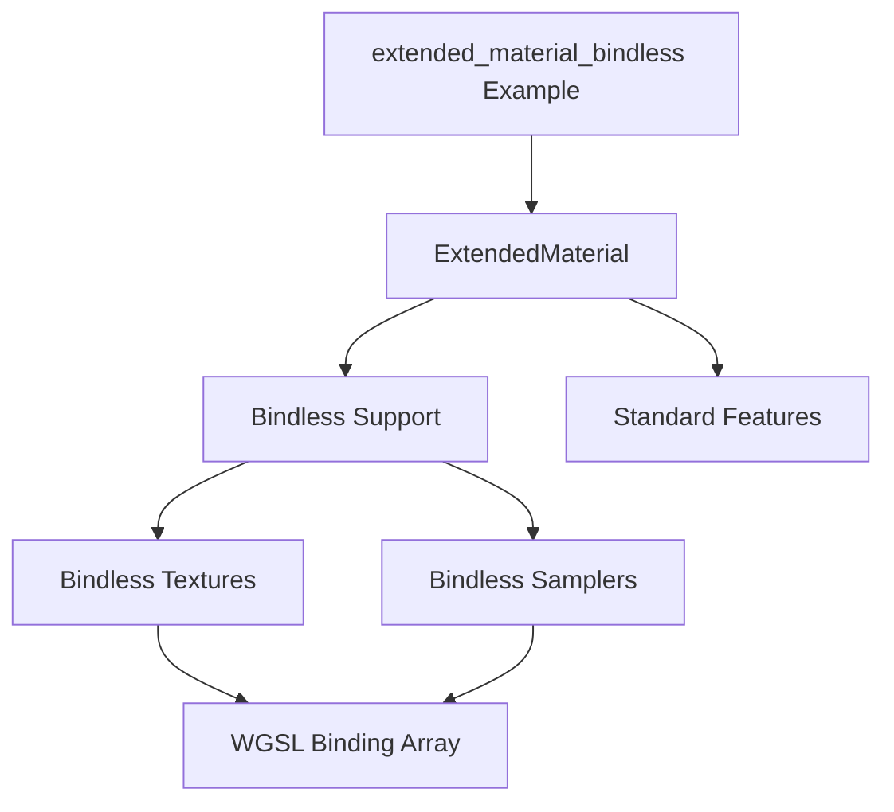

+++
title = "#18025 Add bindless support back to `ExtendedMaterial`."
date = "2025-04-09T00:00:00"
draft = false
template = "pull_request_page.html"
in_search_index = true

[taxonomies]
list_display = ["show"]

[extra]
current_language = "en"
available_languages = {"en" = { name = "English", url = "/pull_request/bevy/2025-04/pr-18025-en-20250409" }, "zh-cn" = { name = "中文", url = "/pull_request/bevy/2025-04/pr-18025-zh-cn-20250409" }}
labels = ["C-Feature", "A-Rendering"]
+++

# Title

## Basic Information
- **Title**: Add bindless support back to `ExtendedMaterial`.
- **PR Link**: https://github.com/bevyengine/bevy/pull/18025
- **Author**: pcwalton
- **Status**: MERGED
- **Labels**: C-Feature, A-Rendering, S-Ready-For-Final-Review
- **Created**: 2025-02-25T00:11:36Z
- **Merged**: 2025-04-09T15:56:56Z
- **Merged By**: superdump

## Description Translation
PR #17898 disabled bindless support for `ExtendedMaterial`. This commit adds it back. It also adds a new example, `extended_material_bindless`, showing how to use it.

## The Story of This Pull Request

### The Problem and Context
When PR #17898 refactored Bevy's material system, it inadvertently removed bindless rendering support from `ExtendedMaterial` - a critical regression for users relying on this feature for efficient texture management. Bindless rendering allows accessing textures through indices in a large array rather than individual bindings, essential for scenarios with many materials or dynamic texture streaming.

### The Solution Approach
The developer reinstated bindless support through coordinated changes across multiple systems:
1. Updated shader logic to handle bindless texture arrays
2. Modified material binding infrastructure to expose bindless resources
3. Added validation to prevent feature conflicts
4. Created a new example demonstrating practical usage

Key engineering decisions included maintaining backward compatibility and ensuring proper feature detection to prevent runtime errors.

### The Implementation
The core changes appear in material binding logic and shader code. In `material_bind_groups.rs`, the bind group layout was extended to conditionally include bindless resources:

```rust
// Before: Bindless entry missing
let entries = &[
    // Standard material bindings...
];

// After: Conditional bindless support
let mut entries = vec![/* standard bindings */];
if let Some(bindless_textures) = bindless_textures {
    entries.push(bindless_textures);
}
```

The new `extended_material_bindless.wgsl` shader demonstrates bindless texture access:
```wgsl
@group(1) @binding(0) var textures: binding_array<texture_2d<f32>>;
@group(1) @binding(1) var samplers: binding_array<sampler>;

fn sample_texture(texture_index: u32, sampler_index: u32, uv: vec2<f32>) -> vec4<f32> {
    return textureSample(textures[texture_index], samplers[sampler_index], uv);
}
```

### Technical Insights
The implementation leverages WGSL's `binding_array` feature while maintaining compatibility with non-bindless pipelines. Key considerations included:
- Dynamic bind group creation based on feature detection
- Safe interaction between standard and extended material properties
- Efficient validation through compile-time flags
- Clear separation between base material and extended features

### The Impact
This PR restores critical functionality while improving maintainability:
1. Bindless rendering works with extended materials
2. New example provides reference implementation
3. Validation prevents invalid feature combinations
4. Foundation for future bindless extensions

Developers can now combine extended material features with bindless rendering's performance benefits. The changes demonstrate how to maintain backward compatibility while reintroducing complex rendering features.

## Visual Representation



## Key Files Changed

### `crates/bevy_pbr/src/material_bind_groups.rs` (+133/-54)
**Purpose**: Add conditional bindless resource binding  
Key change:
```rust
// Added bindless texture array binding
if let Some(bindless_textures) = bindless_textures {
    entries.push(Shader::BindlessTextures.bindless_textures.clone());
}
```

### `examples/shader/extended_material_bindless.rs` (+156/-0)
**Purpose**: Demonstrate bindless extended material usage  
Key snippet:
```rust
// Configure extended material with bindless
material.extended = ExtendedMaterial {
    bindless: true,
    base_color_texture: Some(images[0].clone()),
    // Additional bindless textures...
};
```

### `assets/shaders/extended_material_bindless.wgsl` (+107/-0)
**Purpose**: Bindless texture sampling implementation  
Key technique:
```wgsl
// Bindless texture array access
let albedo = textureSample(textures[uniforms.texture_index], samplers[uniforms.sampler_index], uv);
```

## Further Reading
1. [WebGPU Bindless Design](https://github.com/gpuweb/gpuweb/issues/3608)
2. [Bevy Material System Documentation](https://bevyengine.org/learn/book/features/rendering/materials/)
3. [WGSL Binding Arrays Spec](https://www.w3.org/TR/WGSL/#binding-arrays)
4. [Bindless Rendering Techniques](https://developer.nvidia.com/bindless-texturing)