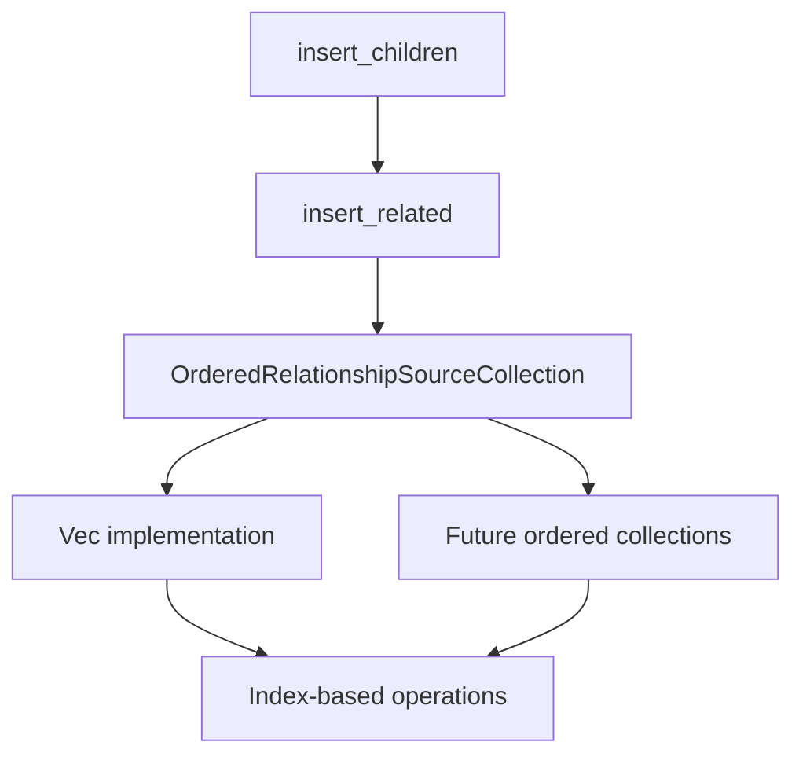

+++
title = "#18409 Finish #17558, re-adding `insert_children`"
date = "2025-04-01T00:00:00"
draft = false
template = "pull_request_page.html"
in_search_index = true

[taxonomies]
list_display = ["show"]

[extra]
current_language = "en"
available_languages = {"en" = { name = "English", url = "/pull_request/bevy/2025-04/pr-18409-en-20250401" }, "zh-cn" = { name = "中文", url = "/pull_request/bevy/2025-04/pr-18409-zh-cn-20250401" }}
labels = ["A-ECS", "C-Usability", "P-Regression"]
+++

# #18409 Finish #17558, re-adding `insert_children`

## Basic Information
- **Title**: Finish #17558, re-adding `insert_children`
- **PR Link**: https://github.com/bevyengine/bevy/pull/18409
- **Author**: ElliottjPierce
- **Status**: MERGED
- **Labels**: `A-ECS`, `C-Usability`, `S-Ready-For-Final-Review`, `P-Regression`
- **Created**: 2025-03-19T02:01:52Z
- **Merged**: Not merged
- **Merged By**: N/A

## Description Translation
fixes #17478

# Objective

- Complete #17558.
- the `insert_children` method was previously removed, and as #17478 points out, needs to be added back.

## Solution

- Add a `OrderedRelationshipSourceCollection`, which allows sorting, ordering, rearranging, etc of a `RelationshipSourceCollection`.
- Implement `insert_related`
- Implement `insert_children`
- Tidy up some docs while I'm here.

## Testing

@bjoernp116 set up a unit test, and I added a doc test to `OrderedRelationshipSourceCollection`.

## The Story of This Pull Request

The PR addresses a regression in Bevy's ECS hierarchy management where the critical `insert_children` method was accidentally removed in a previous refactor. This method is essential for precisely controlling child entity ordering in hierarchies, particularly important for UI systems and scene graphs where rendering order and layout depend on child sequence.

The core challenge was reintroducing ordered insertion capabilities while maintaining the existing relationship system's integrity. The solution introduces two key components:

1. **OrderedRelationshipSourceCollection Trait**
```rust
pub trait OrderedRelationshipSourceCollection: RelationshipSourceCollection {
    fn insert(&mut self, index: usize, entity: Entity);
    fn index_of(&self, entity: Entity) -> Option<usize>;
    fn move_to(&mut self, entity: Entity, new_index: usize);
}
```
This extension to the existing relationship system enables ordered manipulation of entity collections while preserving backward compatibility. The trait provides essential mutation operations while abstracting over different collection types.

2. **insert_related Method**
```rust
pub fn insert_related<R: Relationship>(&mut self, index: usize, related: &[Entity]) -> &mut Self
where
    <R::RelationshipTarget as RelationshipTarget>::Collection:
        OrderedRelationshipSourceCollection,
{
    // Implementation handling index clamping and relationship updates
}
```
The method enables inserting multiple related entities at specific positions, handling edge cases like:
- Duplicate entities (last occurrence determines final position)
- Out-of-bounds indices (clamped to valid range)
- Existing relationships (automatically updated)

A key implementation detail is the use of component hooks to maintain consistency between `ChildOf` relationships and their corresponding `Children` collections. When inserting children, the system:

1. Checks for existing parent relationships
2. Updates previous parent's children list if needed
3. Inserts the new child at the specified position
4. Maintains collection ordering through the ordered trait

The PR also enhances documentation, particularly clarifying the behavior of relationship collections and their ordering guarantees. New unit tests validate the insertion logic, including a test case that verifies correct ordering when inserting duplicate entities.

## Visual Representation



## Key Files Changed

### `crates/bevy_ecs/src/relationship/relationship_source_collection.rs` (+154/-2)
Added new trait for ordered relationship management:
```rust
pub trait OrderedRelationshipSourceCollection: RelationshipSourceCollection {
    fn insert(&mut self, index: usize, entity: Entity);
    fn index_of(&self, entity: Entity) -> Option<usize>;
    fn move_to(&mut self, entity: Entity, new_index: usize);
}

impl OrderedRelationshipSourceCollection for Vec<Entity> {
    fn insert(&mut self, index: usize, entity: Entity) {
        let index = index.min(self.len());
        self.insert(index, entity);
    }
    
    // Other trait implementations
}
```
Enables ordered operations on Vec-backed relationship collections.

### `crates/bevy_ecs/src/relationship/related_methods.rs` (+60/-0)
Implemented core insertion logic:
```rust
pub fn insert_related<R: Relationship>(&mut self, index: usize, related: &[Entity]) -> &mut Self {
    let id = self.id();
    self.world_scope(|world| {
        for (offset, related) in related.iter().enumerate() {
            let index = index + offset;
            // Relationship update logic
            world.entity_mut(*related).insert(R::from(id));
        }
    });
    self
}
```
Handles batch insertion with position tracking.

### `crates/bevy_ecs/src/hierarchy.rs` (+38/-0)
Enhanced documentation examples:
```rust
/// let mut main_entity = world.spawn_empty();
/// main_entity.add_related::<ChildOf>(&[e0, e1, e2, e2]);
/// main_entity.insert_related::<ChildOf>(1, &[e0, e3, e4, e4]);
/// assert_eq!(relationship_source, &[e1, e0, e3, e2, e4]);
```
Demonstrates ordered insertion behavior.

## Further Reading

1. Bevy ECS Relationships Guide: [Bevy's Official Documentation](https://bevyengine.org/learn/book/ecs-relationships/)
2. Entity Component System Pattern: [Wikipedia Overview](https://en.wikipedia.org/wiki/Entity_component_system)
3. Rust Trait System: [Rust Book Chapter](https://doc.rust-lang.org/book/ch10-02-traits.html)