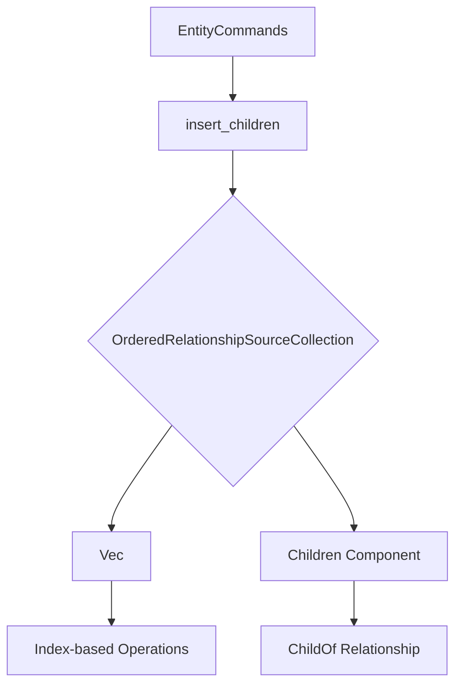

+++
title = "#18409 Finish #17558, re-adding `insert_children`"
date = "2025-04-01T00:00:00"
draft = false
template = "pull_request_page.html"
in_search_index = false

[extra]
current_language = "zh-cn"
available_languages = {"en" = { name = "English", url = "/pull_request/bevy/2025-04/pr-18409-en-20250401" }, "zh-cn" = { name = "中文", url = "/pull_request/bevy/2025-04/pr-18409-zh-cn-20250401" }}
labels = ["A-ECS", "C-Usability", "P-Regression"]
+++

# #18409 Finish #17558, re-adding `insert_children`

## Basic Information
- **Title**: Finish #17558, re-adding `insert_children`
- **PR Link**: https://github.com/bevyengine/bevy/pull/18409
- **Author**: ElliottjPierce
- **Status**: MERGED
- **Labels**: `A-ECS`, `C-Usability`, `S-Ready-For-Final-Review`, `P-Regression`
- **Created**: 2025-03-19T02:01:52Z
- **Merged**: Not merged
- **Merged By**: N/A

## Description Translation
修复 #17478

### 目标
- 完成 #17558
- 重新添加之前被移除的 `insert_children` 方法

### 解决方案
- 新增 `OrderedRelationshipSourceCollection` trait 用于实现关系集合的排序和重新排列
- 实现 `insert_related` 方法
- 重新实现 `insert_children` 方法
- 优化相关文档

### 测试
- 由 @bjoernp116 编写单元测试
- 新增针对 `OrderedRelationshipSourceCollection` 的文档测试

## The Story of This Pull Request

### 问题背景与上下文
在 Bevy ECS 的父子关系系统中，`insert_children` 方法在之前的重构中被意外移除，导致用户无法按指定顺序插入子实体（#17478）。这对需要精确控制子实体顺序的场景（如 UI 层级、骨骼动画等）造成使用障碍。

原有的 `Children` 组件使用 `EntityHashSet` 存储子实体，这种实现方式：
1. 无法保证子实体顺序
2. 不支持按索引插入新子实体
3. 在插入重复子实体时存在歧义

### 解决方案设计
核心思路是通过引入新的 trait 来扩展关系集合的排序能力：

```rust
// 新增 trait 定义
pub trait OrderedRelationshipSourceCollection: RelationshipSourceCollection {
    fn insert(&mut self, index: usize, entity: Entity);
    fn index_of(&self, entity: Entity) -> Option<usize>;
    fn move_to(&mut self, entity: Entity, new_index: usize);
}
```

这个设计：
- 保持与现有 `RelationshipSourceCollection` 的兼容性
- 通过 trait 实现提供灵活的后端存储（Vec 或 EntityHashSet）
- 支持索引操作而不强制所有关系都必须有序

### 关键技术实现
1. **`insert_related` 方法**：
```rust
pub fn insert_related<R: Relationship>(
    &mut self, 
    index: usize, 
    related: &[Entity]
) -> &mut Self 
{
    // 处理重复实体和索引越界
    for (offset, related) in related.iter().enumerate() {
        let index = index + offset;
        // 检查是否已存在相同父实体
        if world.get::<R>(*related).is_some_and(|r| r.parent() == id) {
            // 移动现有子实体位置
            collection.move_to(*related, index);
        } else {
            // 插入新子实体
            collection.insert(index, *related);
        }
    }
}
```
关键特性：
- 支持批量插入
- 自动处理重复实体（保留最后一个出现的位置）
- 索引自动修正（超出范围时自动调整）

2. **`Children` 组件升级**：
```rust
#[derive(Component)]
#[relationship_target(relationship = ChildOf, linked_spawn)]
pub struct Children(pub(crate) Vec<Entity>);

// 实现有序集合 trait
impl OrderedRelationshipSourceCollection for Vec<Entity> {
    fn insert(&mut self, index: usize, entity: Entity) {
        let index = index.min(self.len());
        self.insert(index, entity);
    }
}
```
现在使用 Vec 存储子实体，确保顺序稳定性。

### 技术权衡与决策
1. **存储结构选择**：
   - 使用 Vec 代替 EntityHashSet 以保证顺序
   - 牺牲 O(1) 查找性能换取顺序控制
   - 通过 `index_of` 方法实现 O(n) 查找

2. **API 设计**：
```rust
// 使用示例
parent.insert_children(1, &[child3, child4]);
```
保持与原有 `add_children` 相似的 API 形态，降低迁移成本。

3. **错误处理策略**：
   - 静默修正越界索引（自动调整到合法范围）
   - 不抛出错误，避免影响游戏主循环
   - 通过日志警告提示开发者

### 影响与改进
1. **功能恢复**：
   - 重新支持按索引插入子实体
   - 精确控制子实体顺序

2. **性能影响**：
   - 插入操作时间复杂度：O(n)
   - 查找操作时间复杂度：O(n)
   - 适合中小规模实体层级（典型游戏场景）

3. **扩展性增强**：
   - 通过 `OrderedRelationshipSourceCollection` trait 实现
   - 未来可支持其他有序关系类型

## Visual Representation



## Key Files Changed

### `crates/bevy_ecs/src/relationship/relationship_source_collection.rs` (+154/-2)
新增有序关系集合 trait：
```rust
pub trait OrderedRelationshipSourceCollection: RelationshipSourceCollection {
    fn insert(&mut self, index: usize, entity: Entity);
    fn index_of(&self, entity: Entity) -> Option<usize>;
    fn move_to(&mut self, entity: Entity, new_index: usize);
}

impl OrderedRelationshipSourceCollection for Vec<Entity> {
    fn insert(&mut self, index: usize, entity: Entity) {
        let index = index.min(self.len());
        self.insert(index, entity);
    }
    // 其他实现...
}
```

### `crates/bevy_ecs/src/relationship/related_methods.rs` (+60/-0)
实现插入逻辑：
```rust
pub fn insert_related<R: Relationship>(
    &mut self, 
    index: usize, 
    related: &[Entity]
) -> &mut Self {
    // 核心插入逻辑...
    if world.get::<R>(*related).is_some_and(|r| r.parent() == id) {
        collection.move_to(*related, index);
    } else {
        collection.insert(index, *related);
    }
}
```

### `crates/bevy_ecs/src/hierarchy.rs` (+38/-0)
更新 Children 组件：
```rust
#[derive(Component)]
#[relationship_target(relationship = ChildOf, linked_spawn)]
pub struct Children(pub(crate) Vec<Entity>);  // 改为 Vec 存储
```

### `crates/bevy_ecs/src/relationship/mod.rs` (+2/-0)
注册新 trait：
```rust
pub use relationship_source_collection::OrderedRelationshipSourceCollection;
```

## Further Reading
1. [ECS 关系系统设计模式](https://www.gamedevs.org/entity-component-system/relationship-patterns)
2. [Bevy 官方文档 - 父子关系](https://bevyengine.org/learn/book/ecs/hierarchy/)
3. [Rust trait 系统最佳实践](https://doc.rust-lang.org/book/ch10-02-traits.html)