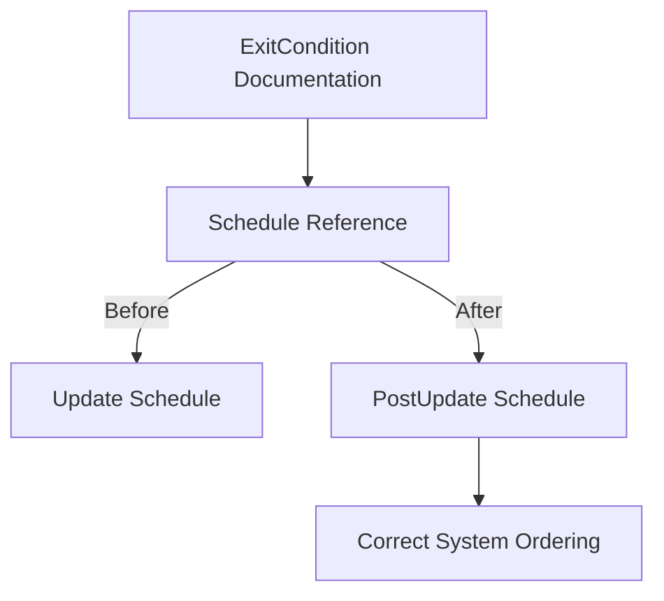

+++
title = "#18438 Fix documentation: incorrect references to the `Update` schedule in `ExitCondition`"
date = "2025-04-10T00:00:00"
draft = false
template = "pull_request_page.html"
in_search_index = true

[taxonomies]
list_display = ["show"]

[extra]
current_language = "en"
available_languages = {"en" = { name = "English", url = "/pull_request/bevy/2025-04/pr-18438-en-20250410" }, "zh-cn" = { name = "中文", url = "/pull_request/bevy/2025-04/pr-18438-zh-cn-20250410" }}
labels = ["C-Docs", "D-Trivial"]
+++

# Title

## Basic Information
- **Title**: Fix documentation: incorrect references to the `Update` schedule in `ExitCondition`
- **PR Link**: https://github.com/bevyengine/bevy/pull/18438
- **Author**: Henauxg
- **Status**: MERGED
- **Labels**: C-Docs, D-Trivial, S-Ready-For-Final-Review
- **Created**: 2025-03-20T12:16:48Z
- **Merged**: 2025-04-10T20:51:08Z
- **Merged By**: mockersf

## Description Translation
# Objective

- The referenced `ScheduleLabel` for `OnPrimaryClosed` and `OnAllClosed` in `ExitCondition` was incorrect

## Solution

- Changed `Update` to `PostUpdate`

## The Story of This Pull Request

The PR addresses a documentation inconsistency in Bevy's window handling system. The core issue centered around incorrect schedule references in API documentation comments, which could mislead developers about system execution order.

In Bevy's architecture, systems are organized into discrete schedules like `Update` and `PostUpdate` that execute in a specific sequence. The `ExitCondition` enum controls window closure behavior, with variants `OnPrimaryClosed` and `OnAllClosed` that trigger during `PostUpdate`. However, their documentation incorrectly stated they ran during the `Update` schedule.

This discrepancy created potential for developer confusion. Systems reacting to window closure events might be incorrectly ordered if placed in `Update` based on the documentation. The actual behavior already used `PostUpdate`, but the documentation didn't reflect this reality.

The solution involved a targeted edit to two documentation comments. By updating the referenced schedule from `Update` to `PostUpdate`, the PR brought documentation in line with actual system behavior. This change required no code modifications beyond the comments themselves, as the functional implementation was already correct.

The fix ensures developers referencing these comments will now see accurate information about when window closure events are processed. This alignment is crucial in Bevy's schedule-driven architecture, where system ordering affects data access and execution timing.

## Visual Representation



## Key Files Changed

**File**: `crates/bevy_window/src/lib.rs`

**Changes**:
- Updated schedule references in documentation comments for two enum variants

**Before**:
```rust
/// When the primary window is closed, the [`App`] will exit.
///
/// This will be inserted into the `Update` schedule.
#[default]
OnPrimaryClosed,

/// When all windows are closed, the [`App`] will exit.
///
/// This will be inserted into the `Update` schedule.
OnAllClosed,
```

**After**:
```rust
/// When the primary window is closed, the [`App`] will exit.
///
/// This will be inserted into the `PostUpdate` schedule.
#[default]
OnPrimaryClosed,

/// When all windows are closed, the [`App`] will exit.
///
/// This will be inserted into the `PostUpdate` schedule.
OnAllClosed,
```

## Further Reading

1. Bevy's Schedule Documentation: [https://bevyengine.org/learn/book/getting-started/schedules/](https://bevyengine.org/learn/book/getting-started/schedules/)
2. System Ordering in Bevy: [https://bevyengine.org/learn/book/getting-started/system-order/](https://bevyengine.org/learn/book/getting-started/system-order/)
3. Window Management in Bevy: [https://bevyengine.org/examples/window/window-close-detection/](https://bevyengine.org/examples/window/window-close-detection/)