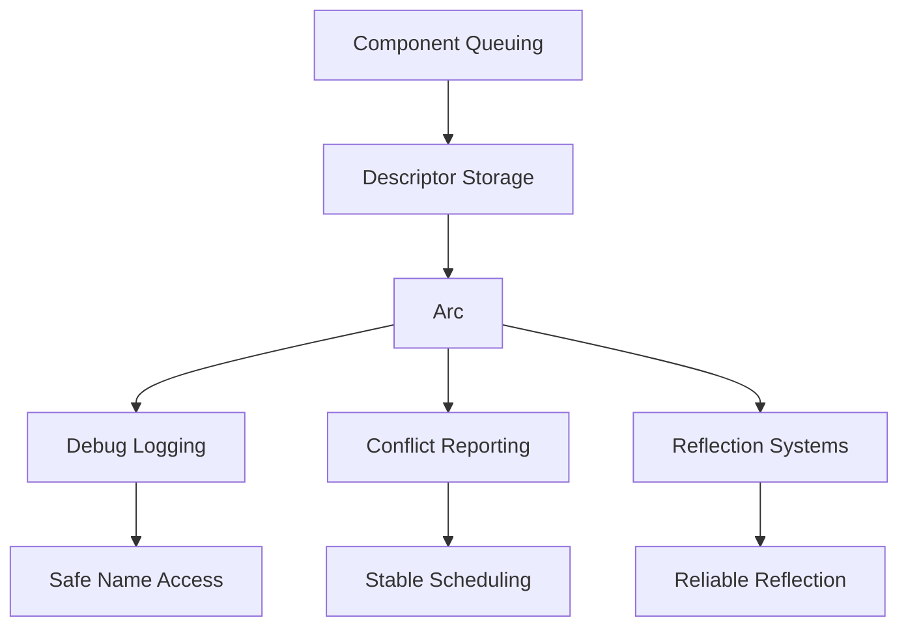

+++
title = "#18451 Get names of queued components"
date = "2025-04-01T00:00:00"
draft = false
template = "pull_request_page.html"
in_search_index = true

[taxonomies]
list_display = ["show"]

[extra]
current_language = "en"
available_languages = {"en" = { name = "English", url = "/pull_request/bevy/2025-04/pr-18451-en-20250401" }, "zh-cn" = { name = "中文", url = "/pull_request/bevy/2025-04/pr-18451-zh-cn-20250401" }}
labels = ["A-ECS", "C-Usability"]
+++

# #18451 Get names of queued components

## Basic Information
- **Title**: Get names of queued components
- **PR Link**: https://github.com/bevyengine/bevy/pull/18451
- **Author**: ElliottjPierce
- **Status**: MERGED
- **Labels**: `A-ECS`, `C-Usability`, `S-Ready-For-Final-Review`, `M-Needs-Migration-Guide`
- **Created**: 2025-03-20T21:44:25Z
- **Merged**: Not merged
- **Merged By**: N/A

## Description Translation
# Objective

#18173 allows components to be queued without being fully registered. But much of bevy's debug logging contained `components.get_name(id).unwrap()`. However, this panics when the id is queued. This PR fixes this, allowing names to be retrieved for debugging purposes, etc, even while they're still queued.

## Solution

We change `ComponentInfo::descriptor` to be `Arc<ComponentDescriptor>` instead of not arc'd. This lets us pass the descriptor around (as a name or otherwise) as needed. The alternative would require some form of `MappedRwLockReadGuard`, which is unstable, and would be terribly blocking. Putting it in an arc also signifies that it doesn't change, which is a nice signal to users. This does mean there's an extra pointer dereference, but I don't think that's an issue here, as almost all paths that use this are for debugging purposes or one-time set ups.

## Testing

Existing tests.

## Migration Guide

`Components::get_name` now returns `Option<Cow<'_, str>` instead of `Option<&str>`. This is because it now returns results for queued components. If that behavior is not desired, or you know the component is not queued, you can use `components.get_info().map(ComponentInfo::name)` instead.

Similarly, `ScheduleGraph::conflicts_to_string` now returns `impl Iterator<Item = (String, String, Vec<Cow<str>>)>` instead of `impl Iterator<Item = (String, String, Vec<&str>)>`. Because `Cow<str>` derefs to `&str`, most use cases can remain unchanged.


## The Story of This Pull Request

The PR addresses a usability gap in Bevy's ECS debugging capabilities that emerged after the introduction of component queuing in #18173. When components are queued for registration but not fully initialized, existing debug logging that relied on `Components::get_name` would panic due to missing component registration. This created reliability issues in debugging workflows and error reporting.

The core solution involves modifying how component descriptors are stored and accessed. By changing `ComponentInfo` to hold an `Arc<ComponentDescriptor>` instead of a direct reference, the implementation achieves two key goals:
1. Enables safe sharing of component metadata across systems
2. Allows access to component names even during queued state

The choice of `Arc` over alternatives like unstable `MappedRwLockReadGuard` was driven by stability requirements and the need to minimize blocking operations. While introducing an extra pointer indirection, this trade-off was deemed acceptable given the primary use cases in debugging paths rather than hot loops.

Key implementation changes appear in the component metadata handling:

```rust
// Before: Direct descriptor reference
pub struct ComponentInfo {
    descriptor: ComponentDescriptor,
}

// After: Arc-wrapped descriptor
pub struct ComponentInfo {
    descriptor: Arc<ComponentDescriptor>,
}
```

This architectural shift propagates through several systems:
1. Debug logging utilities can now safely access component names via the atomic reference
2. Conflict reporting in the scheduler handles both registered and queued components
3. Reflection systems gain stability when dealing with partially initialized components

The migration impacts return types but maintains backward compatibility through `Cow<str>` usage. For example:

```rust
// Before: Direct string slice
pub fn get_name(&self, id: ComponentId) -> Option<&str>

// After: Flexible Cow return type
pub fn get_name(&self, id: ComponentId) -> Option<Cow<'_, str>>
```

This approach allows consumers to handle names as either borrowed or owned strings without breaking existing code that expects string slices, as `Cow` provides transparent dereferencing to `&str`.

## Visual Representation



## Key Files Changed

### `crates/bevy_ecs/src/component.rs` (+110/-49)
**Core Change:** Converted `ComponentDescriptor` storage to `Arc`
```rust
// Before:
impl ComponentInfo {
    pub fn new(id: ComponentId, descriptor: ComponentDescriptor) -> Self {
        Self { id, descriptor }
    }
}

// After:
impl ComponentInfo {
    pub fn new(id: ComponentId, descriptor: Arc<ComponentDescriptor>) -> Self {
        Self { id, descriptor }
    }
}
```
Enables shared ownership of component metadata across systems.

### `crates/bevy_ecs/src/schedule/mod.rs` (+25/-5)
**Impact:** Updated conflict reporting to handle queued components
```rust
// Before:
fn conflicts_to_string(&self) -> impl Iterator<Item = (String, String, Vec<&str>)> + '_ 

// After:
fn conflicts_to_string(&self) -> impl Iterator<Item = (String, String, Vec<Cow<str>>)> + '_ 
```
Allows scheduler to display names of both registered and queued components.

### `crates/bevy_ecs/src/query/access.rs` (+2/-3)
**Consistency Update:** Aligned debug formatting with new metadata handling
```rust
// Modified Debug impl to work with Arc-based descriptors
Debug::entries(self.bit_set.ones().map(T::get_sparse_set_index))
```
Maintains consistent debugging output across ECS systems.

### `crates/bevy_ecs/Cargo.toml` (+2/-2)
**Dependency Adjustment:** Added `bevy_reflect` dependency
```toml
bevy_reflect = ["dep:bevy_reflect"]
```
Ensures reflection system compatibility with new descriptor handling.

## Further Reading
- [Rust Arc Documentation](https://doc.rust-lang.org/std/sync/struct.Arc.html)
- [Bevy ECS Component Registration](https://bevyengine.org/learn/book/next/ecs/components/)
- [Cow Type Explained](https://doc.rust-lang.org/std/borrow/enum.Cow.html)
- [Entity Component System Pattern](https://en.wikipedia.org/wiki/Entity_component_system)