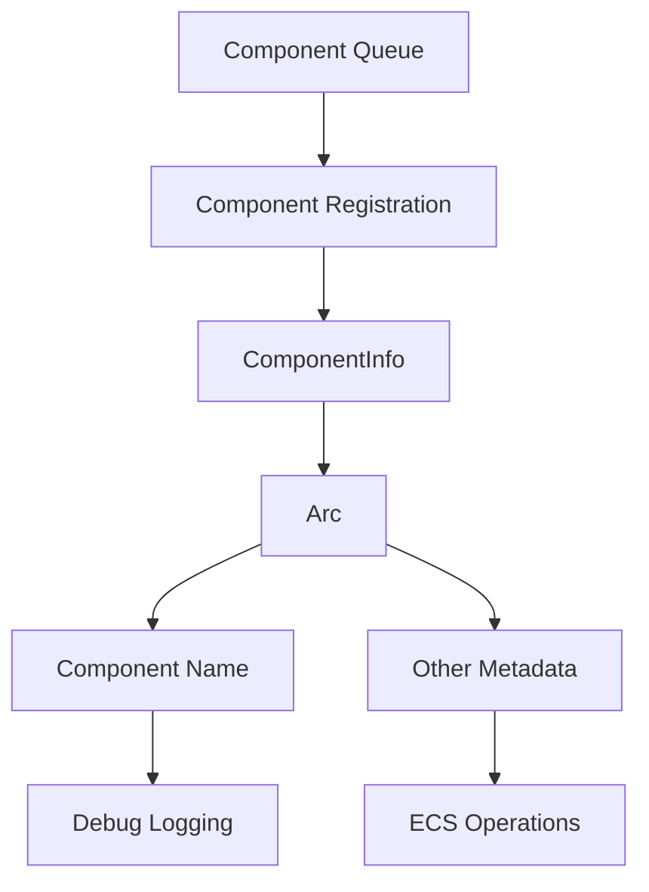

+++
title = "#18451 Get names of queued components"
date = "2025-04-01T00:00:00"
draft = false
template = "pull_request_page.html"
in_search_index = false

[extra]
current_language = "zh-cn"
available_languages = {"en" = { name = "English", url = "/pull_request/bevy/2025-04/pr-18451-en-20250401" }, "zh-cn" = { name = "中文", url = "/pull_request/bevy/2025-04/pr-18451-zh-cn-20250401" }}
labels = ["A-ECS", "C-Usability"]
+++

# #18451 Get names of queued components

## Basic Information
- **Title**: Get names of queued components
- **PR Link**: https://github.com/bevyengine/bevy/pull/18451
- **Author**: ElliottjPierce
- **Status**: MERGED
- **Labels**: `A-ECS`, `C-Usability`, `S-Ready-For-Final-Review`, `M-Needs-Migration-Guide`
- **Created**: 2025-03-20T21:44:25Z
- **Merged**: Not merged
- **Merged By**: N/A

## Description Translation

# Objective

#18173 允许组件在未完全注册的情况下进入队列。但 Bevy 的许多调试日志包含 `components.get_name(id).unwrap()`，当 id 处于队列状态时会导致 panic。本 PR 修复此问题，允许在调试等场景下获取名称，即使组件仍在队列中。

## Solution

我们将 `ComponentInfo::descriptor` 改为 `Arc<ComponentDescriptor>` 而非非 Arc 版本。这使得我们可以按需传递描述符（作为名称或其他用途）。替代方案需要某种形式的 `MappedRwLockReadGuard`（不稳定且会造成阻塞）。使用 Arc 也表明描述符不可变，这对用户是良好信号。虽然会增加指针解引用开销，但考虑到主要用途是调试或一次性设置，这可以接受。

## Testing

现有测试。

## Migration Guide

`Components::get_name` 现在返回 `Option<Cow<'_, str>>` 而非 `Option<&str>`。若不需要队列组件信息，或确定组件未在队列，可使用 `components.get_info().map(ComponentInfo::name)`。

同理，`ScheduleGraph::conflicts_to_string` 现在返回 `impl Iterator<Item = (String, String, Vec<Cow<str>>)>`。由于 `Cow<str>` 可解引用为 `&str`，大多数用例无需修改。

## The Story of This Pull Request

### 问题背景与挑战
在 Bevy ECS 中，当组件处于队列状态（queued）但未完全注册时，调试日志中通过 `components.get_name(id).unwrap()` 获取组件名称的操作会触发 panic。这个问题随着 #18173 引入组件队列机制后变得显著，因为新机制允许组件延迟注册，但现有的调试工具链尚未适配这种中间状态。

### 解决方案选择
核心问题在于组件描述符（ComponentDescriptor）的所有权管理。原始实现直接存储描述符，导致在队列状态下无法安全共享。团队考虑两种方案：
1. 使用 `MappedRwLockReadGuard`：需要依赖不稳定 API，且会造成锁竞争
2. 使用 `Arc<ComponentDescriptor>`：通过原子引用计数实现安全共享，无锁访问

最终选择方案 2，因其：
- 避免引入不稳定 API
- 明确传达描述符的不可变性
- 与 Rust 的所有权模型良好契合

### 实现细节
关键修改在 `component.rs`：
```rust
// Before:
pub struct ComponentInfo {
    descriptor: ComponentDescriptor,
    // ...其他字段
}

// After: 
pub struct ComponentInfo {
    descriptor: Arc<ComponentDescriptor>,
    // ...其他字段
}
```
这使得描述符可以跨多个上下文共享。相关方法同步调整：
```rust
// 获取组件名称的方法修改
pub fn name(&self) -> Cow<'static, str> {
    self.descriptor.name.clone()
}
```

### 影响与权衡
主要改进：
1. 消除调试日志中的潜在 panic
2. 支持在组件生命周期更早阶段获取元数据
3. 提升多线程环境下的访问安全性

性能方面，增加指针解引用操作，但：
- 主要影响路径属于调试和非性能关键路径
- Arc 的原子操作在现代硬件上开销可忽略

### 迁移适配
接口变化带来两处主要兼容性调整：
1. `Components::get_name` 返回类型改为 `Option<Cow<'_, str>>`
2. 调度冲突报告接口使用 `Cow<str>` 集合

对于大多数用例，原有代码无需修改，因 `Cow` 可自动解引用为 `&str`。需要精确控制内存的场景可通过 `.into_owned()` 显式转换。

## Visual Representation



## Key Files Changed

### `crates/bevy_ecs/src/component.rs` (+110/-49)
核心修改点：
```rust
// 组件描述符改为 Arc 包装
pub struct ComponentInfo {
    id: ComponentId,
    descriptor: Arc<ComponentDescriptor>,
    // ...
}

// 名称获取接口适配
impl ComponentInfo {
    pub fn name(&self) -> Cow<'static, str> {
        self.descriptor.name.clone()
    }
}
```
此修改使组件描述符成为共享的不可变数据，支持跨多个访问点安全使用。

### `crates/bevy_ecs/src/schedule/mod.rs` (+25/-5)
调整调试输出接口：
```rust
// 返回值类型从 &str 改为 Cow<str>
fn conflicts_to_string(&self) -> impl Iterator<Item = (String, String, Vec<Cow<str>>)> {
    // 使用 ComponentInfo::name 获取 Cow<str>
}
```
确保调度系统能正确显示队列中的组件名称。

### `crates/bevy_ecs/Cargo.toml` (+2/-2)
版本号更新：
```toml
version = "0.16.0-dev"  # 从之前版本更新
```
反映 ECS 模块的版本演进。

### `crates/bevy_ecs/src/world/reflect.rs` (+2/-2)
反射系统适配：
```rust
// 获取组件名称时使用新的 Cow 接口
let name = components.get_name(id).map(|c| c.into_owned());
```
确保反射系统正确处理组件名称的所有权。

## Further Reading
1. [Rust Arc 官方文档](https://doc.rust-lang.org/std/sync/struct.Arc.html)
2. [Bevy ECS 架构指南](https://bevyengine.org/learn/book/ecs/)
3. [Cow 类型的最佳实践](https://blog.logrocket.com/understanding-rust-cow-type/)
4. [组件生命周期管理](https://github.com/bevyengine/bevy/discussions/1843)