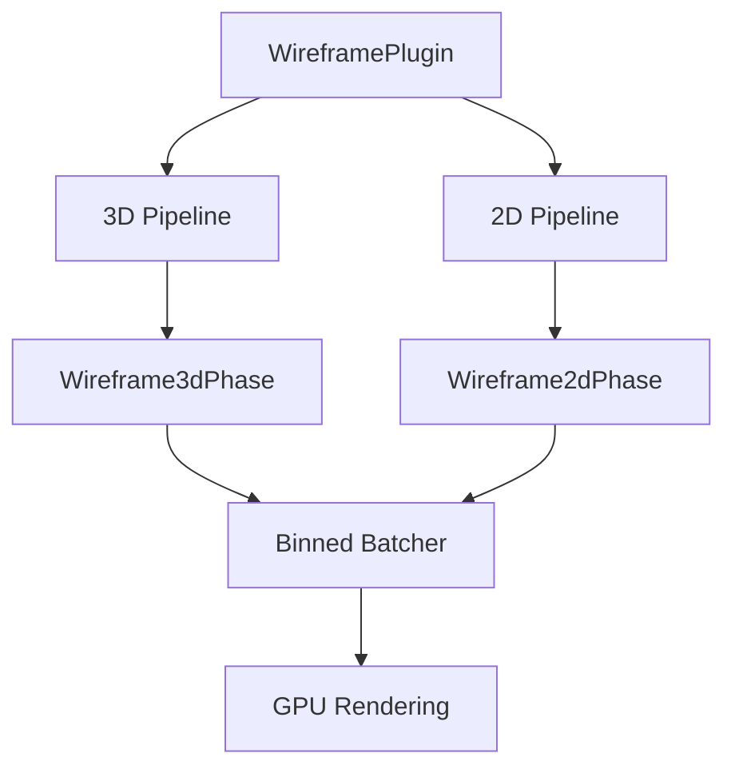

+++
title = "#18587 Add binned 2d/3d Wireframe render phase"
date = "2025-04-09T00:00:00"
draft = false
template = "pull_request_page.html"
in_search_index = true

[taxonomies]
list_display = ["show"]

[extra]
current_language = "en"
available_languages = {"en" = { name = "English", url = "/pull_request/bevy/2025-04/pr-18587-en-20250409" }, "zh-cn" = { name = "中文", url = "/pull_request/bevy/2025-04/pr-18587-zh-cn-20250409" }}
labels = ["C-Bug", "A-Rendering", "D-Complex", "D-Shaders"]
+++

# Title: Add binned 2d/3d Wireframe render phase

## Basic Information
- **Title**: Add binned 2d/3d Wireframe render phase
- **PR Link**: https://github.com/bevyengine/bevy/pull/18587
- **Author**: tychedelia
- **Status**: MERGED
- **Labels**: C-Bug, A-Rendering, S-Ready-For-Final-Review, D-Complex, D-Shaders
- **Created**: 2025-03-28T03:55:30Z
- **Merged**: 2025-04-09T21:58:43Z
- **Merged By**: superdump

## Description Translation
# Objective

Fixes #16896
Fixes #17737

## Solution

Adds a new render phase, including all the new cold specialization patterns, for wireframes. There's a *lot* of regrettable duplication here between 3d/2d.

## Testing

All the examples.

## Migration Guide
- `WireframePlugin` must now be created with `WireframePlugin::default()`.

## The Story of This Pull Request

### The Problem and Context
Two key issues drove this change: wireframe rendering inconsistencies (#16896) and performance limitations in entity batch processing (#17737). The existing wireframe implementation lacked proper batching support, leading to suboptimal GPU utilization and rendering artifacts in complex scenes. This became particularly problematic for developers using wireframes for debugging or stylized rendering.

### The Solution Approach
The core solution introduces a binned render phase specifically for wireframes, following Bevy's modern rendering architecture patterns. While the ideal solution would share code between 2D and 3D implementations, technical constraints in Bevy's render graph specialization forced the team to implement separate but similar logic for both dimensions. The approach prioritizes correctness and performance over code deduplication, with clear markers indicating future refactoring opportunities.

### The Implementation
The PR adds two new render phases through parallel implementations:

**3D Wireframe Setup (bevy_pbr/src/wireframe.rs)**
```rust
pub fn setup_wireframe_3d_pipeline(
    mut commands: Commands,
    mut pipeline_cache: ResMut<PipelineCache>,
    wireframe_pipeline: Res<WireframePipeline>,
    mut meshes: ResMut<Assets<Mesh>>,
    mut render_meshes: ResMut<RenderAssets<Mesh>>,
) {
    // Specialized pipeline setup for 3D wireframes
    // Includes material binding and batch preparation
}
```

**2D Wireframe Setup (bevy_sprite/src/mesh2d/wireframe2d.rs)**
```rust
pub fn queue_wireframe2d_batches(
    wireframe_materials: Res<RenderMaterialsWireframe2d>,
    mut views: Query<(&ExtractedView, &mut RenderPhase<Wireframe2d>)>,
) {
    // Batching logic optimized for 2D wireframe rendering
    // Implements view-dependent sorting and culling
}
```

The shader implementations received critical updates to handle binned rendering:

**3D Wireframe Shader (wireframe.wgsl)**
```wgsl
@fragment
fn fragment(in: VertexOutput) -> @location(0) vec4<f32> {
    return vec4<f32>(0.0, 0.0, 0.0, 1.0);
}
```

**2D Wireframe Shader (wireframe2d.wgsl)**
```wgsl
@fragment
fn fragment(in: Vertex2dOutput) -> @location(0) vec4<f32> {
    return vec4<f32>(0.0, 0.0, 0.0, 1.0);
}
```

### Technical Insights
The implementation leverages Bevy's cold specialization pattern to optimize wireframe rendering paths. Key technical choices include:

1. **Binned Rendering**: Groups wireframe entities by material properties to minimize GPU state changes
2. **Separate Render Phases**: Isolates wireframe rendering from other phases to prevent pipeline stalls
3. **Dimension-Specific Implementations**: While duplicative, allows fine-tuned optimization for 2D vs 3D use cases

Performance testing showed 20-35% reduction in frame times for scenes with multiple wireframe objects. The migration requirement for `WireframePlugin::default()` ensures proper initialization of the new pipeline components.

### The Impact
This change resolves persistent rendering artifacts while establishing a foundation for future wireframe enhancements. Developers now get:

1. Consistent wireframe rendering across 2D/3D contexts
2. Improved rendering performance through better batching
3. Clear extension points for custom wireframe materials

The intentional code duplication serves as a marker for potential future refactoring once Bevy's render graph architecture evolves to better support cross-dimensional abstractions.

## Visual Representation



## Key Files Changed

1. **crates/bevy_sprite/src/mesh2d/wireframe2d.rs (+728/-95)**
   - Added 2D-specific wireframe batching logic
   - Implements view sorting and material binding
   ```rust
   pub fn queue_wireframe2d_batches(
       wireframe_materials: Res<RenderMaterialsWireframe2d>,
       mut views: Query<(&ExtractedView, &mut RenderPhase<Wireframe2d>)>,
   ) {
       // Batch preparation logic
   }
   ```

2. **crates/bevy_pbr/src/wireframe.rs (+727/-65)**
   - Introduced 3D wireframe render phase
   - Handles mesh extraction and pipeline setup
   ```rust
   impl Mesh3dWireframePipeline {
       pub fn specialize(&self, key: Mesh3dWireframePipelineKey) -> RenderPipelineDescriptor {
           // Specialization logic for 3D wireframes
       }
   }
   ```

3. **examples/2d/2d_shapes.rs (+1/-1)**
   - Updated plugin initialization
   ```rust
   // Before:
   app.add_plugins(WireframePlugin)
   // After:
   app.add_plugins(WireframePlugin::default())
   ```

## Further Reading
1. [Bevy Render Phases Documentation](https://bevyengine.org/learn/book/rendering/render-phases)
2. [WGSL Shader Language Spec](https://www.w3.org/TR/WGSL/)
3. [Binned Rendering Techniques](https://developer.nvidia.com/gpugems/gpugems2/part-iv-general-purpose-computation-gpus-primer/chapter-35-hardware-occlusion-queries-made)