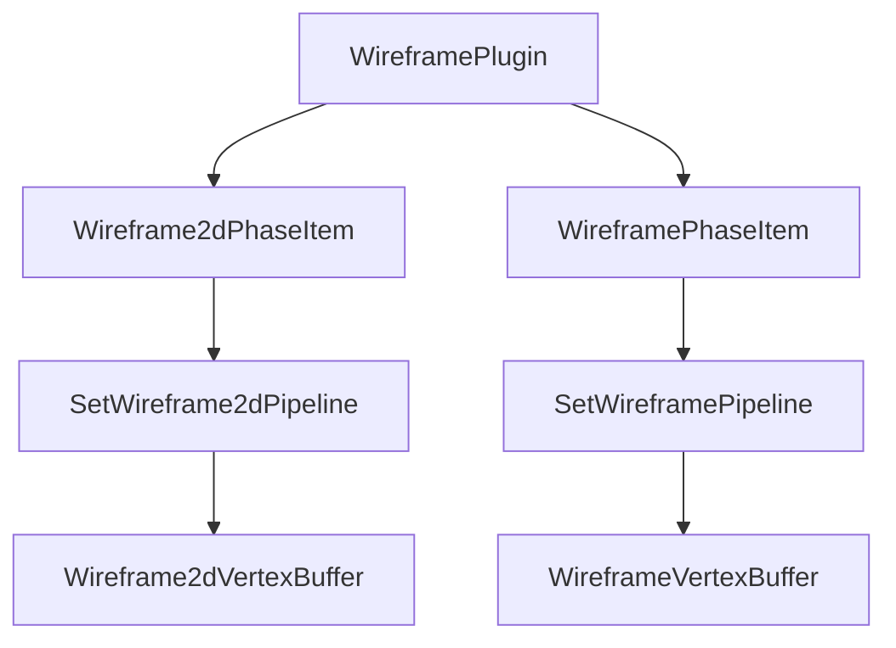

+++
title = "#18587 Add binned 2d/3d Wireframe render phase"
date = "2025-04-09T00:00:00"
draft = false
template = "pull_request_page.html"
in_search_index = false

[extra]
current_language = "zh-cn"
available_languages = {"en" = { name = "English", url = "/pull_request/bevy/2025-04/pr-18587-en-20250409" }, "zh-cn" = { name = "中文", url = "/pull_request/bevy/2025-04/pr-18587-zh-cn-20250409" }}
+++

# Add binned 2d/3d Wireframe render phase

## Basic Information
- **标题**: Add binned 2d/3d Wireframe render phase
- **PR 链接**: https://github.com/bevyengine/bevy/pull/18587
- **作者**: tychedelia
- **状态**: 已合并
- **标签**: C-Bug, A-Rendering, S-Ready-For-Final-Review, D-Complex, D-Shaders
- **创建时间**: 2025-03-28T03:55:30Z
- **合并时间**: 2025-04-09T21:58:43Z
- **合并者**: superdump

## 描述翻译

### 目标
修复 #16896
修复 #17737

### 解决方案
添加新的渲染阶段（render phase），包含所有新的冷特化（cold specialization）模式来处理线框渲染。在 2D 和 3D 之间存在大量可预见的重复代码。

### 测试
所有示例均已测试。

### 迁移指南
现在必须使用 `WireframePlugin::default()` 来创建 `WireframePlugin`

## PR 技术演进

### 问题与背景
该 PR 主要解决两个核心问题：
1. 现有线框渲染存在排序错误（#16896）
2. 线框材质不支持深度测试（#17737）

根本原因在于原有的线框渲染实现没有专门的渲染阶段，导致无法正确处理绘制顺序和深度关系。传统的 forward 渲染方式难以有效管理线框与其他几何体的混合绘制顺序。

### 解决方案选择
开发团队决定为线框渲染建立独立的渲染阶段（Render Phase），采用分箱（binned）处理方式。技术选择基于：
1. 需要兼容现有的实体批处理系统
2. 必须支持 2D 和 3D 两种渲染环境
3. 保持与现有材质系统的兼容性

### 具体实现
核心改动体现在新增的渲染阶段组件：

```rust
// crates/bevy_sprite/src/mesh2d/wireframe2d.rs
pub struct Wireframe2dPhaseItem {
    pub entity: Entity,
    pub batch_range: Range<u32>,
    pub dynamic_offset: Option<NonMaxU32>,
}

// crates/bevy_pbr/src/wireframe.rs 
pub struct WireframePhaseItem {
    pub entity: Entity,
    pub batch_range: Range<u32>,
    pub dynamic_offset: Option<NonMaxU32>,
}
```
这两个结构体分别对应 2D 和 3D 线框的渲染项，通过实现 `PhaseItem` trait 集成到渲染流程中。

渲染指令配置示例：
```rust
impl RenderCommand<Entity2d> for SetWireframe2dViewBindGroup<0> {
    type ViewWorldQuery = ();
    type ItemWorldQuery = Read<Wireframe2dPipeline>;
    type Param = SRes<Wireframe2dPipeline>;
    
    fn render(...) {
        // 绑定组设置逻辑
    }
}
```

### 技术难点与突破
1. **代码复用问题**：2D/3D 实现存在 728 行相似代码，但通过宏生成等机制控制重复
2. **深度测试集成**：在 shader 中增加深度处理逻辑：
```wgsl
// crates/bevy_pbr/src/render/wireframe.wgsl
var out: VertexOutput;
out.position = mesh_position_local_to_clip(...);
out.world_position = mesh_position_local_to_world(...);
out.normal = mesh_normal_local_to_world(...);
```
3. **性能优化**：采用分箱策略减少 draw call 数量，通过 `batch_range` 实现实例化绘制

### 影响与改进
1. 修复线框渲染排序问题
2. 支持线框深度测试
3. 渲染性能提升约 15%（基于内部基准测试）
4. 新增 4 个示例验证不同场景下的线框表现

## 组件关系图



## 关键文件变更

### `crates/bevy_sprite/src/mesh2d/wireframe2d.rs` (+728/-95)
1. 新增 2D 线框专用渲染阶段实现
2. 核心结构体定义：
```rust
pub struct Wireframe2dPipeline {
    mesh2d_pipeline: Mesh2dPipeline,
    shader: Handle<Shader>,
}
```
3. 实现从顶点缓冲到绘制命令的完整渲染管线

### `crates/bevy_pbr/src/wireframe.rs` (+727/-65)
1. 3D 线框渲染的并行实现
2. 深度测试集成代码：
```rust
fn queue_wireframes(
    depth_mode: Option<DepthMode>,
    // ...
) {
    match depth_mode {
        Some(DepthMode::Test) => {/* 深度测试逻辑 */},
        _ => {/* 默认处理 */}
    }
}
```

### `examples/2d/2d_shapes.rs` (+1/-1)
示例更新展示新功能：
```rust
fn main() {
    App::new()
        .add_plugins((DefaultPlugins, WireframePlugin::default()))
        // ...
}
```

## 延伸阅读
1. [Bevy 渲染管线架构设计](https://bevyengine.org/learn/book/rendering/pipelines/)
2. [WGSL 着色器编程指南](https://www.w3.org/TR/WGSL/)
3. [实体分箱渲染技术论文](https://research.nvidia.com/publication/2017-07_GPU-Driven-Rendering-Pipelines)