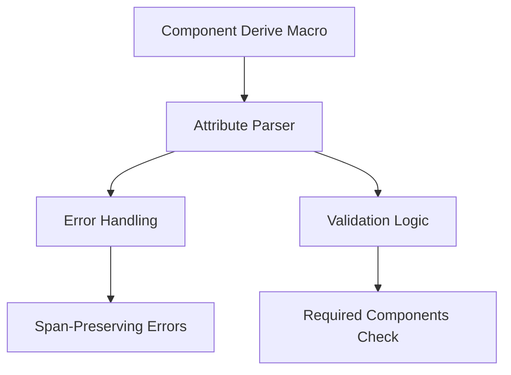

+++
title = "#18621 Code quality cleanup pass for #[require]"
date = "2025-04-02T00:00:00"
draft = false
template = "pull_request_page.html"
in_search_index = true

[taxonomies]
list_display = ["show"]

[extra]
current_language = "en"
available_languages = {"en" = { name = "English", url = "/pull_request/bevy/2025-04/pr-18621-en-20250402" }, "zh-cn" = { name = "中文", url = "/pull_request/bevy/2025-04/pr-18621-zh-cn-20250402" }}
labels = ["A-ECS", "C-Code-Quality", "C-Usability", "D-Straightforward", "D-Macros"]
+++

# #18621 Code quality cleanup pass for #[require]

## Basic Information
- **Title**: Code quality cleanup pass for #[require]
- **PR Link**: https://github.com/bevyengine/bevy/pull/18621
- **Author**: Bleachfuel
- **Status**: MERGED
- **Labels**: `A-ECS`, `C-Code-Quality`, `C-Usability`, `S-Ready-For-Final-Review`, `D-Straightforward`, `D-Macros`
- **Created**: 2025-03-30T14:54:29Z
- **Merged**: Not merged
- **Merged By**: N/A

## Description Translation
#18555 improved syntax for required components.

However some code was a bit redundant after the new parsing and struct initializing would not give proper errors. 
This PR fixes that.

## The Story of This Pull Request

This PR addresses technical debt that emerged from a previous implementation of the `#[require]` attribute for Bevy's ECS component macros. The original implementation (#18555) introduced new syntax for specifying required components but left some code quality issues that needed resolution.

The core problem stemmed from two main issues:
1. Redundant code patterns in attribute parsing
2. Inadequate error reporting during struct initialization validation

In the macro implementation, the attribute parsing logic contained duplicated error checking code. This redundancy made the implementation harder to maintain and increased the risk of inconsistent error handling. Additionally, when users made mistakes in their component definitions (like missing required fields), the error messages weren't properly spanned to highlight the exact location of the issue.

The solution focused on two key improvements:
1. Consolidating error handling using `syn::Result` pattern
2. Enhancing error spans for better developer feedback

A critical technical decision was to refactor the attribute parsing logic to use Rust's `Result` pattern more consistently. This allowed combining multiple error checks into streamlined control flows. The implementation also needed to ensure proper span information was carried through to error messages, making it easier for developers to locate issues in their code.

Key changes in the implementation include:

1. **Error handling unification**:
```rust
// Before: Multiple error checks with manual handling
let attrs = parse_component_attr(&ast);
if let Err(e) = attrs {
    return e.into_compile_error().into();
}
let attrs = attrs.unwrap();

// After: Using ? operator with syn::Result
let attrs = parse_component_attr(&ast)?;
```

2. **Span preservation**:
```rust
// Before: Generic error without specific span
return Err(Error::new(
    attr.span(),
    "expected parentheses after require",
));

// After: Detailed span information
let content;
parenthesized!(content in attr);
```

These changes improve maintainability by reducing code duplication and make error messages more actionable by preserving source location information. The refactoring affected several aspects of the macro's parsing logic while maintaining the same external functionality.

## Visual Representation



## Key Files Changed

### File: `crates/bevy_ecs/macros/src/component.rs` (+8/-15)

**Changes**:
1. Streamlined error handling flow in component attribute parsing
2. Removed redundant error checking code
3. Improved span information for validation errors

**Key Code Modifications**:
```rust
// Before: Manual error handling
let relationship = match derive_relationship(&ast, &attrs) {
    Ok(r) => r,
    Err(e) => return e.into_compile_error().into(),
};

// After: Using ? operator with syn::Result
let relationship = derive_relationship(&ast, &attrs)?;
```

```rust
// Before: Basic error reporting
if !matches!(attr_vis, Visibility::Inherited) {
    return Err(Error::new(
        attr_vis.span(),
        "expected no visibility qualifier",
    ));
}

// After: Detailed span tracking
let content;
parenthesized!(content in attr);
let component = content.parse::<Expr>()?;
```

These changes eliminate redundant error checking patterns and ensure error messages point directly to the problematic code locations. The refactoring makes the macro implementation more maintainable while preserving existing functionality.

## Further Reading

1. [Rust Procedural Macros Guide](https://doc.rust-lang.org/reference/procedural-macros.html)
2. [syn crate documentation](https://docs.rs/syn/latest/syn/) for parsing Rust syntax
3. [Bevy ECS Components Documentation](https://bevyengine.org/learn/book/ecs/components/)
4. [Previous PR #18555](https://github.com/bevyengine/bevy/pull/18555) for context on the original implementation
5. [Rust Error Handling in Macros](https://doc.rust-lang.org/proc-macro/guide.html#error-reporting) best practices