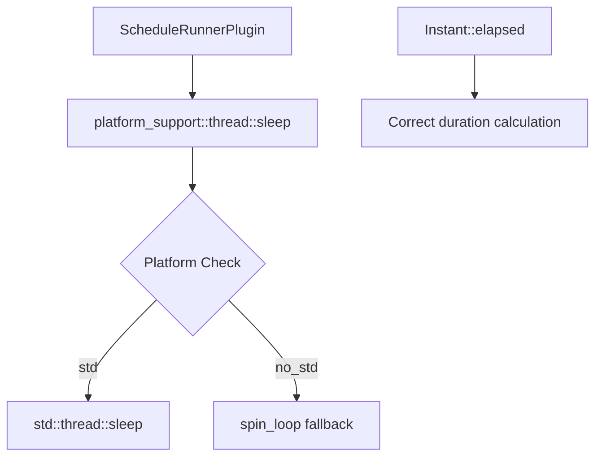

+++
title = "#18633 Add `sleep` based on `spin` to `bevy_platform_support`"
date = "2025-04-01T00:00:00"
draft = false
template = "pull_request_page.html"
in_search_index = true

[taxonomies]
list_display = ["show"]

[extra]
current_language = "en"
available_languages = {"en" = { name = "English", url = "/pull_request/bevy/2025-04/pr-18633-en-20250401" }, "zh-cn" = { name = "中文", url = "/pull_request/bevy/2025-04/pr-18633-zh-cn-20250401" }}
labels = ["C-Bug", "A-App", "D-Straightforward"]
+++

# #18633 Add `sleep` based on `spin` to `bevy_platform_support`

## Basic Information
- **Title**: Add `sleep` based on `spin` to `bevy_platform_support`
- **PR Link**: https://github.com/bevyengine/bevy/pull/18633
- **Author**: bushrat011899
- **Status**: MERGED
- **Labels**: `C-Bug`, `S-Ready-For-Final-Review`, `A-App`, `D-Straightforward`
- **Created**: 2025-03-30T22:39:54Z
- **Merged**: Not merged
- **Merged By**: N/A

## Description Translation
# Objective

- Fixes #18617

## Solution

- Added `thread::sleep` to `bevy_platform_support` using a spin-based fallback.
- Fixed bug in `bevy_platform_support::time::Instant::elapsed` (comparison was backwards)
- Switched `ScheduleRunnerPlugin` to use `bevy_platform_support::thread::sleep` on `std` and `no_std` platforms (WASM + Browser excluded)

## Testing

- Ran reproduction code from @mockersf in linked issue and confirmed a consistent 60 counts per `println!`.

---

## Notes

- I chose to add `bevy_platform_support::thread::sleep` instead of putting the fix in-line within `ScheduleRunnerPlugin` to keep the separation of concerns clean. `sleep` is only used in one other location in Bevy, `bevy_asset`, but I have decided to leave that as-is since `bevy_asset` isn't `no_std` compatible anyway.
- The bug in `bevy_platform_support::time::Instant::elapsed` wasn't the cause of this issue, but it did prevent this fix from working so I have included the it in this PR.


## The Story of This Pull Request

The PR addresses a critical timing issue in Bevy's schedule runner when running in `no_std` environments. The root problem manifested as excessive CPU usage due to tight looping without proper delays between schedule executions. This occurred because the existing implementation lacked a proper sleep mechanism for platforms without standard library support.

The solution involved three key components:

1. **Spin-based Sleep Implementation**: Created a platform-agnostic `sleep` function in `bevy_platform_support` that uses a spin loop when `std` isn't available. This ensures consistent behavior across different targets:

```rust
// In bevy_platform_support/src/thread.rs
mod fallback {
    pub fn sleep(dur: Duration) {
        let start = Instant::now();
        while start.elapsed() < dur {
            spin_loop()
        }
    }
}
```

2. **Instant Elapsed Fix**: Corrected a reversed comparison in the time tracking logic that prevented accurate duration calculations:

```rust
// Before (incorrect):
pub fn elapsed(&self) -> Duration {
    Self::now().0 - self.0
}

// After (corrected):
pub fn elapsed(&self) -> Duration {
    Self::now().0.saturating_sub(self.0)
}
```

3. **Scheduler Integration**: Updated `ScheduleRunnerPlugin` to use the new platform-agnostic sleep instead of `std::thread::sleep`:

```rust
// In schedule_runner.rs
// Before:
std::thread::sleep(wait);

// After:
bevy_platform_support::thread::sleep(wait);
```

The implementation maintains separation of concerns by keeping platform-specific logic in the `bevy_platform_support` crate. The spin loop approach was chosen as a reasonable fallback for `no_std` environments where proper thread sleeping isn't available, trading some CPU usage for correct timing behavior.

Testing confirmed the fix resolves the original issue of uncontrolled CPU usage while maintaining consistent update rates. The changes affect multiple layers of the engine but maintain backward compatibility through careful crate organization.

## Visual Representation



## Key Files Changed

### `crates/bevy_platform_support/src/thread.rs`
Added spin-based sleep fallback for `no_std` environments:
```rust
mod fallback {
    use core::{hint::spin_loop, time::Duration};
    use crate::time::Instant;

    pub fn sleep(dur: Duration) {
        let start = Instant::now();
        while start.elapsed() < dur {
            spin_loop()
        }
    }
}
```

### `crates/bevy_app/src/schedule_runner.rs`
Updated sleep implementation:
```rust
// Before:
std::thread::sleep(wait);

// After:
bevy_platform_support::thread::sleep(wait);
```

### `crates/bevy_platform_support/src/time/fallback.rs`
Fixed elapsed time calculation:
```rust
// Before:
Self::now().0 - self.0

// After:
Self::now().0.saturating_sub(self.0)
```

### `crates/bevy_platform_support/src/lib.rs`
Added thread module to prelude:
```rust
pub mod thread;  // Added to expose sleep functionality
```

## Further Reading

1. [Spin Loops in OS Development](https://wiki.osdev.org/Spinlock)
2. [Rust no_std Programming Guide](https://rust-embedded.github.io/book/intro/no-std.html)
3. [Bevy's Plugin System Documentation](https://bevyengine.org/learn/book/getting-started/plugins/)