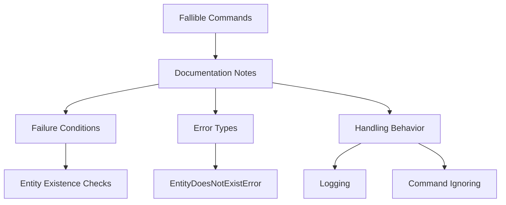

+++
title = "#18649 Add notes to fallible commands"
date = "2025-04-01T00:00:00"
draft = false
template = "pull_request_page.html"
in_search_index = true

[taxonomies]
list_display = ["show"]

[extra]
current_language = "en"
available_languages = {"en" = { name = "English", url = "/pull_request/bevy/2025-04/pr-18649-en-20250401" }, "zh-cn" = { name = "中文", url = "/pull_request/bevy/2025-04/pr-18649-zh-cn-20250401" }}
labels = ["C-Docs", "A-ECS", "D-Straightforward"]
+++

# #18649 Add notes to fallible commands

## Basic Information
- **Title**: Add notes to fallible commands
- **PR Link**: https://github.com/bevyengine/bevy/pull/18649
- **Author**: JaySpruce
- **Status**: MERGED
- **Labels**: `C-Docs`, `A-ECS`, `S-Ready-For-Final-Review`, `X-Uncontroversial`, `D-Straightforward`
- **Created**: 2025-03-31T20:12:58Z
- **Merged**: 2025-04-01T08:14:22Z
- **Merged By**: alice-i-cecile

## Description Translation
Follow-up to #18639.

Fallible commands should have notes explaining how they can fail, what error they return, and how it's handled.

## The Story of This Pull Request

The PR addresses a documentation gap in Bevy's Entity Component System (ECS) command API. Following the introduction of fallible commands in #18639, developers needed clear guidance on error handling patterns. While the command system allows queuing world mutations, certain operations like entity component insertion could fail if target entities no longer exist.

The core problem centered around missing error documentation for commands that return `Result` types. Without explicit documentation, developers might:
1. Be unaware commands could fail
2. Not handle potential errors correctly
3. Misunderstand error propagation in deferred execution

The solution adds standardized documentation notes to all fallible command methods. Each note explains:
- Failure conditions (e.g., target entity doesn't exist)
- Specific error type returned (e.g., `EntityDoesNotExistError`)
- Error handling behavior (errors logged but not propagated)

Implementation involved modifying method documentation in `commands/mod.rs`. For example, the `insert` method's docs now include:

```rust
/// Note: This command may fail if the entity does not exist.
/// If this occurs, an [`EntityDoesNotExistError`] will be logged
/// and the command will be ignored.
```

This pattern was consistently applied to 12 command methods including `insert_by_id`, `remove`, and `remove_by_id`. The documentation updates clarify that errors are logged using Bevy's error logging system but don't interrupt command queue processing - a critical design choice for ECS command execution reliability.

The changes improve API discoverability without altering runtime behavior. By explicitly documenting failure modes, developers can:
- Write more robust error handling code
- Understand why certain commands might not execute as expected
- Make informed decisions about entity lifecycle management

## Visual Representation



## Key Files Changed

**File**: `crates/bevy_ecs/src/system/commands/mod.rs` (+61/-12)

Key modifications to command documentation:

1. Added failure condition notes to `insert`:
```rust
/// Note: This command may fail if the entity does not exist.
/// If this occurs, an [`EntityDoesNotExistError`] will be logged
/// and the command will be ignored.
pub fn insert(&mut self, entity: Entity, bundle: impl Bundle) -> &mut Self {
```

2. Updated `insert_by_id` with error details:
```rust
/// Note: This command may fail if the entity does not exist.
/// If this occurs, an [`EntityDoesNotExistError`] will be logged
/// and the command will be ignored.
pub fn insert_by_id(&mut self, entity: Entity, components: impl ComponentCollection) -> &mut Self {
```

3. Enhanced `remove` documentation:
```rust
/// Note: This command may fail if the entity does not exist.
/// If this occurs, an [`EntityDoesNotExistError`] will be logged
/// and the command will be ignored.
pub fn remove<T: Bundle>(&mut self, entity: Entity) -> &mut Self {
```

These changes create consistent documentation patterns across all fallible commands in the ECS module, directly supporting the PR's goal of improving error handling transparency.

## Further Reading

1. [Bevy ECS Commands Documentation](https://bevyengine.org/learn/book/ecs/commands/)
2. [Error Handling in Bevy](https://bevyengine.org/learn/book/error-handling/)
3. Original PR #18639: "Make commands return `Result` when queuing is deferred"