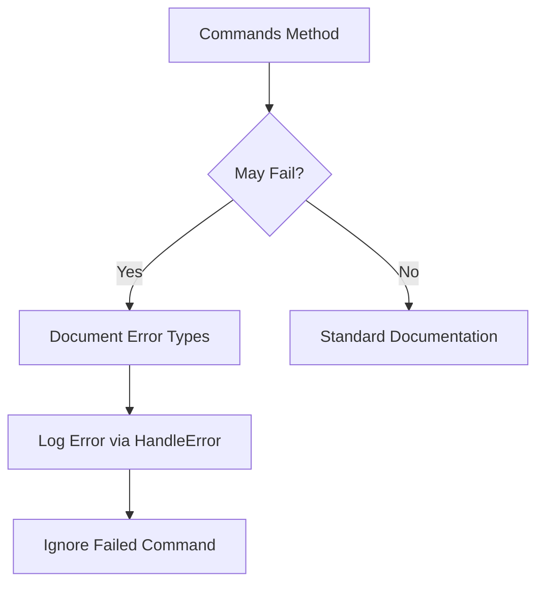

+++
title = "#18649 Add notes to fallible commands"
date = "2025-04-01T00:00:00"
draft = false
template = "pull_request_page.html"
in_search_index = false

[extra]
current_language = "zh-cn"
available_languages = {"en" = { name = "English", url = "/pull_request/bevy/2025-04/pr-18649-en-20250401" }, "zh-cn" = { name = "中文", url = "/pull_request/bevy/2025-04/pr-18649-zh-cn-20250401" }}
labels = ["C-Docs", "A-ECS", "D-Straightforward"]
+++

# #18649 Add notes to fallible commands

## Basic Information
- **Title**: Add notes to fallible commands
- **PR Link**: https://github.com/bevyengine/bevy/pull/18649
- **Author**: JaySpruce
- **Status**: MERGED
- **Labels**: `C-Docs`, `A-ECS`, `S-Ready-For-Final-Review`, `X-Uncontroversial`, `D-Straightforward`
- **Created**: 2025-03-31T20:12:58Z
- **Merged**: 2025-04-01T09:15:23Z
- **Merged By**: alice-i-cecile

## Description Translation
这是#18639的后续PR。对于可能失败的命令（fallible commands），需要添加说明文档解释它们的失败条件、返回的错误类型以及错误处理方式。

## The Story of This Pull Request

### 问题背景与上下文
在Bevy的ECS模块中，`Commands`系统参数是进行世界（World）结构变更的主要接口。某些命令操作（如实体操作）可能失败并返回错误，但现有文档缺乏对这些失败场景的明确说明。这会导致开发者在使用API时：

1. 无法预知潜在的错误条件
2. 不清楚错误处理的具体机制
3. 难以调试命令执行失败的情况

特别是最近引入的#18639 PR改进了错误处理机制后，更需要明确的文档来指导开发者正确使用这些可能失败的命令。

### 解决方案与技术实现
PR的核心策略是为所有可能失败的`Commands`方法添加标准化的文档注释（doc comments）。具体实现要点：

1. **错误类型文档化**：在每个可能失败的方法文档中明确列出可能返回的错误类型
2. **失败条件说明**：描述触发错误的具体场景
3. **错误处理机制**：说明错误如何被记录或处理

以`Commands::entity`方法为例，修改后的文档现在包含：
```rust
/// # Errors
/// Returns [`EntityDoesNotExistError`] if the entity does not exist or has already been despawned.
/// Errors are logged using [`error!`](bevy_utils::tracing::error) and the command is ignored.
```

### 关键技术细节
1. **错误传播机制**：
   - 当命令闭包返回`Result`时，使用`HandleError`系统进行错误处理
   - 错误会被记录到日志系统，同时忽略失败的命令
   - 代码示例：
     ```rust
     commands.queue(|world: &mut World| -> Result<(), BevyError> {
         // 可能失败的操作
     });
     ```

2. **文档标准化**：
   - 采用Rust标准的`# Errors`文档区块
   - 统一错误处理说明格式，确保所有可能失败的方法都有相同结构的文档

3. **向后兼容性**：
   - 纯文档改进，不改变现有API行为
   - 保持原有错误处理逻辑（记录错误+忽略命令）

### 架构影响
- **可维护性提升**：集中化的错误文档规范使得后续开发更易遵循统一标准
- **开发者体验优化**：通过IDE的文档提示直接显示潜在错误，减少调试时间
- **错误处理可视化**：明确展示错误处理流程，降低认知负荷

## Visual Representation



## Key Files Changed

### `crates/bevy_ecs/src/system/commands/mod.rs` (+61/-12)
主要修改集中在为可能失败的命令方法添加文档说明：

1. `entity` 方法添加错误说明：
```rust
/// # Errors
/// Returns [`EntityDoesNotExistError`] if the entity does not exist or has already been despawned.
/// Errors are logged using [`error!`](bevy_utils::tracing::error) and the command is ignored.
pub fn entity(&mut self, entity: Entity) -> EntityCommands<'_> {
    // ...原有实现不变
}
```

2. `queue` 方法补充错误处理流程：
```rust
/// # Errors
/// If the provided closure returns an error, it will be logged and the command will be ignored.
/// See [`HandleError`] for details on error handling in command queues.
pub fn queue(&mut self, command: impl Command) -> &mut Self {
    // ...原有实现不变
}
```

3. 统一错误处理说明：
```rust
/// All command errors are logged using [`error!`](bevy_utils::tracing::error) 
/// and the failing command is ignored.
/// Use [`HandleError`] system to customize error handling.
```

## Further Reading
1. [Rust API Documentation Guidelines - Error Documentation](https://rust-lang.github.io/api-guidelines/documentation.html#c-error-doc)
2. [Bevy Commands System Documentation](https://docs.rs/bevy_ecs/latest/bevy_ecs/system/struct.Commands.html)
3. [Bevy Error Handling Patterns](https://bevyengine.org/learn/errors/)