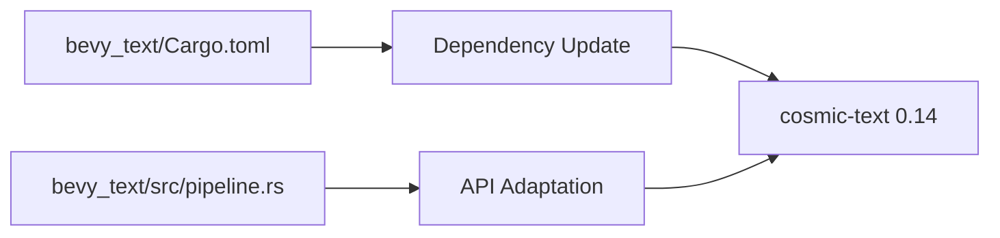

+++
title = "#18651 Update cosmic-text to 0.14"
date = "2025-04-27T00:00:00"
draft = false
template = "pull_request_page.html"
in_search_index = true

[taxonomies]
list_display = ["show"]

[extra]
current_language = "en"
available_languages = {"en" = { name = "English", url = "/pull_request/bevy/2025-04/pr-18651-en-20250427" }, "zh-cn" = { name = "中文", url = "/pull_request/bevy/2025-04/pr-18651-zh-cn-20250427" }}
labels = ["D-Trivial", "C-Dependencies", "A-Text"]
+++

# Title: Update cosmic-text to 0.14

## Basic Information
- **Title**: Update cosmic-text to 0.14
- **PR Link**: https://github.com/bevyengine/bevy/pull/18651
- **Author**: kristoff3r
- **Status**: MERGED
- **Labels**: D-Trivial, C-Dependencies, S-Ready-For-Final-Review, A-Text
- **Created**: 2025-03-31T20:50:56Z
- **Merged**: 2025-04-26T21:55:48Z
- **Merged By**: mockersf

## Description Translation
# Objective

New cosmic-text version is out, we should use it.

## Solution

Bump the version.

## Testing

Code compiles, text example works

## The Story of This Pull Request

The PR addresses a routine but critical maintenance task - keeping dependencies up-to-date. The cosmic-text library, used for text layout and rendering in Bevy's text system, released version 0.14. The primary motivation was to leverage potential improvements in the updated dependency while maintaining compatibility.

The core challenge involved adapting to cosmic-text's API changes between versions. While the version bump in Cargo.toml appears straightforward, the implementation required a code modification to match the updated method signature in cosmic-text's Buffer API. The key technical adjustment occurred in the text pipeline where the set_rich_text method now requires a reference to Attrs rather than taking ownership of the value.

In `pipeline.rs`, the call to `buffer.set_rich_text` was updated from passing `Attrs::new()` directly to passing `&Attrs::new()`. This change reflects cosmic-text's updated API requirements for the attrs parameter, likely made to allow more efficient reuse of attribute objects or to align with Rust's borrowing best practices.

The testing approach focused on two key aspects: basic compilation success and functional verification using Bevy's text examples. This dual verification ensured both syntactic compatibility (through successful compilation) and semantic correctness (through visual validation of text rendering).

## Visual Representation



## Key Files Changed

1. **crates/bevy_text/Cargo.toml**
```toml
# Before:
cosmic-text = { version = "0.13", features = ["shape-run-cache"] }

# After:
cosmic-text = { version = "0.14", features = ["shape-run-cache"] }
```
Updates the cosmic-text dependency to leverage new features/bug fixes in 0.14 while maintaining the same feature flags.

2. **crates/bevy_text/src/pipeline.rs**
```rust
// Before:
buffer.set_rich_text(
    font_system,
    spans_iter,
    Attrs::new(),
    Shaping::Advanced,
    Some(justify.into()),
);

// After:
buffer.set_rich_text(
    font_system,
    spans_iter,
    &Attrs::new(),
    Shaping::Advanced,
    Some(justify.into()),
);
```
Adjusts the API call to match cosmic-text 0.14's requirement for a reference to text attributes rather than direct value ownership.

## Further Reading
- [cosmic-text Changelog](https://github.com/pop-os/cosmic-text/releases) - For details on API changes between versions
- Rust Borrowing and References - Understanding when to use references vs values
- Semantic Versioning - How dependency versioning works in Rust crates